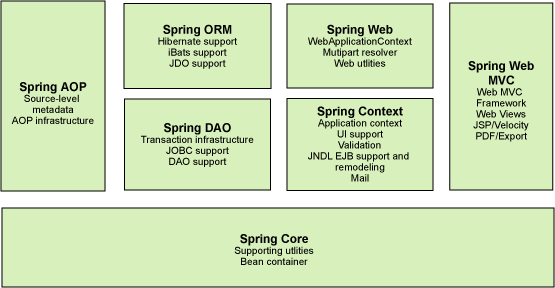
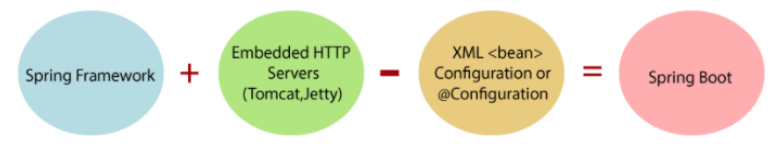

# java-framework
Java framework learning notes recording

因实习需求在这里规划短期框架学习路径与内容，主要参考狂神java学习视频，记录自己的学习笔记与内容。

## 1 学习路径规划

#### 1.1 Mybatis

1. 认识Mybatis

2. 传统Dao层实现与Mybatis的简单实现

3. Mybatis配置

4. 使用xml实现CRUD

5. 注解实现

   - @Alias

   - @param("id")
   - @Select
   - @Insert
   - @Update
   - @Delete

6. 结果集合映射

   1）多对一关联assosiation

   2）一对多集合collection

7. 动态SQL

8. 缓存

   

#### 1.2 Spring

1. 认识Srping

2. IOC控制反转

3. HelloSpring

4. IOC创建对象的方式

   - 无参构造创建
   - 有参构造创建
     - 参数名
     - 参数下标
     - 参数类型

5. Spring配置文件

6. 依赖注入DI

   - 构造器
   - setter注入
   - p命名c命名
   - 自动装配

7. 作用域

8. 注解

   1）Bean    =>  @Component

   2）属性注入@Value

   3）@Component （pojo） @Repository （dao）@Service（service）@Controller（controller）

   4）自动装配

   ​	@Autowired

   ​	@Resource

   ​	@Nullable

   5）作用域

   ​	@Scope

9. 使用Java类实现xml配置

10. 代理

11. AOP面向切面编程

12. 声明式事务

    

#### 1.3 Spring MVC

1. HelloSpringMVC

2. Spring MVC执行流程

3. 注解版Spring MVC开发

   @Controller

   @RequestMapping

   @GetMapping

   @PostMapping

   @PutMapping

   @DeleteMapping

   @PathVariable

   @RequestParam

   @ResponseBody

4. Controller配置

5. RestFul风格

6. 处理数据及结果跳转

   1）获取请求参数

   2）处理结果跳转

   3）前端显示数据

7. JSON

#### 1.4 Spring Boot

1. 认识Spring Boot
2. 运行原理
3. Spring Boot配置
   - 全局配置文件（application.properties / application.yaml）
   - yaml配置文件
     - 使用yaml文件实现属性注入
       - @Component
       - @ConfigurationProperties(prefix="ymal文件名")
4. JSR303数据验证
5. 多环境切换
6. 自动配置原理
   - Conditional
7. 静态资源路径
8. 模板引擎 Thymeleaf
9. 扩展装备Spring MVC

