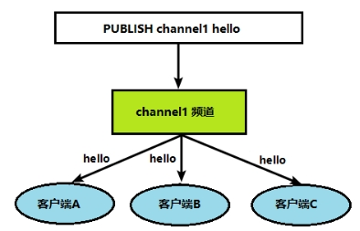

# Redis

## 1. NoSQL数据库简介

### 1.1 NoSQL数据库概述

NoSQL(NoSQL = ***Not Only SQL***\)，意即“不仅仅是SQL”，泛指***\*非关系型的数据库\****。 

NoSQL 不依赖业务逻辑方式存储，而以简单的key-value模式存储。因此大大的增加了数据库的扩展能力。

- 不遵循SQL标准。
- 不支持ACID。
- 远超于SQL的性能。

#### 1.1.1 NoSQL适用场景

- 对数据高并发的读写
- 海量数据的读写
- 对数据高可扩展性的

#### 1.1.2 NoSQL不适用场景

- 需要事务支持
- 基于sql的结构化查询存储，处理复杂的关系,需要即席查询。
- **用不着sql的和用了sql也不行的情况，请考虑用NoSql**

#### 1.1.3 Memcache

|  | ü 很早出现的NoSql数据库ü 数据都在内存中，一般不持久化ü 支持简单的key-value模式，支持类型单一ü 一般是作为缓存数据库辅助持久化的数据库 |
| -------------------------- | ------------------------------------------------------------ |

#### 1.1.4 Redis

|  | 几乎覆盖了Memcached的绝大部分功能数据都在内存中，支持持久化，主要用作备份恢复除了支持简单的key-value模式，还支持多种数据结构的存储，比如 list、set、hash、zset等。一般是作为缓存数据库辅助持久化的数据库 |
| -------------------------- | ------------------------------------------------------------ |

#### 1.1.5 MongoDB

|  | ü 高性能、开源、模式自由(schema  free)的***\*文档型数据库\****ü 数据都在内存中， 如果内存不足，把不常用的数据保存到硬盘ü 虽然是key-value模式，但是对value（尤其是***\*json\****）提供了丰富的查询功能ü 支持二进制数据及大型对象ü 可以根据数据的特点***\*替代RDBMS\**** ，成为独立的数据库。或者配合RDBMS，存储特定的数据。 |
| -------------------------- | ------------------------------------------------------------ |

1.2 行式存储数据库


1.3 图关系型数据库

主要应用：社会关系，公共交通网络，地图及网络拓谱(n*(n-1)/2)


## 2.Redis概述安装

- Redis是一个开源的**key-value**存储系统。
- 和Memcached类似，它支持存储的value类型相对更多，包括**string**(字符串)、**list**(链表)、**set**(集合)、**zset**(sorted set --有序集合)和**hash**（哈希类型）。
- 这些数据类型都支持push/pop、add/remove及取交集并集和差集及更丰富的操作，而且这些操作都是**原子性**的。
- 在此基础上，Redis支持各种不同方式的**排序**。
- 与memcached一样，为了保证效率，数据都是**缓存在内存**中。
- 区别的是Redis会**周期性**的把更新的**数据入磁盘**或者把修改操作写入追加的记录文件。
- 并且在此基础上实现了**master-slave(主从)**同步。

### 2.1应用场景

#### 2.1.1**配合关系型数据库做高速缓存**

- 高频次，热门访问的数据，降低数据库IO
- 分布式架构，做session共享

 


#### 2.1.2 多样的数据结构存储持久化数据


### 2.2 Redis安装


## 3.常用五大数据类型

### 3.1 Redis键（key）

- keys *查看当前库所有key   (匹配：keys *1)
- exists key判断某个key是否存在
- type key 查看你的key是什么类型
- del key    删除指定的key数据
- unlink key  根据value选择非阻塞删除

​		仅将keys从keyspace元数据中删除，真正的删除会在后续异步操作。

- expire key 10  10秒钟：为给定的key设置过期时间

- ttl key 查看还有多少秒过期，-1表示永不过期，-2表示已过期

  

- select命令切换数据库

- dbsize查看当前数据库的key的数量

- flushdb清空当前库

- flushall通杀全部库

- ### 3.2 Redis字符串（String）

- get  <key>查询对应键值

- append  <key><value>将给定的<value> 追加到原值的末尾

- strlen  <key>获得值的长度

- setnx  <key><value>只有在 key 不存在时   设置 key 的值

  

- incr  <key>

​		将 key 中储存的数字值增1

​		只能对数字值操作，如果为空，新增值为1

- decr  <key>

​		将 key 中储存的数字值减1

​		只能对数字值操作，如果为空，新增值为-1

- incrby / decrby  <key><步长>将 key 中储存的数字值增减。自定义步长。

  

- mset  <key1><value1><key2><value2>  ..... 

​		同时设置一个或多个 key-value对  

- mget  <key1><key2><key3> .....

​		同时获取一个或多个 value  

- msetnx <key1><value1><key2><value2>  ..... 

​		同时设置一个或多个 key-value 对，当且仅当所有给定 key 都不存在。

​	**原子性，有一个失败则都失败**


- getrange  <key><起始位置><结束位置>

​		获得值的范围，类似java中的substring，**前包，后包**

- setrange  <key><起始位置><value>

​		用 <value>  覆写<key>所储存的字符串值，从<起始位置>开始(**索引从0开始**)。


- **setex  <key><过期时间**><value>

​		设置键值的同时，设置过期时间，单位秒。

- getset <key><value>

​		以新换旧，设置了新值同时获得旧值。

### 3.3 Redis列表（List）

#### 3.3.1 简介

单键多值

Redis 列表是简单的字符串列表，按照插入顺序排序。你可以添加一个元素到列表的头部（左边）或者尾部（右边）。

它的底层实际是个**双向链表**，对两端的操作性能很高，通过索引下标的操作中间的节点性能会较差。

#### 3.3.2 **常用命令**

- lpush/rpush  <key><value1><value2><value3> .... 从左边/右边插入一个或多个值。

- lpop/rpop  <key>从左边/右边吐出一个值。值在键在，值光键亡。

  

- rpoplpush  <key1><key2>从<key1>列表右边吐出一个值，插到<key2>列表左边。 

- lrange <key><start><stop>

​		按照索引下标获得元素(从左到右)

- lrange mylist 0 -1  0左边第一个，-1右边第一个，（0-1表示获取所有）

- lindex <key><index>按照索引下标获得元素(从左到右)

- llen <key>获得列表长度 

  

- linsert <key>  before <value><newvalue>在<value>的后面插入<newvalue>插入值

- lrem <key><n><value>从左边删除n个value(从左到右)

- lset<key><index><value>将列表key下标为index的值替换成value

### 3.4 Redis集合（Set）

#### 3.4.1 简介

Redis set对外提供的功能与list类似是一个列表的功能，特殊之处在于set是可以***自动排重***的，当你需要存储一个列表数据，又不希望出现重复数据时，set是一个很好的选择，并且set提供了判断某个成员是否在一个set集合内的重要接口，这个也是list所不能提供的。

Redis的Set是string类型的无序集合。它底层其实是一个value为null的hash表，所以添加，删除，查找的***复杂度都是O(1)***。

一个算法，随着数据的增加，执行时间的长短，如果是O(1)，数据增加，查找数据的时间不变

#### 3.4.2 **常用命令**

- sadd <key><value1><value2> ..... 

  将一个或多个 member 元素加入到集合 key 中，已经存在的 member 元素将被忽略

- smembers <key>取出该集合的所有值。

- sismember <key><value>判断集合<key>是否为含有该<value>值，有1，没有0

- scard<key>返回该集合的元素个数。

- srem <key><value1><value2> .... 删除集合中的某个元素。

- spop <key>***\*随机从该集合中吐出一个值。\****

- srandmember <key><n>随机从该集合中取出n个值。不会从集合中删除 。

- smove <source><destination>value把集合中一个值从一个集合移动到另一个集合

- sinter <key1><key2>返回两个集合的交集元素。

- sunion <key1><key2>返回两个集合的并集元素。

- sdiff <key1><key2>返回两个集合的***\*差集\****元素(key1中的，不包含key2中的)

### 3.5 Redis哈希（Hash）

- hset <key><field><value>给<key>集合中的  <field>键赋值<value>

- hget <key1><field>从<key1>集合<field>取出 value 

- hmset <key1><field1><value1><field2><value2>... 批量设置hash的值

- hexists<key1><field>查看哈希表 key 中，给定域 field 是否存在。 

- hkeys <key>列出该hash集合的所有field

- hvals <key>列出该hash集合的所有value

- hincrby <key><field><increment>为哈希表 key 中的域 field 的值加上增量 1  -1

- hsetnx <key><field><value>将哈希表 key 中的域 field 的值设置为 value ，当且仅当域 field 不存在

  

  ### 3.6 Redis有序集合Zset（sorted set）

- zadd  <key><score1><value1><score2><value2>…

  将一个或多个 member 元素及其 score 值加入到有序集 key 当中。

- ***zrange <key><start><stop>  [WITHSCORES]***  

  返回有序集 key 中，下标在<start><stop>之间的元素

  带WITHSCORES，可以让分数一起和值返回到结果集。

- zrangebyscore key minmax [withscores] [limit offset count]

  返回有序集 key 中，所有 score 值介于 min 和 max 之间(包括等于 min 或 max )的成员。有序集成员按 score 值递增(从小到大)次序排列。 

- zrevrangebyscore key maxmin [withscores] [limit offset count]        

  同上，改为从大到小排列。 

- zincrby <key><increment><value>    为元素的score加上增量

- zrem  <key><value>删除该集合下，指定值的元素 

- zcount <key><min><max>统计该集合，分数区间内的元素个数 

- zrank <key><value>返回该值在集合中的排名，从0开始。


## 4.Redis配置文件

网络相关配置

- 默认情况bind=127.0.0.1只能接受本机的访问请求

不写的情况下，无限制接受任何ip地址的访问

- protected-mode

将本机访问保护模式设置no


5. ## redis的发布和订阅

Redis 发布订阅 (pub/sub) 是一种消息通信模式：发送者 (pub) 发送消息，订阅者 (sub) 接收消息。

Redis 客户端可以订阅任意数量的频道。

1、客户端可以订阅频道如下图

 

2、当给这个频道发布消息后，消息就会发送给订阅的客户端

 

 

6. ## Redis新数据类型

### 6.1. Bitmaps

- setbit<key><offset><value>设置Bitmaps中某个偏移量的值（0或1）
- getbit<key><offset>获取Bitmaps中某个偏移量的值
- bitcount<key>[start end] 统计字符串从start字节到end字节比特值为1的数量
- bitop and(or/not/xor) <destkey> [key…]

​		bitop是一个复合操作， 它可以做多个Bitmaps的and（交集） 、 or（并集） 、 not（非） 、 xor（异或） 操作并将结果保存在destkey中。

### 6.2.HyperLogLog

- pfadd <key>< element> [element ...]  添加指定元素到 HyperLogLog 中
- pfcount<key> [key ...] 计算HLL的近似基数，可以计算多个HLL，比如用HLL存储每天的UV，计算一周的UV可以使用7天的UV合并计算即可
- pfmerge<destkey><sourcekey> [sourcekey ...]  将一个或多个HLL合并后的结果存储在另一个HLL中，比如每月活跃用户可以使用每天的活跃用户来合并计算可得

### 6.3.Geospatial

- geoadd<key>< longitude><latitude><member> [longitude latitude member...]  添加地理位置（经度，纬度，名称）
- geopos  <key><member> [member...]  获得指定地区的坐标值
- geodist<key><member1><member2>  [m|km|ft|mi ]  获取两个位置之间的直线距离
- georadius<key>< longitude><latitude>radius m|km|ft|mi  以给定的经纬度为中心，找出某一半径内的元素

## 7.Redis_Jedis测试

### 7.1Jedis需要的jar包

```xml
<dependency>
<groupId>redis.clients</groupId>
<artifactId>jedis</artifactId>
<version>3.2.0</version>
</dependency>
```

### 7.2.连接Redis注意事项

禁用Linux的防火墙：Linux(CentOS7)里执行命令

**systemctl stop/disable firewalld.service**

### 7.3.Jedis常用操作

#### 7.3.1创建动态工程

#### 7.3.2创建测试程序

```java
package com.atguigu.jedis;
import redis.clients.jedis.Jedis;
public class Demo01 {
public static void main(String[] args) {
Jedis jedis = new Jedis("192.168.137.3",6379);
String pong = jedis.ping();
System.out.println("连接成功："+pong);
jedis.close();
}
}//如果连不上看一下：Network中的两个修改，防火墙有没有关。
```

### 7.4.测试相关数据类型

## 8.Redis_Jedis实例

### 8.1.完成一个手机验证码功能

1、输入手机号，点击发送后随机生成6位数字码，2分钟有效 

1）**Random || 2）**把验证码放到redis里面，设置过期时间120s。

2、输入验证码，点击验证，返回成功或失败

3）**从redis获取验证码和输入的验证码进行比较

 

3、每个手机号每天只能输入3次

4）**incr每次发送之后+1，大于2时候，提交不能发送

## 9.Redis与Spring Boot整合

## 9.1.整合步骤

1、 在pom.xml文件中引入redis相关依赖

springboot版本修改为2.2.1

加上spring-boot-starter-web

```xml
<!-- redis -->
<dependency>
<groupId>org.springframework.boot</groupId>
<artifactId>spring-boot-starter-data-redis</artifactId>
</dependency>

<!-- spring2.X集成redis所需common-pool2-->
<dependency>
<groupId>org.apache.commons</groupId>
<artifactId>commons-pool2</artifactId>
<version>2.6.0</version>
</dependency>
```

2、 application.properties配置redis配置

```properties
#Redis服务器地址
spring.redis.host=192.168.140.136
#Redis服务器连接端口
spring.redis.port=6379
#Redis数据库索引（默认为0）
spring.redis.database= 0
#连接超时时间（毫秒）
spring.redis.timeout=1800000
#连接池最大连接数（使用负值表示没有限制）
spring.redis.lettuce.pool.max-active=20
#最大阻塞等待时间(负数表示没限制)
spring.redis.lettuce.pool.max-wait=-1
#连接池中的最大空闲连接
spring.redis.lettuce.pool.max-idle=5
#连接池中的最小空闲连接
spring.redis.lettuce.pool.min-idle=0
```

3、 添加redis配置类

```java
@EnableCaching
@Configuration
public class RedisConfig extends CachingConfigurerSupport {

    @Bean
    public RedisTemplate<String, Object> redisTemplate(RedisConnectionFactory factory) {
        RedisTemplate<String, Object> template = new RedisTemplate<>();
        RedisSerializer<String> redisSerializer = new StringRedisSerializer();
        Jackson2JsonRedisSerializer jackson2JsonRedisSerializer = new Jackson2JsonRedisSerializer(Object.class);
        ObjectMapper om = new ObjectMapper();
        om.setVisibility(PropertyAccessor.ALL, JsonAutoDetect.Visibility.ANY);
        om.enableDefaultTyping(ObjectMapper.DefaultTyping.NON_FINAL);
        jackson2JsonRedisSerializer.setObjectMapper(om);
        template.setConnectionFactory(factory);
//key序列化方式
        template.setKeySerializer(redisSerializer);
//value序列化
        template.setValueSerializer(jackson2JsonRedisSerializer);
//value hashmap序列化
        template.setHashValueSerializer(jackson2JsonRedisSerializer);
        return template;
    }

    @Bean
    public CacheManager cacheManager(RedisConnectionFactory factory) {
        RedisSerializer<String> redisSerializer = new StringRedisSerializer();
        Jackson2JsonRedisSerializer jackson2JsonRedisSerializer = new Jackson2JsonRedisSerializer(Object.class);
//解决查询缓存转换异常的问题
        ObjectMapper om = new ObjectMapper();
        om.setVisibility(PropertyAccessor.ALL, JsonAutoDetect.Visibility.ANY);
        om.enableDefaultTyping(ObjectMapper.DefaultTyping.NON_FINAL);
        jackson2JsonRedisSerializer.setObjectMapper(om);
// 配置序列化（解决乱码的问题）,过期时间600秒
        RedisCacheConfiguration config = RedisCacheConfiguration.defaultCacheConfig()
                .entryTtl(Duration.ofSeconds(600))
                .serializeKeysWith(RedisSerializationContext.SerializationPair.fromSerializer(redisSerializer))
                .serializeValuesWith(RedisSerializationContext.SerializationPair.fromSerializer(jackson2JsonRedisSerializer))
                .disableCachingNullValues();
        RedisCacheManager cacheManager = RedisCacheManager.builder(factory)
                .cacheDefaults(config)
                .build();
        return cacheManager;
    }
}
```

4、测试一下

RedisTestController中添加测试方法

```java
@RestController
@RequestMapping("/redisTest")
public class RedisTestController {
    @Autowired
    private RedisTemplate redisTemplate;

    @GetMapping
    public String testRedis() {
        //设置值到redis
        redisTemplate.opsForValue().set("name","lucy");
        //从redis获取值
        String name = (String)redisTemplate.opsForValue().get("name");
        return name;
    }
}
```

进入redis

***/usr/local/bin/redis-server /etc/redis.conf***

***/usr/local/bin/redis-cli***

## 10.Redis_事务_锁机制_秒杀

### 10.1.Redis的事务定义


Redis事务是一个单独的隔离操作：事务中的所有命令都会序列化、按顺序地执行。事务在执行的过程中，不会被其他客户端发送来的命令请求所打断。

Redis事务的主要作用就是串联多个命令防止别的命令插队。

### 10.2.Mult、Exec、discard

从输入Multi命令开始，输入的命令都会依次进入命令队列中，但不会执行，直到输入Exec后，Redis会将之前的命令队列中的命令依次执行。

组队的过程中可以通过discard来放弃组队。  

 

### 10.3.事务的错误处理

组队中某个命令出现了报告错误，执行时整个的所有队列都会被取消。

 

如果执行阶段某个命令报出了错误，则只有报错的命令不会被执行，而其他的命令都会执行，不会回滚。


### 10.5.事务冲突的问题

#### 10.5.1.例子

一个请求想给金额减8000

一个请求想给金额减5000

一个请求想给金额减1000


#### 10.5.2.悲观锁


***悲观锁(Pessimistic Lock)***, 顾名思义，就是很悲观，每次去拿数据的时候都认为别人会修改，所以每次在拿数据的时候都会上锁，这样别人想拿这个数据就会block直到它拿到锁。***传统的关系型数据库里边就用到了很多这种锁机制***，比如***行锁***，***表锁***等，***读锁***，***写锁***等，都是在做操作之前先上锁。

#### 10.5.3乐观锁


***乐观锁(Optimistic Lock)*** 顾名思义，就是很乐观，每次去拿数据的时候都认为别人不会修改，所以不会上锁，但是在更新的时候会判断一下在此期间别人有没有去更新这个数据，可以使用版本号等机制。***乐观锁适用于多读的应用类型，这样可以提高吞吐量***。Redis就是利用这种check-and-set机制实现事务的。

#### 10.5.4.WATCH key [key...]

在执行multi之前，先执行watch key1 [key2],可以监视一个(或多个) key ，如果在事务***执行之前这个(或这些) key 被其他命令所改动，那么事务将被打断。***

#### 10.5.5.unwatch

取消 WATCH 命令对所有 key 的监视。

如果在执行 WATCH 命令之后，EXEC 命令或DISCARD 命令先被执行了的话，那么就不需要再执行UNWATCH 了。

### 10.6.Redis事务三特性

- 单独的隔离操作 

  事务中的所有命令都会序列化、按顺序地执行。事务在执行的过程中，不会被其他客户端发送来的命令请求所打断。 

- 没有隔离级别的概念 

  n 队列中的命令没有提交之前都不会实际被执行，因为事务提交前任何指令都不会被实际执行

- 不保证原子性 

  事务中如果有一条命令执行失败，其后的命令仍然会被执行，没有回滚 

  

## 11.Redis持久化之RDB

### 11.1.简介


在指定的时间间隔内将内存中的数据集快照写入磁盘， 也就是行话讲的Snapshot快照，它恢复时是将快照文件直接读到内存里

#### 11.1.1.备份如何执行

Redis会单独创建（fork）一个子进程来进行持久化，会先将数据写入到 一个临时文件中，待持久化过程都结束了，再用这个临时文件替换上次持久化好的文件。 整个过程中，主进程是不进行任何IO操作的，这就确保了极高的性能 如果需要进行大规模数据的恢复，且对于数据恢复的完整性不是非常敏感，那RDB方式要比AOF方式更加的高效。***RDB的缺点是***最后一次持久化后的数据可能丢失。

#### 11.1.2.Fork

- Fork的作用是复制一个与当前进程一样的进程。新进程的所有数据（变量、环境变量、程序计数器等） 数值都和原进程一致，但是是一个全新的进程，并作为原进程的子进程
- 在Linux程序中，fork()会产生一个和父进程完全相同的子进程，但子进程在此后多会exec系统调用，出于效率考虑，Linux中引入了“***写时复制技术***”
- ***一般情况父进程和子进程会共用同一段物理内存***，只有进程空间的各段的内容要发生变化时，才会将父进程的内容复制一份给子进程。

#### 11.1.3.RDB持久化流程


#### 11.1.4***dump.rdb文件***

rdb文件的保存路径，也可以修改。默认为Redis启动时命令行所在的目录下

dir "/myredis/"


#### 11.1.5如何出发RDB快照

保持策略

#### 11.1.6优势

- 适合大规模的数据恢复
- 对数据完整性和一致性要求不高更适合使用
- 节省磁盘空间
- 恢复速度快

#### 11.1.7劣势

- Fork的时候，内存中的数据被克隆了一份，大致2倍的膨胀性需要考虑
- 虽然Redis在fork时使用了***\*写时拷贝技术\****,但是如果数据庞大时还是比较消耗性能。
- 在备份周期在一定间隔时间做一次备份，所以如果Redis意外down掉的话，就会丢失最后一次快照后的所有修改。


## 12.Redis持久化之AOF

### 12.1.是什么

以***日志***的形式来记录每个写操作（增量保存），将Redis执行过的所有写指令记录下来(***读操作不记录***)， ***只许追加文件但不可以改写文件***，redis启动之初会读取该文件重新构建数据，换言之，redis 重启的话就根据日志文件的内容将写指令从前到后执行一次以完成数据的恢复工作

### 12.2.AOF持久化流程

（1）客户端的请求写命令会被append追加到AOF缓冲区内；

（2）AOF缓冲区根据AOF持久化策略[always,everysec,no]将操作sync同步到磁盘的AOF文件中；

（3）AOF文件大小超过重写策略或手动重写时，会对AOF文件rewrite重写，压缩AOF文件容量；

（4）Redis服务重启时，会重新load加载AOF文件中的写操作达到数据恢复的目的


#### 12.2.1.AOF默认不开启

可以在redis.conf中配置文件名称，默认为 appendonly.aof

AOF文件的保存路径，同RDB的路径一致。

#### 12.2.2AOF和RDB同时开启

AOF和RDB同时开启，系统默认取AOF的数据（数据不会存在丢失）

#### 12.2.3AOF启动、修复、恢复

- AOF的备份机制和性能虽然和RDB不同, 但是备份和恢复的操作同RDB一样，都是拷贝备份文件，需要恢复时再拷贝到Redis工作目录下，启动系统即加载。

- 正常恢复

​		修改默认的appendonly no，改为yes

​		将有数据的aof文件复制一份保存到对应目录(查看目录：config get dir)

​		恢复：重启redis然后重新加载

 

- 异常恢复

​		修改默认的appendonly no，改为yes

​		如遇到***\*AOF文件损坏\****，通过/usr/local/bin/***\*redis-check-aof--fix appendonly.aof\****进行恢复

​		备份被写坏的AOF文件

​		恢复：重启redis，然后重新加载

#### 12.2.4.AOF同步频率设置

- appendfsync always

始终同步，每次Redis的写入都会立刻记入日志；性能较差但数据完整性比较好

- appendfsync everysec

每秒同步，每秒记入日志一次，如果宕机，本秒的数据可能丢失。

- appendfsync no

redis不主动进行同步，把同步时机交给操作系统。

### 12.3Rewrite压缩

#### 12.3.1是什么

AOF采用文件追加方式，文件会越来越大为避免出现此种情况，新增了重写机制, 当AOF文件的大小超过所设定的阈值时，Redis就会启动AOF文件的内容压缩， 只保留可以恢复数据的最小指令集.可以使用命令bgrewriteaof

#### 12.3.2重写原理，如何实现重写

AOF文件持续增长而过大时，会fork出一条新进程来将文件重写(也是先写临时文件最后再rename)，redis4.0版本后的重写，是指上就是把rdb 的快照，以二级制的形式附在新的aof头部，作为已有的历史数据，替换掉原来的流水账操作。

no-appendfsync-on-rewrite：


### 12.4.优势


- 备份机制更稳健，丢失数据概率更低。
- 可读的日志文本，通过操作AOF稳健，可以处理误操作。

### 12.5.劣势

- 比起RDB占用更多的磁盘空间。
- 恢复备份速度要慢。
- 每次读写都同步的话，有一定的性能压力。
- 存在个别Bug，造成恢复不能。

