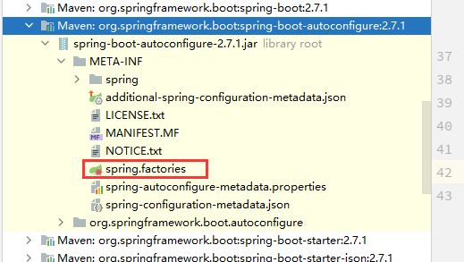
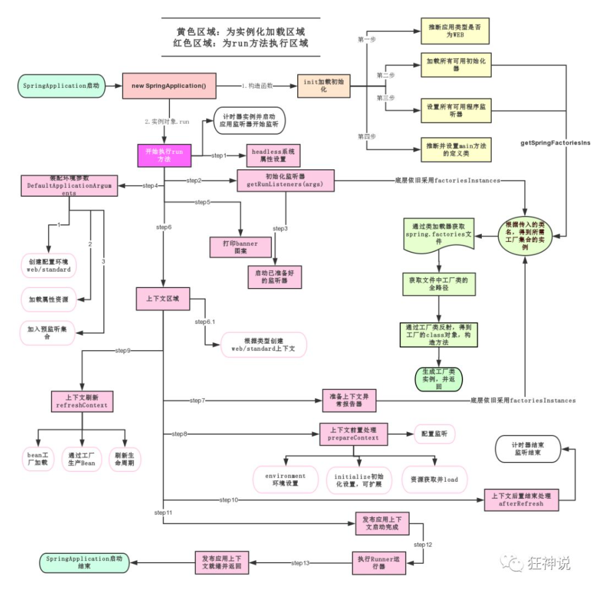
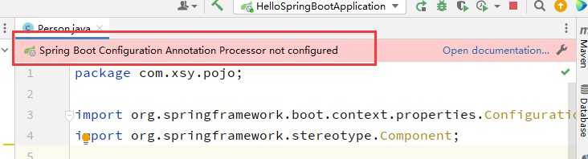
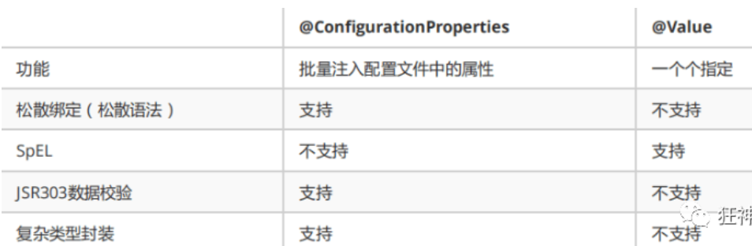
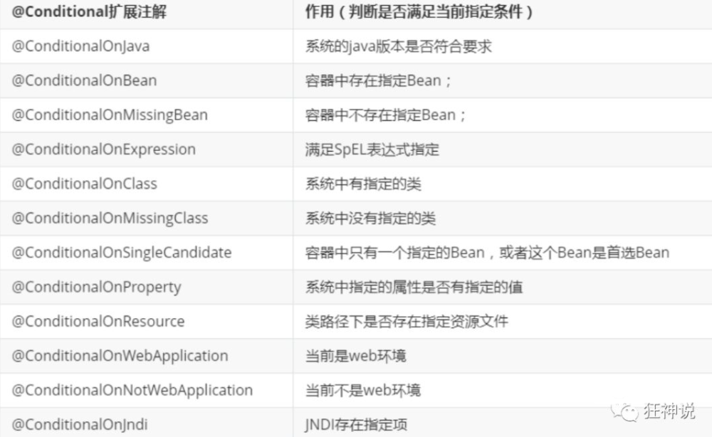
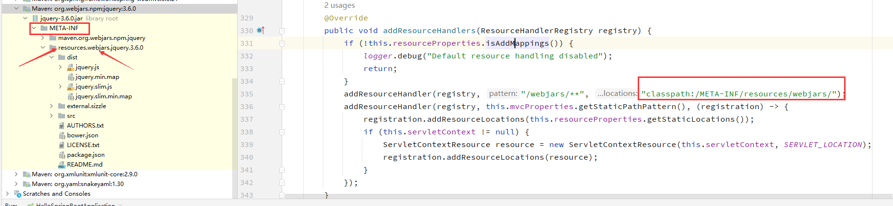
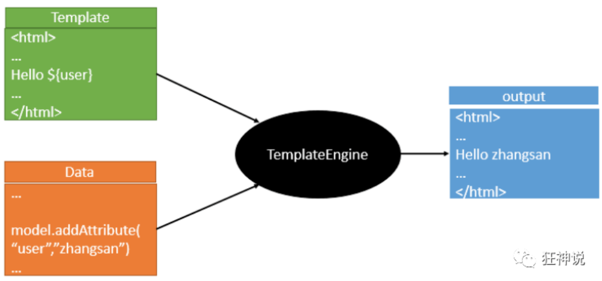
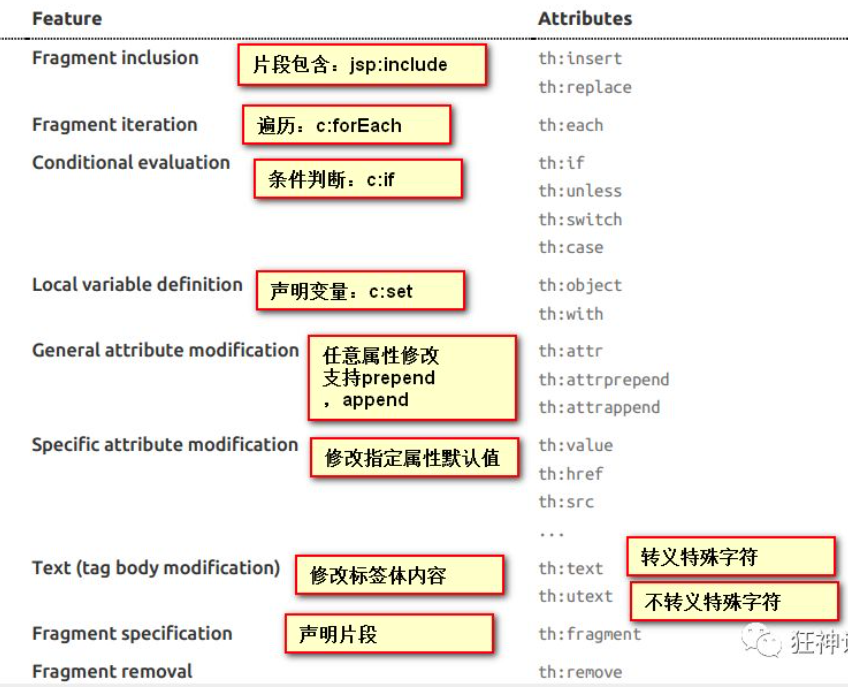
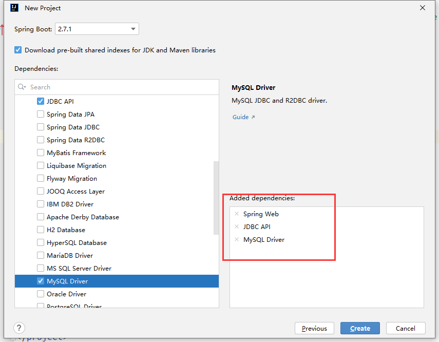

# Springboot

## 1、Springboot简介

### 1.1、回顾spring

- **Spring是为了解决企业级应用开发的复杂性而创建的，简化开发。**

- Spring是如何简化Java开发的

  为了降低Java开发的复杂性，Spring采用了以下4种关键策略：

  1、基于POJO的轻量级和最小侵入性编程，所有东西都是bean；

  2、通过IOC，依赖注入（DI）和面向接口实现松耦合；

  3、基于切面（AOP）和惯例进行声明式编程；

  4、通过切面和模版减少样式代码，RedisTemplate，xxxTemplate；

### 1.2、什么是Springboot

- 就是一个javaweb的开发框架，
- 好处，官方说是简化开发，**约定大于配置**
- Spring Boot 基于 Spring 开发，Spirng Boot 本身并不提供 Spring 框架的核心特性以及扩展功能，只是用于快速、敏捷地开发新一代基于 Spring 框架的应用程序。
- 它并不是用来替代 Spring 的解决方案，而是和 Spring 框架紧密结合用于提升 Spring 开发者体验的工具。
- Spring Boot 以**约定大于配置的核心思想**，默认帮我们进行了很多设置，多数 Spring Boot 应用只需要很少的 Spring 配置。同时它集成了大量常用的第三方库配置（例如 Redis、MongoDB、Jpa、RabbitMQ、Quartz 等等），Spring Boot 应用中这些第三方库几乎可以零配置的开箱即用。
- **Spring Boot的主要优点：**
  - 为所有Spring开发者更快的入门
  - **开箱即用**，提供各种默认配置来简化项目配置
  - **内嵌式容器**（tomcat、jetty）简化Web项目
  - 没有冗余代码生成和XML配置的要求

### 1.3、创建一个springboot项目（两种方法)

> 由于springboot的包扫描机制是启动类所在包及其子包，所以启动类需要放在较外层，否则很容易出现`Whitelabel Error Page`


- 创建maven项目，再导包，再编写启动类，编写控制器测试

  - 创建一个maven项目

  - 导包：spring-boot-start-parent、spring-boot-starter-web、spring-boot-starter-test

    ```xml
    <!-- https://mvnrepository.com/artifact/org.springframework.boot/spring-boot-starter-parent -->
    <dependency>
        <groupId>org.springframework.boot</groupId>
        <artifactId>spring-boot-starter-parent</artifactId>
        <version>2.7.1</version>
        <type>pom</type>
    </dependency>
    <!-- https://mvnrepository.com/artifact/org.springframework.boot/spring-boot-starter-web -->
    <dependency>
        <groupId>org.springframework.boot</groupId>
        <artifactId>spring-boot-starter-web</artifactId>
        <version>2.7.1</version>
    </dependency>
    <!-- https://mvnrepository.com/artifact/org.springframework.boot/spring-boot-starter-test -->
    <dependency>
        <groupId>org.springframework.boot</groupId>
        <artifactId>spring-boot-starter-test</artifactId>
        <version>2.7.1</version>
        <scope>test</scope>
    </dependency>
    ```

    

  - 启动类：注解@SpringBootApplication修饰

    ```java
    package com.xsy;
    
    import org.springframework.boot.SpringApplication;
    import org.springframework.boot.autoconfigure.SpringBootApplication;
    
    @SpringBootApplication
    public class HelloApplication {
        public static void main(String[] args) {
            SpringApplication.run(HelloApplication.class,args);
        }
    }
    ```

    

  - 控制层类：

    ```java
    package com.xsy.controller;
    
    import org.springframework.stereotype.Controller;
    import org.springframework.web.bind.annotation.RequestMapping;
    import org.springframework.web.bind.annotation.ResponseBody;
    
    @Controller
    public class HelloController {
    
        @ResponseBody
        @RequestMapping("/hello")
        public String hello() {
            return "Hello World!";
        }
    }
    ```

    启动HelloApplication类，浏览器访问 http://localhost:8080/hello

    

- 使用SpringBoot Initializr创建项目

  - 新建项目，输入项目名、存放位置、group、artifact、jdk等配置，next

  - 确定springboot版本，选择web下的依赖，create

    

### 1.4、打包项目

- 将项目打成jar包，点击 maven的 package，如果打包成功，则会在target目录下生成一个 jar 包，打成了jar包后，就可以在任何地方运行了！OK

  

## 2、 运行原理（之前的版本，好像现在改了）

### 2.1、pom.xml

- Maven项目，我们一般从pom.xml文件探究起；

  ```xml
  <?xml version="1.0" encoding="UTF-8"?>
  <project xmlns="http://maven.apache.org/POM/4.0.0" xmlns:xsi="http://www.w3.org/2001/XMLSchema-instance"
           xsi:schemaLocation="http://maven.apache.org/POM/4.0.0 https://maven.apache.org/xsd/maven-4.0.0.xsd">
      <modelVersion>4.0.0</modelVersion>
      <parent>
          <groupId>org.springframework.boot</groupId>
          <artifactId>spring-boot-starter-parent</artifactId>
          <version>2.7.1</version>
          <relativePath/> <!-- lookup parent from repository -->
      </parent>
      <groupId>com.xsy</groupId>
      <artifactId>helloSpringBoot</artifactId>
      <version>0.0.1-SNAPSHOT</version>
      <name>helloSpringBoot</name>
      <description>helloSpringBoot</description>
      <properties>
          <java.version>11</java.version>
      </properties>
      <dependencies>
          <dependency>
              <groupId>org.springframework.boot</groupId>
              <artifactId>spring-boot-starter-web</artifactId>
          </dependency>
  
          <dependency>
              <groupId>org.springframework.boot</groupId>
              <artifactId>spring-boot-starter-test</artifactId>
              <scope>test</scope>
          </dependency>
      </dependencies>
  
      <build>
          <plugins>
              <plugin>
                  <groupId>org.springframework.boot</groupId>
                  <artifactId>spring-boot-maven-plugin</artifactId>
              </plugin>
          </plugins>
      </build>
  
  </project>
  ```

  - **父依赖**

    ```xml
    <parent>
        <groupId>org.springframework.boot</groupId>
        <artifactId>spring-boot-starter-parent</artifactId>
        <version>2.2.5.RELEASE</version>
        <relativePath/> <!-- lookup parent from repository -->
    </parent>
    ```

    点进去，发现还有一个父依赖

    ```xml
    <parent>
        <groupId>org.springframework.boot</groupId>
        <artifactId>spring-boot-dependencies</artifactId>
        <version>2.2.5.RELEASE</version>
        <relativePath>../../spring-boot-dependencies</relativePath>
    </parent>
    ```

    这里才是真正管理SpringBoot应用里面所有依赖版本的地方，SpringBoot的版本控制中心；

    **以后我们导入依赖默认是不需要写版本；但是如果导入的包没有在依赖中管理着就需要手动配置版本了；**

    - 所以是因为spring boot 这个maven项目集成了spring-boot-starter-parent,这个parent有继承了**spring-boot-dependencies**才可以不用写版本，使用默认的版本。

    - spring-boot-starter-parent里面配置了资源管理器、插件管理器、版本（可通过properties覆盖默认配置）

      

  - **启动器 spring-boot-starter**

    ```xml
    <dependency>
        <groupId>org.springframework.boot</groupId>
        <artifactId>spring-boot-starter-web</artifactId>
    </dependency>
    ```

    **springboot-boot-starter-xxx**：就是spring-boot的**场景启动器**

    **spring-boot-starter-web**：开启web这个场景，帮我们导入了web模块正常运行所依赖的组件；

    SpringBoot将所有的功能场景都抽取出来，做成 一个个的starter （启动器），只需要在项目中引入这些starter即可，所有相关的依赖都会导入进来 ， **我们要用什么功能就导入什么样的场景启动器即可** ；我们未来也可以自己自定义 starter；

### 2.2、主启动类

- **主启动类**

  ```java
  //@SpringBootApplication 来标注一个主程序类
  //说明这是一个Spring Boot应用
  @SpringBootApplication
  public class SpringbootApplication {
  
     public static void main(String[] args) {
       //以为是启动了一个方法，没想到启动了一个服务
        SpringApplication.run(SpringbootApplication.class, args);
     }
  }
  ```

#### 2.2.1、注解@SpringBootApplication

  - @SpringBootApplication（组合注解）

    作用：标注在某个类上，说明这个类是SpringBoot的主配置类 ， SpringBoot就应该运行这个类的main方法来启动SpringBoot应用；

    进入这个注解：可以看到上面还有其他注解！**@SpringBootApplication上集成了@SpringBootConfiguration、@EnableAutoConfiguration、@ComponentScan注解**

    ```java
    @SpringBootConfiguration
    @EnableAutoConfiguration
    @ComponentScan(
        excludeFilters = {@Filter(
        type = FilterType.CUSTOM,
        classes = {TypeExcludeFilter.class}
    ), @Filter(
        type = FilterType.CUSTOM,
        classes = {AutoConfigurationExcludeFilter.class}
    )}
    )
    public @interface SpringBootApplication {
        // ......
    }
    ```

    - @ComponentScan

      这个注解在Spring中很重要 ,它对应XML配置中的元素。

      作用：自动扫描并加载符合条件的组件或者bean ， 将这个bean定义加载到IOC容器中

    - @SpringBootConfiguration

      作用：SpringBoot的配置类 ，标注在某个类上 ， 表示这是一个SpringBoot的配置类；

      我们继续进去这个注解查看

      ```java
      // 点进去得到下面的 @Component
      @Configuration
      public @interface SpringBootConfiguration {}
      
      @Component
      public @interface Configuration {}
      ```

      这里的 @Configuration，说明这是一个配置类 ，配置类就是对应Spring的xml 配置文件；（详见Spring框架）

      里面的 @Component 这就说明，启动类本身也是Spring中的一个组件而已，负责启动应用！

      我们回到 SpringBootApplication 注解中继续看。

    - @EnableAutoConfiguration

      **@EnableAutoConfiguration ：开启自动配置功能**

      以前我们需要自己配置的东西，而现在SpringBoot可以自动帮我们配置 ；@EnableAutoConfiguration告诉SpringBoot开启自动配置功能，这样自动配置才能生效；

      点进注解接续查看：

      ```java
      @AutoConfigurationPackage
      @Import(AutoConfigurationImportSelector.class)		
      public @interface EnableAutoConfiguration {...}
      ```

      - **@AutoConfigurationPackage ：自动配置包**

        ```java
        @Import({Registrar.class})			// 导入了选择器
        public @interface AutoConfigurationPackage {
        }
        ```

        **@import** ：Spring底层注解@import ， 给容器中导入一个组件

        Registrar.class 作用：将主启动类的所在包及包下面所有子包里面的所有组件扫描到Spring容器 ；（扫描主启动器所在的包，包括子包）

      - **@Import({AutoConfigurationImportSelector.class}) ：给容器导入组件 ；**

        AutoConfigurationImportSelector ：自动配置导入选择器，那么它会导入哪些组件的选择器呢？我们点击去这个类看源码：

        ```java
        // AutoConfigurationImportSelector中的方法：获得候选的配置
        protected List<String> getCandidateConfigurations(AnnotationMetadata metadata, AnnotationAttributes attributes) {
            //这里的getSpringFactoriesLoaderFactoryClass（）方法
            //返回的就是我们最开始看的启动自动导入配置文件的注解类；EnableAutoConfiguration
            List<String> configurations = SpringFactoriesLoader.loadFactoryNames(this.getSpringFactoriesLoaderFactoryClass(), this.getBeanClassLoader());
            Assert.notEmpty(configurations, "No auto configuration classes found in META-INF/spring.factories. If you are using a custom packaging, make sure that file is correct.");
            return configurations;
        }
        ```
        - 这个方法又调用了  SpringFactoriesLoader 类的静态方法！我们进入SpringFactoriesLoader类loadFactoryNames() 方法

          ```java
          public static List<String> loadFactoryNames(Class<?> factoryClass, @Nullable ClassLoader classLoader) {
              String factoryClassName = factoryClass.getName();
              //这里它又调用了 loadSpringFactories 方法
              return (List)loadSpringFactories(classLoader).getOrDefault(factoryClassName, Collections.emptyList());
          }
          ```

          - 我们继续点击查看 loadSpringFactories 方法

            ```java
            private static Map<String, List<String>> loadSpringFactories(@Nullable ClassLoader classLoader) {
                //获得classLoader ， 我们返回可以看到这里得到的就是EnableAutoConfiguration标注的类本身
                MultiValueMap<String, String> result = (MultiValueMap)cache.get(classLoader);
                if (result != null) {
                    return result;
                } else {
                    try {
                        //去获取一个资源 "META-INF/spring.factories"
                        Enumeration<URL> urls = classLoader != null ? classLoader.getResources("META-INF/spring.factories") : ClassLoader.getSystemResources("META-INF/spring.factories");
                        LinkedMultiValueMap result = new LinkedMultiValueMap();
            
                        //将读取到的资源遍历，封装成为一个Properties
                        while(urls.hasMoreElements()) {
                            URL url = (URL)urls.nextElement();
                            UrlResource resource = new UrlResource(url);
                            Properties properties = PropertiesLoaderUtils.loadProperties(resource);
                            Iterator var6 = properties.entrySet().iterator();
            
                            while(var6.hasNext()) {
                                Entry<?, ?> entry = (Entry)var6.next();
                                String factoryClassName = ((String)entry.getKey()).trim();
                                String[] var9 = StringUtils.commaDelimitedListToStringArray((String)entry.getValue());
                                int var10 = var9.length;
            
                                for(int var11 = 0; var11 < var10; ++var11) {
                                    String factoryName = var9[var11];
                                    result.add(factoryClassName, factoryName.trim());
                                }
                            }
                        }
            
                        cache.put(classLoader, result);
                        return result;
                    } catch (IOException var13) {
                        throw new IllegalArgumentException("Unable to load factories from location [META-INF/spring.factories]", var13);
                    }
                }
            }
            ```

            - **spring.factories**:里面是一些默认配置好的东西，包括一些场景需要的依赖。**这个文件里面的类全名对应的类都是spring的javaConfig形式的配置文件（也就是一个个@Component注解和@Bean修饰的类）（一个Component修饰的类就等于一个spring xml配置文件）**，但里面的东西并不是加载，需要符合特定条件（ConditionalOnClass+条件）（开启特定场景）才能被加载

              

          

- 所以，自动配置真正实现是从classpath中搜寻所有的META-INF/spring.factories配置文件 ，并将其中对应的 org.springframework.boot.autoconfigure. 包下的配置项，通过反射实例化为对应标注了 @Configuration的JavaConfig形式的IOC容器配置类 ， 然后将这些都汇总成为一个实例并加载到IOC容器中。

- **结论：**

  1. SpringBoot在启动的时候从类路径下的META-INF/spring.factories中获取EnableAutoConfiguration指定的值
  2. 将这些值作为自动配置类导入容器 ， 自动配置类就生效 ， 帮我们进行自动配置工作；
  3. 整个J2EE的整体解决方案和自动配置都在springboot-autoconfigure的jar包中；
  4. 它会给容器中导入非常多的自动配置类 （xxxAutoConfiguration）, 就是给容器中导入这个场景需要的所有组件 ， 并配置好这些组件 ；
  5. 有了自动配置类 ， 免去了我们手动编写配置注入功能组件等的工作；

  

#### 2.2.2、run方法

分析该方法主要分两部分，一部分是SpringApplication的实例化，二是run方法的执行；

- SpringApplication，这个类主要做了以下四件事情：

  1、推断应用的类型是普通的项目还是Web项目

  2、查找并加载所有可用初始化器 ， 设置到initializers属性中

  3、找出所有的应用程序监听器，设置到listeners属性中

  4、推断并设置main方法的定义类，找到运行的主类

  ```java
  public SpringApplication(ResourceLoader resourceLoader, Class... primarySources) {
      // ......
      this.webApplicationType = WebApplicationType.deduceFromClasspath();
      this.setInitializers(this.getSpringFactoriesInstances();
      this.setListeners(this.getSpringFactoriesInstances(ApplicationListener.class));
      this.mainApplicationClass = this.deduceMainApplicationClass();
  }
  ```

  

- run方法执行

  

## 3、SpringBoot配置

### 3.1 配置文件

- SpringBoot使用**一个全局的配置文件 ， 配置文件名称是固定的**
  - application.properties
    - 语法结构 ：`key=value`

  - application.yml
    - 语法结构 ：`key：空格value`

- **配置文件的作用 ：**修改SpringBoot自动配置的默认值，因为SpringBoot在底层都给我们自动配置好了；

比如我们可以在配置文件中修改Tomcat 默认启动的端口号！测试一下！`server.port=8081`

### 3.2、yaml配置文件

- **这种语言以数据作为中心，而不是以标记语言为重点！**

- 比如一个简单的端口配置，我们来对比下yaml和xml

  - xml

    ```xml
    <server>
        <port>8081<port>
    </server>
    ```

    

  - yaml

    ```yaml
    server:
        port: 8081
    ```

    

#### 3.2.1、yaml语法

说明：语法要求严格！

1、空格不能省略

2、以缩进来控制层级关系，**只要是左边对齐的一列数据都是同一个层级的，并没有指定必须空多少个，只要对齐了就是同一级**。

3、属性和值的**大小写敏感**的。

- **字面量：普通的值  [ 数字，布尔值，字符串  ]**

  ```yaml
  key: value
  ```

  注意：

  - **“ ” 双引号，不会转义字符串里面的特殊字符 ， 特殊字符会作为本身想表示的意思，也就是如果要用换行符的作用，就要用双引号**；

    比如 ：name: "kuang \n shen"  输出 ：kuang  换行  shen

  - **'' 单引号，会转义特殊字符 ， 特殊字符最终会变成和普通字符一样输出**

    比如 ：name: ‘kuang \n shen’  输出 ：kuang  \n  shen

- **对象、Map（键值对）**

  ```yaml
  # 写法1
  key:
      key1: value1
      key2: value2
      
  # 写法2：行内写法
  key: {key1: value1,key2: value2}		# 逗号分隔，逗号后没有空格
  ```

  

- **数组（ List、set ）**：用 - 值表示数组中的一个元素,比如：

  ```yaml
  # 写法一
  key:
    - value1
    - vlaue2
    - value3
  
  # 写法二：行内写法，逗号分隔，逗号后没空格
  key: [key1,key2,key3]
  ```

  

#### 3.2.2、使用yaml文件实现属性注入

**yaml文件更强大的地方在于，他可以给我们的实体类直接注入匹配值！**

- 在springboot项目中的resources目录下新建一个文件 application.yml

- 以前的方法：先编写一个实体类 Dog；再通过@value和@Autowired注解实现注入属性值

  ```java
  // Dog.java
  @Component //注册bean
  public class Dog {
      @Value("阿黄")
      private String name;
      @Value("18")
      private Integer age;
  }
  
  
  // DemoApplicationTests.java
  @SpringBootTest
  class DemoApplicationTests {
  
      @Autowired //将狗狗自动注入进来
      Dog dog;
  
      @Test
      public void contextLoads() {
          System.out.println(dog); //打印看下狗狗对象
      }
  
  }
  ```

  

- yaml的方法：

  - 编写pojo类

    ```java
    @Component //注册bean到容器中
    public class Person {
        private String name;
        private Integer age;
        private Boolean happy;
        private Date birth;
        private Map<String,Object> maps;
        private List<Object> lists;
        private Dog dog;
        
        //有参无参构造、get、set方法、toString()方法  
    }
    ```

    

  - 编写springboot项目的application.yaml文件

    ```yaml
    person:
      name: qinjiang
      age: 3
      happy: false
      birth: 2000/01/01
      maps: {k1: v1,k2: v2}
      lists:
       - code
       - girl
       - music
      dog:
        name: 旺财
        age: 1
    ```

    - **注意：**将配置文件的key 值 和 属性的值设置为不一样，则结果输出为null，注入失败

  - 通过@ConfigurationProperties注解注入属性

    ```java
    
    /*
    @ConfigurationProperties作用：
    将配置文件中配置的每一个属性的值，映射到这个组件中；
    告诉SpringBoot将本类中的所有属性和配置文件中相关的配置进行绑定
    参数 prefix = “person” : 将配置文件中的person下面的所有属性一一对应
    */
    @Component //注册bean
    @ConfigurationProperties(prefix = "person")
    public class Person {
        private String name;
        private Integer age;
        private Boolean happy;
        private Date birth;
        private Map<String,Object> maps;
        private List<Object> lists;
        private Dog dog;
    }
    ```

    这个时候通常会提示：Springboot配置注解处理器没有配置。

    

  - 配置SpringBoot注解处理器（在配置文件中导入配置处理器依赖）

    ```xml
    <dependency>
        <groupId>org.springframework.boot</groupId>
        <artifactId>spring-boot-configuration-processor</artifactId>
        <optional>true</optional>
    </dependency>
    ```

    

  - 编写测试类进行测试

    ```java
    @SpringBootTest
    class HelloSpringBootApplicationTests {
        @Autowired
        Person person;
        
        @Test
        void contextLoads() {
            System.out.println(person);
        }
    }
    ```

    

#### 3.2.3、加载指定的配置文件

- @PropertySource：加载指定的配置文件
- @ConfigurationProperties：默认从全局配置文件中获取值


- 我们去在resources目录下新建一个person.properties文件

  ```properties
  name=小十一
  ```

  

- 然后在我们的代码中指定加载person.properties文件

  ```java
  @PropertySource(value = "classpath:person.properties")
  @Component //注册bean
  public class Person {
  
      @Value("${name}")
      private String name;
      ......  
  }
  ```


3.2.4、配置文件占位符

配置文件还可以编写占位符生成随机数

```yaml
# application.yaml

person:
    name: 小十一-${random.uuid} # 随机uuid
    age: ${random.int}  # 随机int
    happy: false
    birth: 2000/01/01
    maps: {k1: v1,k2: v2}
    lists:
      - code
      - girl
      - music
    dog:
      name: ${person.hello:other}_旺财
      age: 1
```

3.3、对比

- @Value这个使用起来并不友好！我们需要为每个属性单独注解赋值，比较麻烦；我们来看个功能对比图

  

  - @ConfigurationProperties只需要写一次即可 ， @Value则需要每个字段都添加
  - 松散绑定：这个什么意思呢? 比如我的yml中写的last-name，这个和lastName是一样的， **- 后面跟着的字母默认是大写的**。这就是松散绑定。可以测试一下
  - JSR303数据校验 ， 这个就是我们可以在字段是增加一层过滤器验证 ， 可以保证数据的合法性
  - 复杂类型封装，yml中可以封装对象 ， 使用value就不支持

## 4、JSR303数据验证

Springboot中可以用@validated来校验数据，如果数据异常则会统一抛出异常，方便异常中心统一处理。(需要导入响应的包)

```java
import org.springframework.validation.annotation.Validated;
import javax.validation.constraints.Email;


@Component //注册bean
@ConfigurationProperties(prefix = "person")
@Validated  //数据校验
public class Person {
    @Email(message="邮箱格式错误") //name必须是邮箱格式
    private String name;
}
```

### 4.1、常见的数据验证

```java

@NotNull(message="名字不能为空")
private String userName;
@Max(value=120,message="年龄最大不能超过120")
private int age;
@Email(message="邮箱格式错误")
private String email;

空检查
@Null       验证对象是否为null
@NotNull    验证对象是否不为null, 无法查检长度为0的字符串
@NotBlank   检查约束字符串是不是Null还有被Trim的长度是否大于0,只对字符串,且会去掉前后空格.
@NotEmpty   检查约束元素是否为NULL或者是EMPTY.
    
Booelan检查
@AssertTrue     验证 Boolean 对象是否为 true  
@AssertFalse    验证 Boolean 对象是否为 false  
    
长度检查
@Size(min=, max=) 验证对象（Array,Collection,Map,String）长度是否在给定的范围之内  
@Length(min=, max=) string is between min and max included.

日期检查
@Past       验证 Date 和 Calendar 对象是否在当前时间之前  
@Future     验证 Date 和 Calendar 对象是否在当前时间之后  
@Pattern    验证 String 对象是否符合正则表达式的规则

.......等等
除此以外，我们还可以自定义一些数据校验规则
```


## 5、多环境切换

profile是Spring对不同环境提供不同配置功能的支持，可以通过激活不同的环境版本，实现快速切换环境；

### 5.1、properties版本的多配置切换

我们在主配置文件编写的时候，文件名可以是 application-{profile}.properties/yml , 用来指定多个环境版本；

**例如：**

​	application-test.properties 代表测试环境配置

​	application-dev.properties 代表开发环境配置

但是Springboot并不会直接启动这些配置文件，它**默认使用application.properties主配置文件；我们需要通过一个配置来选择需要激活的环境**：

```properties
#比如在配置文件中指定使用dev环境，我们可以通过设置不同的端口号进行测试；
#我们启动SpringBoot，就可以看到已经切换到dev下的配置了；
spring.profiles.active=dev
```


### 5.2、yaml版本的多配置切换

通过`---`分割多个配置环境

```yaml
server:
  port: 8081
#选择要激活那个环境块
spring:
  profiles:
    active: prod

---
server:
  port: 8083
spring:
  profiles: dev #配置环境的名称


---
server:
  port: 8084
spring:
  profiles: prod  #配置环境的名称
```

**注意：如果yml和properties同时都配置了端口，并且没有激活其他环境 ， 默认会使用properties配置文件的！**

### 5.3、配置文件的加载位置

- springboot 启动会扫描以下位置的application.properties或者application.yml文件作为Spring boot的默认配置文件，（优先级顺序，扫描的倒序，在后面扫描的会覆盖前面，也就是优先级高的覆盖优先级低的）：
  - **项目路径下**的config文件夹配置文件（优先级最高）
  - 项目路径下配置文件
  - 资源路径下的config文件夹配置文件
  - 资源路径下配置文件

  高优先级的配置会覆盖低优先级的配置；

- 指定位置加载配置文件

  我们还可以通过`spring.config.location`选项来改变默认的配置文件位置

  项目打包好以后，我们可以使用**命令行参数**的形式，启动项目的时候来指定配置文件的新位置；这种情况，一般是后期运维做的多，相同配置，**外部指定的配置文件优先级最高**

  ```shell
  java -jar spring-boot-config.jar --spring.config.location=F:/application.properties
  ```

  

## 6、自动配置原理

配置文件到底能写什么？怎么写？

### 6.1、分析自动配置原理

我们以**HttpEncodingAutoConfiguration（Http编码自动配置）**为例解释自动配置原理；

```java
//表示这是一个配置类，和以前编写的配置文件一样，也可以给容器中添加组件；
@Configuration 		// 有了这个注解，然后开启了包扫描的话，会把这个对象变成bean放在IOC容器中

//启动指定类的ConfigurationProperties功能；
//进入这个HttpProperties查看，将配置文件中对应的值和HttpProperties绑定起来；
//HttpProperties这个类通常使用@ConfigurationProperties修饰，会用yaml中的属性值进行属性注入，并加入到ioc容器中
@EnableConfigurationProperties({HttpProperties.class}) 

//Spring底层@Conditional注解
//根据不同的条件判断，如果满足指定的条件，整个配置类里面的配置就会生效；
//这里的意思就是判断当前应用是否是web应用，如果是，当前配置类生效
@ConditionalOnWebApplication(
    type = Type.SERVLET
)

//判断当前项目有没有这个类CharacterEncodingFilter；SpringMVC中进行乱码解决的过滤器；
@ConditionalOnClass({CharacterEncodingFilter.class})

//判断配置文件中是否存在某个配置：spring.http.encoding.enabled；
//如果不存在，判断也是成立的
//即使我们配置文件中不配置pring.http.encoding.enabled=true，也是默认生效的；
@ConditionalOnProperty(
    prefix = "spring.http.encoding",
    value = {"enabled"},
    matchIfMissing = true
)

public class HttpEncodingAutoConfiguration {
    //这个对象通过@ConfigurationProperties和SpringBoot的配置文件映射了
    private final Encoding properties;
    //只有一个有参构造器的情况下，参数的值就会从容器中拿
    public HttpEncodingAutoConfiguration(HttpProperties properties) {
        this.properties = properties.getEncoding();
    }
    
    //给容器中添加一个组件，这个组件的某些值需要从properties中获取
    @Bean
    @ConditionalOnMissingBean //判断容器没有这个组件？
    public CharacterEncodingFilter characterEncodingFilter() {
        CharacterEncodingFilter filter = new OrderedCharacterEncodingFilter();
        filter.setEncoding(this.properties.getCharset().name());
        filter.setForceRequestEncoding(this.properties.shouldForce(org.springframework.boot.autoconfigure.http.HttpProperties.Encoding.Type.REQUEST));
        filter.setForceResponseEncoding(this.properties.shouldForce(org.springframework.boot.autoconfigure.http.HttpProperties.Encoding.Type.RESPONSE));
        return filter;
    }
    //...
}
```

**一句话总结 ：根据当前不同的条件判断，决定这个配置类是否生效！**

- 一但这个配置类生效；这个配置类就会给容器中添加各种组件；
- 这些组件的属性是从对应的properties类中获取的，这些类里面的每一个属性又是和配置文件绑定的；
- 所有在配置文件中能配置的属性都是在xxxxProperties类中封装着；
- 配置文件能配置什么就可以参照某个功能对应的这个属性类(`XXXProperties`类)

```java
//从配置文件中获取指定的值和bean的属性进行绑定
@ConfigurationProperties(prefix = "spring.http") 
public class HttpProperties {
    // .....
}
```

==精髓==

1、SpringBoot启动会加载大量的自动配置类

2、查看需要的功能有没有在SpringBoot默认写好的自动配置类当中；

3、我们再来看这个自动配置类中到底配置了哪些组件；（只要我们要用的组件存在在其中，我们就不需要再手动配置了）

4、给容器中自动配置类添加组件的时候，会从properties类中获取某些属性。我们只需要在配置文件中指定这些属性的值即可；

​	**xxxxAutoConfigurartion：自动配置类；**根据条件，给容器中添加组件（需要开启对应的starter场景）

​	**xxxxProperties:封装配置文件中相关属性；**

### 6.2、@Conditional

自动配置类必须在一定的条件下才能生效；

- **@Conditional派生注解（Spring注解版原生的@Conditional作用）**

  - 作用：必须是@Conditional指定的条件成立，才给容器中添加组件，配置配里面的所有内容才生效；

    

- **我们可以通过在配置文件中**

- **启用 debug=true属性；来让控制台打印自动配置报告，这样我们就可以很方便的知道哪些自动配置类生效；**

  ```properties
  #开启springboot的调试类
  debug=true
  ```

  - Positive matches:（自动配置类启用的：正匹配）

  - Negative matches:（没有启动，没有匹配成功的自动配置类：负匹配）

  - Unconditional classes: （没有条件的类）

    

## 7、静态资源路径

在`WebMvcAutoConfiguration.java`中有一个静态内部类`WebMvcConfiguationAdapter`，里面有一个方法`addResourceHandlers`

```java
public void addResourceHandlers(ResourceHandlerRegistry registry) {
    // 如果在配置文件中配置了spring.mvc.staticPathPattern（对应WebMvcProperties类中属性），就直接返回，不使用默认的资源处理器
    // 需要自己编写对应的资源处理器才可以
    if (!this.resourceProperties.isAddMappings()) {		
        logger.debug("Default resource handling disabled");
        return;
    }
    // 添加资源处理器，web访问路径（http://localhost:8080/webjars/*.js），资源存放路径
    addResourceHandler(registry, "/webjars/**", "classpath:/META-INF/resources/webjars/");	
    // 添加资源处理器，web访问路径，资源存放路径
    // this.mvcProperties.getStaticPathPattern()就是：	/**
    // this.resourceProperties.getStaticLocations()就是："classpath:/META-INF/resources/","classpath:/resources/", "classpath:/static/", "classpath:/public/" 
    addResourceHandler(registry, this.mvcProperties.getStaticPathPattern(), (registration) -> {
        registration.addResourceLocations(this.resourceProperties.getStaticLocations());
        if (this.servletContext != null) {
            ServletContextResource resource = new ServletContextResource(this.servletContext, SERVLET_LOCATION);
            registration.addResourceLocations(resource);
        }
    });
}
```

- 如果在配置文件中配置了spring.mvc.staticPathPattern（对应WebMvcProperties类中属性），就直接返回，不使用默认的资源处理器

- webjars网站里面有web静态资源对应的maven依赖jar包。例如jquery库就对应了pom.xml中的依赖：

  ```xml
  <dependency>
      <groupId>org.webjars.npm</groupId>
      <artifactId>jQuery</artifactId>
      <version>1.7.4</version>
  </dependency>
  ```

  
  - 把`classpath:/META-INF/resources/webjars/`目录下的东西映射到前端路径`/webjars/`
  - 所以访问路径是`http://localhost:8080/webjars/juery/3.6.0/dist/jquery.js`就可以访问到对应的js文件

- 第12行代码是在把静态资源路径（`classpath:/META-INF/resources/`,`classpath:/resources/`, `classpath:/static/`, `classpath:/public/` ）映射到前端路径`/`

  - 路径优先级：`classpath:/resources/`>`classpath:/static/`>`classpath:/public/`,

## 8、模板引擎

jsp也是模板引擎、freemark

thymeleaf模板引擎

### 8.1、thymeleaf 模板引擎

- 前端交给我们的页面，是html页面。如果是我们以前开发，我们需要把他们转成jsp页面，jsp好处就是当我们查出一些数据转发到JSP页面以后，我们可以用jsp轻松实现数据的显示，及交互等。

- 但是SpringBoot这个项目首先是以jar的方式，不是war；第二，我们用的还是嵌入式的Tomcat，所以**springboot现在默认是不支持jsp的**。

**SpringBoot推荐你可以来使用模板引擎：**

- 模板引擎，我们其实大家听到很多，其实jsp就是一个模板引擎，还有用的比较多的freemarker，包括SpringBoot给我们推荐的Thymeleaf。模板引擎的思想都是一样的：

  

  - 数据和页面分离，通过模板引擎渲染到一起


### 8.1.1、导入Thymeleaf

对于springboot来说，任何事情都是一个start的事情。

```xml
<!-- https://mvnrepository.com/artifact/org.springframework.boot/spring-boot-starter-thymeleaf -->
<dependency>
    <groupId>org.springframework.boot</groupId>
    <artifactId>spring-boot-starter-thymeleaf</artifactId>
    <version>2.7.1</version>
</dependency>
```

导入之后，查看`ThymeleafProperties`类

```java
@ConfigurationProperties(
    prefix = "spring.thymeleaf"
)
public class ThymeleafProperties {
    private static final Charset DEFAULT_ENCODING;
    public static final String DEFAULT_PREFIX = "classpath:/templates/";
    public static final String DEFAULT_SUFFIX = ".html";
    private boolean checkTemplate = true;
    private boolean checkTemplateLocation = true;
    private String prefix = "classpath:/templates/";
    private String suffix = ".html";
    private String mode = "HTML";
    private Charset encoding;
}
```

我们可以在其中看到默认的前缀和后缀！(相当于是一个**视图解析器**)

我们只需要把我们的**html页面放在类路径下的templates下，thymeleaf就可以帮我们自动渲染了**。

使用thymeleaf什么都不需要配置，只需要将他放在指定的文件夹下即可！

### 8.1.2、测试Thymeleaf

- 编写controller

  ```java
  @Controller
  public class HelloController {
      @RequestMapping("/t1")
      public String test1(){
          //classpath:/templates/test.html
          return "test";		// 解析这个返回结果，加上前后缀
      }
  }
  ```

  - 资源实际存放位置是：classpath:/templates/test.html

- 编写test.html

  ```html
  <!DOCTYPE html>
  <html lang="en">
  <head>
      <meta charset="UTF-8">
      <title>Title</title>
  </head>
      <body>
      	<h1>Thymeleaf</h1>
      </body>
  </html>
  ```

  - 访问`http://localhost:8080/t1`

8.2、Thymeleaf语法

[Thymeleaf 官网](https://www.thymeleaf.org/ )

### 8.2.1、数据传输入门测试

- controller层

  - controller还是使用Model类来传输数据，跟Spring mvc一样

    ```jvaa
    
    @RequestMapping("/t1")
    public String test1(Model model){
        //存入数据
        model.addAttribute("msg","Hello,Thymeleaf");
        //classpath:/templates/test.html
        return "test";
    }
    ```

    

- html文件

  - 必须加入thymeleaf的命名空间`xmlns:th="http://www.thymeleaf.org"`

    ```html
    <!DOCTYPE html>
    <html lang="en" xmlns:th="http://www.thymeleaf.org">
    <head>
        <meta charset="UTF-8">
        <title>狂神说</title>
    </head>
    <body>
    <h1>测试页面</h1>
    
    <!--th:text就是将div中的内容设置为它指定的值，和之前学习的Vue一样-->
    <div th:text="${msg}"></div>
    </body>
    </html>
    ```

    - HTML中的元素（标签节点，文本节点）都可以被thymeleaf接管，使用`th:元素名`替换原来的元素。

### 8.2.2、语法学习

- 我们可以使用任意的 **th:attr** 来替换Html中原生属性的值！

  

- 表达式

  - 简单表达式
    - 变量表达式：`${...}`
    - 选择变量表达式：`*{...}`
    - 消息表达式：`#{...}`
    - 连接URL表达式：`@{...}`
    - 分段表达式：`~{...}`
  - 

  ```jsp
  Simple expressions:（表达式语法）
  Variable Expressions: ${...}：获取变量值；OGNL；
      1）、获取对象的属性、调用方法
      2）、使用内置的基本对象：#18
           #ctx : the context object.
           #vars: the context variables.
           #locale : the context locale.
           #request : (only in Web Contexts) the HttpServletRequest object.
           #response : (only in Web Contexts) the HttpServletResponse object.
           #session : (only in Web Contexts) the HttpSession object.
           #servletContext : (only in Web Contexts) the ServletContext object.
  
      3）、内置的一些工具对象：
  　　　　　　#execInfo : information about the template being processed.
  　　　　　　#uris : methods for escaping parts of URLs/URIs
  　　　　　　#conversions : methods for executing the configured conversion service (if any).
  　　　　　　#dates : methods for java.util.Date objects: formatting, component extraction, etc.
  　　　　　　#calendars : analogous to #dates , but for java.util.Calendar objects.
  　　　　　　#numbers : methods for formatting numeric objects.
  　　　　　　#strings : methods for String objects: contains, startsWith, prepending/appending, etc.
  　　　　　　#objects : methods for objects in general.
  　　　　　　#bools : methods for boolean evaluation.
  　　　　　　#arrays : methods for arrays.
  　　　　　　#lists : methods for lists.
  　　　　　　#sets : methods for sets.
  　　　　　　#maps : methods for maps.
  　　　　　　#aggregates : methods for creating aggregates on arrays or collections.
  ==================================================================================
  
    Selection Variable Expressions: *{...}：选择表达式：和${}在功能上是一样；
    Message Expressions: #{...}：获取国际化内容
    Link URL Expressions: @{...}：定义URL；
    Fragment Expressions: ~{...}：片段引用表达式
  
  Literals（字面量）
        Text literals: 'one text' , 'Another one!' ,…
        Number literals: 0 , 34 , 3.0 , 12.3 ,…
        Boolean literals: true , false
        Null literal: null
        Literal tokens: one , sometext , main ,…
        
  Text operations:（文本操作）
      String concatenation: +
      Literal substitutions: |The name is ${name}|
      
  Arithmetic operations:（数学运算）
      Binary operators: + , - , * , / , %
      Minus sign (unary operator): -
      
  Boolean operations:（布尔运算）
      Binary operators: and , or
      Boolean negation (unary operator): ! , not
      
  Comparisons and equality:（比较运算）
      Comparators: > , < , >= , <= ( gt , lt , ge , le )
      Equality operators: == , != ( eq , ne )
      
  Conditional operators:条件运算（三元运算符）
      If-then: (if) ? (then)
      If-then-else: (if) ? (then) : (else)
      Default: (value) ?: (defaultvalue)
      
  Special tokens:
      No-Operation: _
  ```

  

- th:each演示

  - controller存放数据

    ```java
    @RequestMapping("/t2")
    public String test2(Map<String,Object> map){
        //存入数据
        map.put("msg","<h1>Hello</h1>");
        map.put("users", Arrays.asList("qinjiang","kuangshen"));
        //classpath:/templates/test.html
        return "test";
    }
    ```

    

  - html页面使用数据

    ```html
    <!DOCTYPE html>
    <html lang="en" xmlns:th="http://www.thymeleaf.org">
    <head>
        <meta charset="UTF-8">
        <title>狂神说</title>
    </head>
    <body>
    <h1>测试页面</h1>
    
    <div th:text="${msg}"></div>		<!--因为尖括号标签什么的都被转义了，所以原样输出：<h1>Hello</h1>-->
    <!--不转义-->
    <div th:utext="${msg}"></div>		<!--因为尖括号标签什么的没有被转义，所以按照h1标签生效的方式输出：Hello-->
    
    <!--遍历数据-->
    <!--th:each每次遍历都会生成当前这个标签：官网#9-->
    <h4 th:each="user :${users}" th:text="${user}"></h4>
    
    <h4>
        <!--行内写法：官网#12-->
        <span th:each="user:${users}">[[${user}]]</span>
    </h4>
    
    </body>
    </html>
    ```


9、自定义Starter

- 启动器模块是一个 **空 jar 文件**，仅提供辅助性依赖管理，这些依赖可能用于自动装配或者其他类库；

- **命名归约：**

  官方命名：

  - 前缀：spring-boot-starter-xxx
  - 比如：spring-boot-starter-web....

  自定义命名：

  - xxx-spring-boot-starter
  - 比如：mybatis-spring-boot-starter

- 


## 9、扩展装备SpringMVC


在进行项目编写前，我们还需要知道一个东西，就是SpringBoot对我们的SpringMVC还做了哪些配置，包括如何扩展，如何定制。

只有把这些都搞清楚了，我们在之后使用才会更加得心应手。途径一：源码分析，途径二：[官方文档！](https://docs.spring.io/spring-boot/docs/2.7.0/reference/htmlsingle/#web.servlet.spring-mvc.auto-configuration)

### 9.1、已有Spring MVC的配置

- 视图转换器`ContentNegotiatingViewResolver`(内容协商视图解析器 )和`BeanNameViewResolver`对象

  - 视图转换器即根据方法的返回值取得视图对象（View），然后由视图对象决定如何渲染（转发，重定向）

  - **ContentNegotiatingViewResolver 这个视图解析器就是用来组合所有的视图解析器的** ，是一个管理者

    ```java
    @Bean
    @ConditionalOnBean(ViewResolver.class)
    @ConditionalOnMissingBean(name = "viewResolver", value = ContentNegotiatingViewResolver.class)
    public ContentNegotiatingViewResolver viewResolver(BeanFactory beanFactory) {
        ContentNegotiatingViewResolver resolver = new ContentNegotiatingViewResolver();
        resolver.setContentNegotiationManager(beanFactory.getBean(ContentNegotiationManager.class));
        // ContentNegotiatingViewResolver使用所有其他视图解析器来定位视图，因此它应该具有较高的优先级
        resolver.setOrder(Ordered.HIGHEST_PRECEDENCE);
        return resolver;
    }
    
    ////////////
    
    @Nullable // 注解说明：@Nullable 即参数可为null
    public View resolveViewName(String viewName, Locale locale) throws Exception {
        RequestAttributes attrs = RequestContextHolder.getRequestAttributes();
        Assert.state(attrs instanceof ServletRequestAttributes, "No current ServletRequestAttributes");
        List<MediaType> requestedMediaTypes = this.getMediaTypes(((ServletRequestAttributes)attrs).getRequest());
        if (requestedMediaTypes != null) {
            // 从IOC容器中获取候选的视图对象
            List<View> candidateViews = this.getCandidateViews(viewName, locale, requestedMediaTypes);
            // 选择一个最适合的视图对象，然后把这个对象返回
            View bestView = this.getBestView(candidateViews, requestedMediaTypes, attrs);
            if (bestView != null) {
                return bestView;
            }
        }
        // .....
    }
    
    ```

    - 所以如果要实现一个自定义的视图解析器，就只需要在IOC容器中加入视图解析器的对象（Beans）就可以了

      ```java
      package com.xsy.config;
      
      @Configuration
      public class MyWebMvcConfig implements WebMvcConfigurer {
      //    // 推荐用法
      //    @Override
      //    public void addViewControllers(ViewControllerRegistry registry) {
      //        // 如果生效，那么所有访问localhost:port/xsy的会转发到test2
      //        registry.addViewController("/xsy").setViewName("test2");
      //    }
      
          
          // 不推荐，自定义视图解析器
          @Bean
          public ViewResolver MyViewResolver(){
              return new MyViewResolver();
          }
      
      
          public static class MyViewResolver implements ViewResolver{
      
              @Override
              public View resolveViewName(String viewName, Locale locale) throws Exception {
                  return null;
              }
          }
      }
      ```

      

- 支持静态资源，例如webjars

- 转换器`Converter`（这就是我们网页提交数据到后台自动封装成为对象的东西，比如把"1"字符串自动转换为int类型）、`Formatter`(格式化器，比如页面给我们了一个2019-8-10，它会给我们自动格式化为Date对象)

- `HttpMessageConverters`(SpringMVC用来转换Http请求和响应的的，比如我们要把一个User对象转换为JSON字符串)

- 静态首页`index.html`（把index放在静态资源目录下就可以了，`classpath:/resources/`、`classpath:/static/`、`classpath:/public/`）

- ...

### 9.2、扩展现有Spring mvc配置

- 如果要扩展Spring mvc配置需要编写一个实现了`WebMvcConfigurer`的类，重写里面的方法，并且使用注解`@Configuration`修饰自定义类，同时不可以使用`@EnableWebMvc`修饰

  - 可以自定义`RequestMappingHandlerMapping`、`RequestMappingHandlerAdapter`、`ExceptionHandlerExceptionResolver`、`viewResolver`（这些都是Spring mvc配置文件中的内容）

    ```java
    package com.xsy.config;
    
    @Configuration
    public class MyWebMvcConfig implements WebMvcConfigurer {
        // 推荐用法
        @Override
        public void addViewControllers(ViewControllerRegistry registry) {
            // 如果生效，那么所有访问localhost:port/xsy的会转发到test2
            registry.addViewController("/xsy").setViewName("test2");
        }
    }
    ```

    

- 如果想完全自定义Web Mvc的配置，就可以使用`@EnableWebMvc`让springboot的默认配置失效


## 10、整合JDBC

### 10.1、Spring Data

- 对于数据访问层，无论是 SQL(关系型数据库) 还是 NOSQL(非关系型数据库)，Spring Boot 底层都是采用 Spring Data 的方式进行统一处理。
- Spring Boot 底层都是采用 Spring Data 的方式进行统一处理各种数据库，Spring Data 也是 Spring 中与 Spring Boot、Spring Cloud 等齐名的知名项目。
- [spring data官网](https://spring.io/projects/spring-data)
- [数据库相关的启动器 ](https://docs.spring.io/spring-boot/docs/2.7.1/reference/htmlsingle/#using.build-systems.starters)


### 10.2、整合JDBC

 1. 新建一个项目测试：springboot-data-jdbc ; 引入相应的模块！基础模块

    

    - 项目建好之后，发现自动帮我们导入了如下的启动器：

      ```xml
      <dependency>
          <groupId>org.springframework.boot</groupId>
          <artifactId>spring-boot-starter-jdbc</artifactId>
      </dependency>
      <dependency>
          <groupId>mysql</groupId>
          <artifactId>mysql-connector-java</artifactId>
          <scope>runtime</scope>
      </dependency>
      ```

      

 2. 编写application.yaml文件配置数据库信息

    ```yaml
    spring:
      datasource:
        username: root
        password: 123456
        #?serverTimezone=UTC解决时区的报错
        url: jdbc:mysql://localhost:3306/school?serverTimezone=UTC&useUnicode=true&characterEncoding=utf-8&useSSL=true
        driver-class-name: com.mysql.cj.jdbc.Driver
    ```

    

 3. 配置完这一些东西后，我们就可以直接去使用了，因为SpringBoot已经默认帮我们进行了自动配置；去测试类测试一下

    ```java
    
    @SpringBootTest
    class SpringbootDataJdbcApplicationTests {
    
        //DI注入数据源
        @Autowired
        DataSource dataSource;
    
        @Test
        public void contextLoads() throws SQLException {
            //看一下默认数据源
            System.out.println(dataSource.getClass());// class com.zaxxer.hikari.HikariDataSource
            //获得连接
            Connection connection =   dataSource.getConnection();
            System.out.println(connection);	// HikariProxyConnection@1376425471 wrapping com.mysql.cj.jdbc.ConnectionImpl
            //关闭连接
            connection.close();
        }
    }
    ```

    - 找到数据源的所有自动配置都在 ：DataSourceAutoConfiguration文件：

      ```java
      @Configuration(proxyBeanMethods = false)
      @Import({ DataSourceConfiguration.Hikari.class, DataSourceConfiguration.Tomcat.class,
               DataSourceConfiguration.Dbcp2.class, DataSourceConfiguration.OracleUcp.class,
               DataSourceConfiguration.Generic.class, DataSourceJmxConfiguration.class })
      protected static class PooledDataSourceConfiguration {
      
      }
      ```

      - 这里导入的类都在 DataSourceConfiguration 配置类下，可以看出 Spring Boot2.7.1 默认使用HikariDataSource 数据源，而以前版本，如 Spring Boot 1.5 默认使用 org.apache.tomcat.jdbc.pool.DataSource 作为数据源；

      - **HikariDataSource 号称 Java WEB 当前速度最快的数据源，相比于传统的 C3P0 、DBCP、Tomcat jdbc 等连接池更加优秀；**

        可以使用 **spring.datasource.type** 指定自定义的数据源类型，值为 要使用的连接池实现的**完全限定名**。

        

### 10.3、JDBCTemplate

- 有了数据源(com.zaxxer.hikari.HikariDataSource)，然后可以拿到数据库连接(java.sql.Connection)，有了连接，就可以使用原生的 JDBC 语句来操作数据库
- 即使不使用第三方第数据库操作框架，如 MyBatis等，Spring 本身也对原生的JDBC 做了轻量级的封装，即JdbcTemplate。
- 数据库操作的所有 CRUD 方法都在 JdbcTemplate 中。
- Spring Boot 不仅提供了默认的数据源，同时默认已经配置好了 JdbcTemplate 放在了容器中，使用`@Autowired`注入即可使用\
- JdbcTemplate 的自动配置是依赖 org.springframework.boot.autoconfigure.jdbc 包下的 JdbcTemplateConfiguration 类

- **JdbcTemplate主要提供以下几类方法：**
  - execute方法：可以用于执行任何SQL语句，一般用于执行DDL语句；
  - update方法及batchUpdate方法：update方法用于执行新增、修改、删除等语句；batchUpdate方法用于执行批处理相关语句；
  - query方法及queryForXXX方法：用于执行查询相关语句；
  - call方法：用于执行存储过程、函数相关语句。

  ```java
  @RestController         // 使用RESRFUL风格的Controller，并且其中的所有方法都相当于添加了@ResponseBody注解（不需要经过视图扫描器）
  @RequestMapping("/jdbc")
  public class JDBCController {
      /**
       * Spring Boot 默认提供了数据源，默认提供了 org.springframework.jdbc.core.JdbcTemplate
       * JdbcTemplate 中会自己注入数据源，用于简化 JDBC操作
       * 还能避免一些常见的错误,使用起来也不用再自己来关闭数据库连接
       */
      @Autowired
      JdbcTemplate jdbcTemplate;
  
      @RequestMapping("/getStudents")
      public List<String> getStudentList() {
          String sql = "select name from student";
          List<String> students = jdbcTemplate.queryForList(sql, String.class);
          System.out.println(students);
          return students;
      }
  
      //http://localhost:8080/jdbc/add/7/小菜/1
      @RequestMapping("/add/{id}/{name}/{tid}")
      public String addStudent(@PathVariable int id, @PathVariable String name, @PathVariable int tid) {
          String sql = "insert into student values(?,?,?)";		// 也可以用preparedStatement
          Object[] objects = new Object[3];
          objects[0] = id;
          objects[1] = name;
          objects[2] = tid;
          jdbcTemplate.update(sql, objects);
          return "addok";
      }
  
      @GetMapping("/del/{id}")
      public String delStudent(@PathVariable int id){
          String sql = "delete from student where id=?";
          jdbcTemplate.update(sql,id);
          return "deleteok";
      }
  }
  ```

  - @RestController：表示使用RESRFUL风格的Controller，并且其中的所有方法都相当于添加了@ResponseBody注解（不需要经过视图扫描器）


### 10.4、整合Mybatis

- Java程序很大一部分要操作数据库，为了提高性能操作数据库的时候，又不得不使用数据库连接池。
- Druid 是阿里巴巴开源平台上一个数据库连接池实现，结合了 C3P0、DBCP 等 DB 池的优点，同时加入了日志监控。


- Spring Boot 2.0 以上默认使用 Hikari 数据源，可以说 Hikari 与 Driud 都是当前 Java Web 上最优秀的数据源，我们来重点介绍 Spring Boot 如何集成 Druid 数据源，如何实现数据库监控。

- Github地址：https://github.com/alibaba/druid/

  

**com.alibaba.druid.pool.DruidDataSource 基本配置参数如下：**

.png)

.png)

.png)

#### 10.4.1、配置Druid

1. 添加依赖

   ```xml
   <!-- https://mvnrepository.com/artifact/com.alibaba/druid -->
   <dependency>
       <groupId>com.alibaba</groupId>
       <artifactId>druid</artifactId>
       <version>1.2.11</version>
   </dependency>
   ```

   

2. 切换数据源

   之前已经说过 Spring Boot 2.0 以上默认使用 com.zaxxer.hikari.HikariDataSource 数据源，但可以 通过 **spring.datasource.type** 指定数据源。

   ```yaml
   spring:
     datasource:
       username: root
       password: 123456
       url: jdbc:mysql://localhost:3306/school?serverTimezone=UTC&useUnicode=true&characterEncoding=utf-8&useSSL=true
       driver-class-name: com.mysql.cj.jdbc.Driver
       type: com.alibaba.druid.pool.DruidDataSource 	# 自定义数据源
   ```

   

3. 测试

   数据源切换之后，在测试类中注入 DataSource，然后获取到它，输出一看便知是否成功切换；

   ```java
   @SpringBootTest
   class SpringbootJdbcDemoApplicationTests {
   
       //DI注入数据源
       @Autowired
       DataSource dataSource;
   
       @Test
       public void contextLoads() throws SQLException {
           //看一下默认数据源
           System.out.println(dataSource.getClass());
           //获得连接
           Connection connection =   dataSource.getConnection();
           System.out.println(connection);
           //关闭连接
           connection.close();
       }
   }
   ```


#### 10.4.2、使用自己的DataSource配置

spring boot默认使用`DataSourceProperties`来接收配置文件的属性值

```java
@ConfigurationProperties(prefix = "spring.datasource")
public class DataSourceProperties implements BeanClassLoaderAware, InitializingBean {

	private ClassLoader classLoader;

	/**
	 * Whether to generate a random datasource name.
	 */
	private boolean generateUniqueName = true;

	/**
	 * Datasource name to use if "generate-unique-name" is false. Defaults to "testdb"
	 * when using an embedded database, otherwise null.
	 */
	private String name;

	/**
	 * Fully qualified name of the connection pool implementation to use. By default, it
	 * is auto-detected from the classpath.
	 */
	private Class<? extends DataSource> type;

	/**
	 * Fully qualified name of the JDBC driver. Auto-detected based on the URL by default.
	 */
	private String driverClassName;

	/**
	 * JDBC URL of the database.
	 */
	private String url;

	/**
	 * Login username of the database.
	 */
	private String username;

	/**
	 * Login password of the database.
	 */
	private String password;

	/**
	 * JNDI location of the datasource. Class, url, username and password are ignored when
	 * set.
	 */
	private String jndiName;

	/**
	 * Connection details for an embedded database. Defaults to the most suitable embedded
	 * database that is available on the classpath.
	 */
	private EmbeddedDatabaseConnection embeddedDatabaseConnection;

	private Xa xa = new Xa();

	private String uniqueName;
    ...
}
```

- Spring boot默认的DataSource默认只会装配以上属性，如果要实现Druid中的其他属性，只能直接写`DataSource`类

  

1. 设置数据源连接初始化大小、最大连接数、等待时间、最小连接数 等设置项；（在源码中可以查看它可以配置的项）

   ```yaml
   spring:
     datasource:
       username: root
       password: 123456
       url: jdbc:mysql://localhost:3306/school?serverTimezone=UTC&useUnicode=true&characterEncoding=utf-8
       driver-class-name: com.mysql.cj.jdbc.Driver
       type: com.alibaba.druid.pool.DruidDataSource
   
       #Spring Boot 默认是不注入这些属性值的，需要自己绑定
       #druid 数据源专有配置
       initialSize: 5
       minIdle: 5
       maxActive: 20
       maxWait: 60000
       timeBetweenEvictionRunsMillis: 60000
       minEvictableIdleTimeMillis: 300000
       validationQuery: SELECT 1 FROM DUAL
       testWhileIdle: true
       testOnBorrow: false
       testOnReturn: false
       poolPreparedStatements: true
   
       #配置监控统计拦截的filters，stat:监控统计、log4j：日志记录、wall：防御sql注入
       #如果允许时报错  java.lang.ClassNotFoundException: org.apache.log4j.Priority
       #则导入 log4j 依赖即可，Maven 地址：https://mvnrepository.com/artifact/log4j/log4j
       filters: stat,wall,log4j
       maxPoolPreparedStatementPerConnectionSize: 20
       useGlobalDataSourceStat: true
       connectionProperties: druid.stat.mergeSql=true;druid.stat.slowSqlMillis=500
   ```

   - 这里用到了log4j，需要导入对应的依赖

     ```xml
             <dependency>
                 <groupId>log4j</groupId>
                 <artifactId>log4j</artifactId>
                 <version>1.2.17</version>
             </dependency>
     ```

     

2. 现在需要自己为 DruidDataSource 绑定全局配置文件中的参数，再添加到容器中，而不再使用 Spring Boot 的自动生成了

   ```java
   @Configuration      // 变成配置类 ==配置文件
   public class DruidConfig {
       @Bean
       @ConfigurationProperties(prefix = "spring.datasource")
       public DataSource druidDataSource(){
           return new DruidDataSource();
       }
   }
   ```

   - 这里相当于XXXProperties已经被写好了，就是`com.alibaba.druid.pool.DruidDataSource`。我们只需要把它通过配置类放进IOC容器中就可以了。

3. 测试

   ```java
   @SpringBootTest
   class SpringbootJdbcDemoApplicationTests {
   
       //DI注入数据源
       @Autowired
       DataSource dataSource;
   
       @Test
       public void contextLoads1() throws SQLException {
           //看一下默认数据源
           System.out.println(dataSource.getClass());
           //获得连接
           Connection connection =   dataSource.getConnection();
           System.out.println(connection);
   
           DruidDataSource druidDataSource = (DruidDataSource) dataSource;
           System.out.println("druidDataSource 数据源最大连接数：" + druidDataSource.getMaxActive());
           System.out.println("druidDataSource 数据源初始化连接数：" + druidDataSource.getInitialSize());
   
           //关闭连接
           connection.close();
       }
   }
   ```


#### 10.4.3、配置Druid数据源监控

Druid 数据源具有监控的功能，并提供了一个 web 界面方便用户查看，类似安装 路由器 时，人家也提供了一个默认的 web 页面。

所以第一步需要设置 Druid 的后台管理页面，比如 登录账号、密码 等；配置后台管理；

```java
//配置 Druid 监控管理后台的Servlet；
//内置 Servlet 容器时没有web.xml文件，所以使用 Spring Boot 的注册 Servlet 方式
@Bean
public ServletRegistrationBean statViewServlet() {
    ServletRegistrationBean bean = new ServletRegistrationBean(new StatViewServlet(), "/druid/*");

    // 这些参数可以在 com.alibaba.druid.support.http.StatViewServlet 
    // 的父类 com.alibaba.druid.support.http.ResourceServlet 中找到
    Map<String, String> initParams = new HashMap<>();
    initParams.put("loginUsername", "admin"); //后台管理界面的登录账号
    initParams.put("loginPassword", "123456"); //后台管理界面的登录密码

    //后台允许谁可以访问
    //initParams.put("allow", "localhost")：表示只有本机可以访问
    //initParams.put("allow", "")：为空或者为null时，表示允许所有访问
    initParams.put("allow", "");
    //deny：Druid 后台拒绝谁访问
    //initParams.put("kuangshen", "192.168.1.20");表示禁止此ip访问

    //设置初始化参数
    bean.setInitParameters(initParams);
    return bean;
}
```

- 配置完毕后，我们可以选择访问 ：http://localhost:8080/druid/login.html

**配置 Druid web 监控 filter 过滤器**

```java
//配置 Druid 监控 之  web 监控的 filter
//WebStatFilter：用于配置Web和Druid数据源之间的管理关联监控统计
@Bean
public FilterRegistrationBean webStatFilter() {
    FilterRegistrationBean bean = new FilterRegistrationBean();
    bean.setFilter(new WebStatFilter());

    //exclusions：设置哪些请求进行过滤排除掉，从而不进行统计
    Map<String, String> initParams = new HashMap<>();
    initParams.put("exclusions", "*.js,*.css,/druid/*,/jdbc/*");
    bean.setInitParameters(initParams);

    //"/*" 表示过滤所有请求
    bean.setUrlPatterns(Arrays.asList("/*"));
    return bean;
}
```


### 10.5、整合Mybatis

1. 导入依赖：mybatis-spring-boot-starter

   ```xml
   <dependency>
       <groupId>org.mybatis.spring.boot</groupId>
       <artifactId>mybatis-spring-boot-starter</artifactId>
       <version>2.1.1</version>
   </dependency>
   ```

   

2. 配置数据库连接信息（跟DruidDataSourse配置一样）

3. 测试数据库是否连接成功（跟DruidDataSourse测试一样）

4. 创建实体类

   ```java
   // Teacher.java
   public class Teacher {
       private int id;
       private String name;
       // getter、setter、constructor、tostring
   }
   
   
   // Student.java
   public class Student {
       private int id;
       private String name;
       private Teacher teacher;
       // getter、setter、constructor、tostring
   }
   ```

   

5. 创建Mapper接口和对应的xml文件

   ```java
   // StudentMapper.java
   @Mapper
   @Repository
   public interface StudentMapper {
       public List<Student> getStudents();
   
       public Student getStudentById(@Param("sid") int sid);
   
       public void addStudent(Student student);
   
       public void delStudentById(@Param("sid") int sid);
   
       public void updateStudent(Student student, @Param("sid") int sid);
   }
   
   ```

   ```xml
   
   ```

   - Mapper接口一定要用`@Mapper`修饰，不然会报错`Type interface com.xsy.mapper.StudentMapper is not known to the MapperRegistry.`。或者在主启动类上使用`@MapperScan`进行扫描Mapper所在的包
   - `@Repository`跟`@Component`一样都是把对象托管到IOC容器中
   - 
   - 

6. maven资源过滤

   ```xml
   <build>
       <resources>
           <resource>
               <directory>src/main/java</directory>
               <includes>
                   <include>**/*.xml</include>
               </includes>
               <filtering>true</filtering>
           </resource>
       </resources>
   </build>
   ```

   

7. 测试
