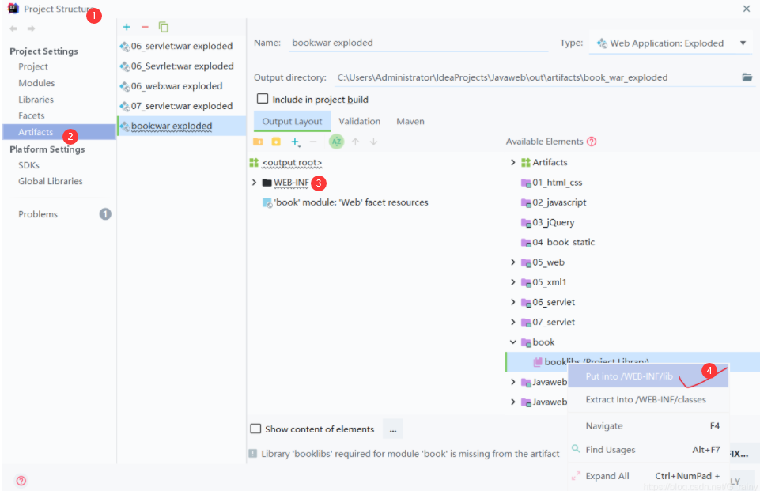
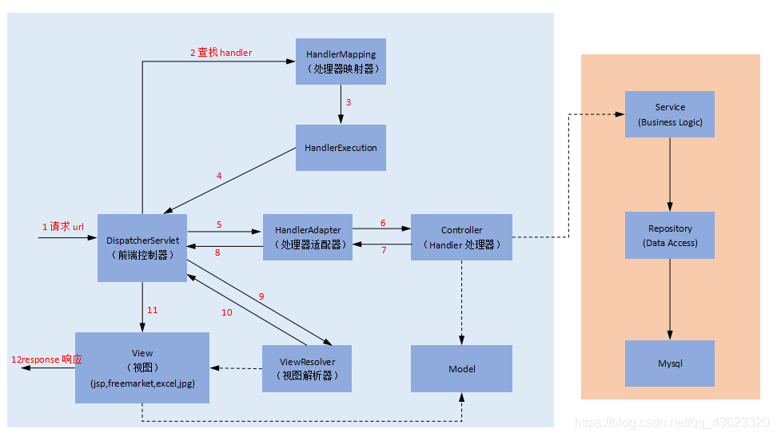

# SpringMVC

## 1、Hello SpringMVC

### 1.0、MVC

- MVC是模型(Model)、视图(View)、控制器(Controller)的简写，是一种软件设计规范。
- 是将业务逻辑、数据、显示分离的方法来组织代码。
- MVC主要作用是**降低了视图与业务逻辑间的双向偶合**。
- MVC不是一种设计模式，**MVC是一种架构模式**。当然不同的MVC存在差异。

**Model（模型）：**数据模型，提供要展示的数据，因此包含**数据和行为**，可以认为是领域模型或JavaBean组件（包含数据和行为），不过现在一般都分离开来：Value Object（数据Dao） 和 服务层（行为Service）。也就是模型提供了模型数据查询和模型数据的状态更新等功能，包括数据和业务。

**View（视图）：**负责进行模型的展示，一般就是我们见到的用户界面，客户想看到的东西。（html、jsp文件）

**Controller（控制器）：**接收用户请求，委托给模型进行处理（状态改变），处理完毕后把返回的模型数据返回给视图，由视图负责展示。也就是说控制器做了个调度员的工作。

### 1.1、什么是springmvc

- Spring MVC是Spring Framework的一部分，是基于Java实现MVC的轻量级Web框架。
- Spring的web框架围绕DispatcherServlet设计。DispatcherServlet的作用是将请求分发到不同的处理器。
- Spring MVC框架像许多其他MVC框架一样, **以请求为驱动** , **围绕一个中心Servlet分派请求及提供其他功能**，**DispatcherServlet是一个实际的Servlet (它继承自HttpServlet 基类)**。
- 原理：~~当发起请求时被前置的控制器（DispatcherServlet）拦截到请求，根据请求参数生成代理请求，找到请求对应的实际控制器，控制器处理请求，创建数据模型，访问数据库，将模型响应给中心控制器，控制器使用模型与视图渲染视图结果，将结果返回给中心控制器，再将结果返回给请求者。~~

### 1.2、第一个springmvc程序

1. 导入依赖包，资源过滤

   ```xml
   <dependencies>
       <!-- https://mvnrepository.com/artifact/javax.servlet/javax.servlet-api -->
       <dependency>
           <groupId>javax.servlet</groupId>
           <artifactId>javax.servlet-api</artifactId>
           <version>4.0.1</version>
           <scope>provided</scope>
       </dependency>
       <!-- https://mvnrepository.com/artifact/javax.servlet.jsp/javax.servlet.jsp-api -->
       <dependency>
           <groupId>javax.servlet.jsp</groupId>
           <artifactId>javax.servlet.jsp-api</artifactId>
           <version>2.3.3</version>
           <scope>provided</scope>
       </dependency>
       <!-- https://mvnrepository.com/artifact/javax.servlet.jsp.jstl/jstl-api -->
       <dependency>
           <groupId>javax.servlet.jsp.jstl</groupId>
           <artifactId>jstl-api</artifactId>
           <version>1.2</version>
       </dependency>
       <!-- https://mvnrepository.com/artifact/org.springframework/spring-webmvc -->
       <dependency>
           <groupId>org.springframework</groupId>
           <artifactId>spring-webmvc</artifactId>
           <version>5.3.20</version>
       </dependency>
   
       <dependency>
           <groupId>junit</groupId>
           <artifactId>junit</artifactId>
           <version>4.12</version>
       </dependency>
   </dependencies>
   
   <build>
       <resources>
           <resource>
               <directory>src/main/java</directory>
               <includes>
                   <include>**/*.xml</include>
                   <include>**/*.properties</include>
               </includes>
               <filtering>false</filtering>
           </resource>
           <resource>
               <directory>src/main/resources</directory>
               <includes>
                   <include>**/*.xml</include>
                   <include>**/*.properties</include>
               </includes>
               <filtering>false</filtering>
           </resource>
       </resources>
   </build>
   
   ```

   

2. 配置web项目的web.xml和spring配置文件applicationContext.xml

   - 在web.xml文件中注册DispatcherServlet，需要绑定spring的配置文件、servlet的启动顺序

   ```xml
   <?xml version="1.0" encoding="UTF-8"?>
   <web-app xmlns="http://xmlns.jcp.org/xml/ns/javaee"
            xmlns:xsi="http://www.w3.org/2001/XMLSchema-instance"
            xsi:schemaLocation="http://xmlns.jcp.org/xml/ns/javaee http://xmlns.jcp.org/xml/ns/javaee/web-app_4_0.xsd"
            version="4.0">
       <!--1. 注册DispatcherServlet，需要绑定spring的配置文件-->
       <servlet>
           <servlet-name>springmvc</servlet-name>
           <servlet-class>org.springframework.web.servlet.DispatcherServlet</servlet-class>
           <init-param>
               <param-name>contextConfigLocation</param-name>
               <param-value>classpath:applicationContext.xml</param-value>
           </init-param>
           <!--servlet的启动顺序，数字越小，启动越早。表示随tomcat一起启动-->
           <load-on-startup>1</load-on-startup>
       </servlet>
       <servlet-mapping>
           <servlet-name>springmvc</servlet-name>
           <!-- /:  所有请求除了jsp请求
                /*: 会匹配所有的请求，包括请求jsp的请求-->
           <url-pattern>/</url-pattern>
       </servlet-mapping>
   </web-app>
   ```
   
   - 配置spring配置文件，给DispatcherServlet添加处理映射器、处理适配器、视图解析器
     - 处理映射器：这里使用`BeanNameUrlHandlerMapping`，将url映射到bean上，这个bean的名字必须带有斜线`/`。这个处理映射器也是springmvc中的dispatcherServlet默认使用的。
     - 处理适配器：这里使用`SimpleControllerHandlerAdapter`，根据处理映射器找到的处理器（controller），按照规则执行这个controller。这个处理适配器也是springmvc中的dispatcherServlet默认使用的。
     - 视图解析器：这里使用`InternalResourceViewResolver`，这个视图解析器也是springmvc中的dispatcherServlet默认使用的。
   
   ```xml
   <?xml version="1.0" encoding="UTF-8"?>
   <beans xmlns="http://www.springframework.org/schema/beans"
          xmlns:xsi="http://www.w3.org/2001/XMLSchema-instance"
          xsi:schemaLocation="http://www.springframework.org/schema/beans http://www.springframework.org/schema/beans/spring-beans.xsd">
   
       <!--1. 给dispatcherServlet添加处理映射器，根据url找处理器-->
       <bean name="handlerMapping" class="org.springframework.web.servlet.handler.BeanNameUrlHandlerMapping"/>
       <!--2. 给dispatcherServlet添加处理适配器，按照特定的规则执行处理器-->
       <bean name="handlerAdapter" class="org.springframework.web.servlet.mvc.SimpleControllerHandlerAdapter"/>
       <!--3. 给dispatcherServlet添加视图解析器，解析处理适配器执行controller之后返回的视图，加上前后缀-->
       <bean name="viewResolver" class="org.springframework.web.servlet.view.InternalResourceViewResolver">
           <property name="prefix" value="/WEB-INF/jsp/"/>    <!--前缀  -->
           <property name="suffix" value=".jsp"/>              <!--后缀  -->
       </bean>
   
       <!--托管controller对象，因为使用BeanNameUrlHandlerMapping这个处理映射器，所有name中要带上/-->
       <bean name="/hello" class="com.xsy.controller.HelloController"/>
   </beans>
   ```


3. 编写HelloController类继承Controller接口，实现`handleRequest`方法

   -  ModelAndView 对象只做两件事：
     - 携带数据，
     - 完成视图跳转（默认转发模式）
   - controller执行完成之后，会把这个ModelAndView对象给处理适配器，处理适配器会给DispatcherServlet，DispatcherServlet会给视图解析器

   ```java
   public class HelloController implements Controller {
   
       @Override
       public ModelAndView handleRequest(HttpServletRequest request, HttpServletResponse response) throws Exception {
           // ModelAndView 对象只做两件事：
           //      1. 携带数据，
           //      2. 完成视图跳转（默认转发模式）
           ModelAndView mv = new ModelAndView();
           mv.addObject("msg","hello springMVC");
           mv.setViewName("hello");
           // controller执行完成之后，会把这个ModelAndView对象给处理适配器，处理适配器会给DispatcherServlet，
           // DispatcherServlet会给视图解析器，视图解析器会给它加上前后缀，hello变成/WEB-INF/jsp/hello.jsp
           // /WEB-INF/jsp/hello.jsp这个jsp文件可以使用ModelAndView对象中携带的数据
           return mv;
       }
   }
   ```

   

4. 编写hello.jsp文件，放在web/WEB-INFO/jsp文件夹下

   - 使用ModelAndView中携带的数据

   ```jsp
   <%@ page contentType="text/html;charset=UTF-8" language="java" %>
   <html>
   <head>
       <title>Title</title>
   </head>
   <body>
   	${msg}		<%使用ModelAndView中携带的数据%>
   </body>
   </html>
   ```

5. 配置tomcat容器，测试web项目

   **可能遇到的问题**：404或者500（`javax.servlet.ServletException: 实例化Servlet类[org.springframework.web.servlet.DispatcherServlet]异常`、`java.lang.ClassNotFoundException: org.springframework.web.servlet.DispatcherServlet`）

   **解决方案**：看看project structure中的artifacts中的web-inf下面有没有lib目录，有没有依赖包。

   

## 2、springmvc执行流程



1. 用户发出一个请求，由于在web.xml配置文件中配置了所有请求都会去找DispatcherServlet（前置控制器，是整个SpringMVC的控制中心）

   我们假设请求的url为 : http://localhost:8080/SpringMVC/hello

   **如上url拆分成三部分：**

   - http://localhost:8080服务器域名
   - SpringMVC部署在服务器上的web站点
   - hello表示控制器

   通过分析，如上url表示为：请求位于服务器localhost:8080上的SpringMVC站点的hello控制器。

2. DispatcherServlet在接到请求之后，调用HandlerMapping（处理映射器），根据请求url查找Handler。

3. DispatherServlet通过getHandler方法获取一个**HandlerExecutionChain**对象，HandlerExecution是由HandlerMapping根据请求映射返回的，其中包含**Handler和拦截器HandlerInterceptor**。其主要作用是根据url查找控制器，如上url被查找控制器为：hello。

4. HandlerExecution将解析后的信息传递给DispatcherServlet,如解析控制器映射等。

5. HandlerAdapter表示处理器适配器，其按照特定的规则去执行Handler。（适配器模式就能模糊掉具体的实现，从而就能提供统一访问接口，所以就需要用到适配器了）

6. Handler让具体的Controller执行。

7. Controller将具体的执行信息返回给HandlerAdapter,如ModelAndView。

8. HandlerAdapter将视图逻辑名或模型传递给DispatcherServlet。

9. DispatcherServlet调用视图解析器(ViewResolver)来解析HandlerAdapter传递的逻辑视图名。

10. 视图解析器将解析后的视图名传给DispatcherServlet。

11. DispatcherServlet根据视图解析器解析的视图结果，调用具体的视图。

12. 最终视图呈现给用户。


## 3、注解版SpringMVC开发

### 3.1 基于注解版的SpringMVC程序

1. 导入依赖包

2. 添加webApplication支持，配置web.xml，跟之前一样

   - 注意web.xml版本问题，要最新版！
   - 注册DispatcherServlet
   - 关联SpringMVC的配置文件
   - 启动级别为1
   - DispatcherServlet的映射路径为 / 【不要用/*，会404】

3. 配置spring的配置文件，开启注解支持

   跟之前差不多，可以简化书写：

   - 让IOC的注解生效
   - 静态资源过滤 ：HTML . JS . CSS . 图片 ， 视频 .....
   - MVC的注解驱动（给DispatcherServlet添加处理映射器、处理适配器），支持`@RequestMapping`、`@ExceptionHandler`等注解
   - 配置视图解析器

   ```xml
   <?xml version="1.0" encoding="UTF-8"?>
   <beans xmlns="http://www.springframework.org/schema/beans"
          xmlns:xsi="http://www.w3.org/2001/XMLSchema-instance"
          xmlns:context="http://www.springframework.org/schema/context"
          xmlns:mvc="http://www.springframework.org/schema/mvc"
          xsi:schemaLocation="http://www.springframework.org/schema/beans http://www.springframework.org/schema/beans/spring-beans.xsd
          http://www.springframework.org/schema/context http://www.springframework.org/schema/context/spring-context.xsd
          http://www.springframework.org/schema/mvc http://www.springframework.org/schema/mvc/spring-mvc.xsd">
       <!--开启注解支持，com.xsy.controller包下所有注解生效-->
       <context:component-scan base-package="com.xsy.controller"/>
       <!--让spring mvc不处理静态资源（.css .js .html .mp3 .png）的访问-->
       <mvc:default-servlet-handler/>
       <!--同样需要处理映射器和处理适配器，但是注解版的处理映射器、处理适配器（、处理器异常解析器(处理器异常解析器如果没有配置，默认为null)），简化为如下：-->
       <!--<bean name="handlerMapping" class="org.springframework.web.servlet.mvc.method.annotation.RequestMappingHandlerMapping"/>-->
       <!--<bean name="handlerAdapter" class="org.springframework.web.servlet.mvc.method.annotation.RequestMappingHandlerAdapter"/>-->
       <!--<bean name="handlerExceptionResolver" class="org.springframework.web.servlet.mvc.method.annotation.ExceptionHandlerExceptionResolver"/>-->
       <mvc:annotation-driven/>
   
       <bean name="viewResolver" class="org.springframework.web.servlet.view.InternalResourceViewResolver">
           <property name="prefix" value="/WEB-INF/jsp/"/>
            <property name="suffix" value=".jsp"/>
       </bean>
   </beans>
   ```

4. 编写Controller类，使用`@Controller`

   ```java
   @Controller
   @RequestMapping("/hc")
   public class HelloController {
       @RequestMapping("/t1")      // 请求路径：/hc/t1
       public String test01(Model model){
           // Model对象，专门用来存放数据
           model.addAttribute("msg","hello springMVC(Annotation)");
           // 使用了RequestMapping注解不仅能指定请求路径、请求方法，而且return的东西会被viewResovler解析，
           // 解析后的视图路径是/WEB-INF/jsp/hello.jsp
           return "hello"; 
       }
       @RequestMapping("/t2")
       public String test02(Model model){
           model.addAttribute("msg","===hello springMVC(Annotation)===");
           return "hello";		
       }
   }
   ```

   - @Controller注解，跟之前pojo层中的@Component一样，会被IOC容器接管。
   - @RequestMapping注解不仅能指定请求路径、请求方法，而且return的东西会被viewResovler解析

5. 编写hello.jsp，跟之前一样

6. 测试（注意lib目录问题）


### 4、Controller配置

- 控制器负责访问应用程序的行为（service层），通常通过接口定义或注解定义两种方法实现。
- 控制器负责解析用户的请求并将其转换为一个模型
- 在Spring MVC中一个控制器类可以包含多个方法

### 4.1、通过接口定义控制器

- 实现org.springframework.web.servlet.mvc包下的Controller接口中的唯一一个方法handlerRequest方法。如1.2节中的实现方式
- 缺点是：一个控制器中只有一个方法，如果要多个方法则需要定义多个Controller；

### 4.2、通过注解定义控制器

- @Controller注解用于声明一个类的实例是一个控制器。如3.1节中的实现方式


## 5、RestFul风格

- **资源：**互联网所有的事物都可以被抽象为资源

  **资源操作**：使用POST、DELETE、PUT、GET，使用不同方法对资源进行操作。

- Restful就是一个资源定位及资源操作的风格。形如：http://主机:端口/站点/请求路径/参数1/参数2/

- **使用RESTful操作资源** ：可以通过不同的请求方式来实现不同的效果！如下：请求地址一样，但是功能可以不同！

  ```java
  @Controller
  @RequestMapping("/hc")
  public class HelloController {
      @RequestMapping(value = "/t3/{a}/{b}", method = RequestMethod.GET)      // 请求/hc/t3/05/3    结果为8
      public String test03(@PathVariable int a,@PathVariable int b, Model model) {
          model.addAttribute("msg", "计算结果：" + (a + b));
          return "hello";
      }
  
      @RequestMapping(value = "/t3/{a}/{b}", method = RequestMethod.POST)      // 请求/hc/t3/05/4    结果为1
      public String test04(@PathVariable int a,@PathVariable int b, Model model) {
          model.addAttribute("msg", "计算结果：" + (a - b));
          return "hello";
      }
  }
  ```
  
- 相同的请求路径，不同的请求方式，可以得到不同的结果

## 6、处理数据及结果跳转

### 6.1、获取请求参数

三种方法：

- 如果参数是基本数据类型或者String，且前端请求中的参数名和方法中的参数名一致，可直接接收不需要特殊处理

  ```java
  @RequestMapping("/t1")
  public String test01(String name, Model model){
      model.addAttribute("msg",name);
      return "test";
  }
  ```

  - 请求地址:`http://localhost:8080/spring_demo03_war_exploded/t1?name=小十一`

- 如果参数名不一致，使用@RequestParam注解

  ```java
  @RequestMapping("/t1")
  public String test01(@RequestParam("username") String name, Model model){
      model.addAttribute("msg",name);
      return "test";
  }
  ```

  - 请求地址：`http://localhost:8080/spring_demo03_war_exploded/t1?username=小十一`

- 如果提交的是一个对象，则使用一个实体类来接收

  ```java
  @RequestMapping("/t2")
  public String test02(User user, Model model){
      model.addAttribute("msg",user.toString());
      return "test";
  }
  ```

  - 请求地址：`http://localhost:8081/spring_demo03_war_exploded/t2?username=%E5%B0%8F%E5%8D%81%E4%B8%80&password=123456`

### 6.2、处理结果跳转

三种方式：

- 通过ModelAndView对象的setViewName方法根据view的名称和视图解析器跳到指定的页面 .

- 通过原生的Servlet API，不会经过视图解析器

  - HttpServletRequest对象中的getDispatcher方法中的forword方法实现转发

  - HttpServeltResponse对象的sendRedirection方法实现重定向

    ```java
    @RequestMapping("/t3")
    public void test03(User user, Model model, HttpServletRequest request, HttpServletResponse response) throws ServletException, IOException {
        request.getSession().setAttribute("msg",user);
        request.getRequestDispatcher("/WEB-INF/jsp/test.jsp").forward(request,response);
    }
    
    @RequestMapping("/t4")
    public void test04(User user, Model model, HttpServletRequest request, HttpServletResponse response) throws ServletException, IOException {
        request.getSession().setAttribute("msg",user);
        response.sendRedirect(request.getContextPath()+"/test-public.jsp");
    }
    ```

    - 由于重定向给出去的是前端路径（直接拼接到url中的端口后面），所以要加上项目部署路径且无法显式访问/WEB-INF/下的内容，

- 通过springMVC来实现转发和重定向

  ```java
  @RequestMapping("/t5")
  public String test05(User user, Model model, HttpServletRequest request, HttpServletResponse response) throws ServletException, IOException {
      model.addAttribute("msg",user);
      return "test";
  }
  
  @RequestMapping("/t6")
  public String test06(User user, Model model, HttpServletRequest request, HttpServletResponse response) throws ServletException, IOException {
      model.addAttribute("msg",user);
      return "redirect:test-pulic.xml";
  }
  ```

  - 只要是重定向都不会经过视图解析器。

  

### 6.3、前端显示数据

三种方式：

- 通过ModelAndView对象的addObject方法
- 通过ModelMap对象，（ModelMap继承了LinkedHashMap<String, Object>）
- 通过Model对象，简单，**推荐**

### 6.4、乱码问题

通过spring内置的编码过滤器解决


## 注解总结

@Controller：用来类上面，表示该类是一个controller类

@RequestMapping：可以用来类和方法上，可以通过`path/value`属性配置请求的路径映射，通过`method`属性限定请求的方法，

@GetMapping：相当于方法上的`@RequestMapping(path="/t",method=RequestMethod.GET)`

@PostMapping：相当于方法上的`@RequestMapping(path="/t",method=RequestMethod.POST)`

@PutMapping

@DeleteMapping

@PathVariable：用在参数上，RestFul风格传参时，用来标识参数。

@RequestParam：用在参数上，用来解决请求中的变量和java代码中参数不一致的问题

@ResponseBody：用在方法上，标识这个方法的返回值就是响应体，不是视图名


## 7、JSON

### 7.1、fastJson

- 阿里巴巴出品，使用简单。[github](https://github.com/alibaba/fastjson)

- maven依赖包

  ```xml
  <!-- https://mvnrepository.com/artifact/com.alibaba/fastjson -->
  <dependency>
      <groupId>com.alibaba</groupId>
      <artifactId>fastjson</artifactId>
      <version>2.0.6</version>
  </dependency>
  ```

- 使用方式

  ```java
  String text = JSON.toJSONString(obj); //序列化
  VO vo = JSON.parseObject("{...}", VO.class); //反序列化
  ```


### 7.2、Jackson

- Jackson可以轻松的将Java对象转换成json对象和xml文档，同样也可以将json、xml转换成Java对象

- ObjectMapper类是Jackson库的主要类。将JSON映射到Java对象（反序列化），或将Java对象映射到JSON（序列化）。

- 依赖包

  ```xml
  <!-- https://mvnrepository.com/artifact/com.fasterxml.jackson.core/jackson-annotations -->
  <dependency>
      <groupId>com.fasterxml.jackson.core</groupId>
      <artifactId>jackson-annotations</artifactId>
      <version>2.13.3</version>
  </dependency>
  <!-- https://mvnrepository.com/artifact/com.fasterxml.jackson.core/jackson-databind -->
  <dependency>
      <groupId>com.fasterxml.jackson.core</groupId>
      <artifactId>jackson-databind</artifactId>
      <version>2.13.3</version>
  </dependency>
  <!-- https://mvnrepository.com/artifact/com.fasterxml.jackson.core/jackson-core -->
  <dependency>
      <groupId>com.fasterxml.jackson.core</groupId>
      <artifactId>jackson-core</artifactId>
      <version>2.13.3</version>
  </dependency>
  ```


- ObjectMapper如何将JSON字段与Java字段匹配?

  - Jackson通过将JSON字段的名称与Java对象中的getter和setter方法相匹配，将JSON对象的字段映射到Java对象中的字段。Jackson删除了getter和setter方法名称的“get”和“set”部分，并将剩余名称的第一个字符转换为小写。 
  - Jackson还可以通过java反射进行匹配
  - 通过注解或者其它方式进行自定义的序列化和反序列化程序。

- 利用ObjectMapper对象将JSON转成Java对象

  - readValue()：可以将json字符串、Json文件、Json文件流等进行转换指定Java类型的对象，有很多重载的方法

- 利用ObjectMapper对象将Java对象转成JSON

  - writeValue()
  - writeValueAsString()
  - writeValueAsBytes()

- 一些ObjectMapper的配置

  ```java
  //序列化时，日期的统一格式
  objectMapper.setDateFormat(new SimpleDateFormat("yyyy-MM-dd HH:mm:ss"));
  
  //类为空时，不要抛异常
  objectMapper.configure(SerializationFeature.FAIL_ON_EMPTY_BEANS, false);
  // 等价于
  objectMapper.disable(SerializationFeature.FAIL_ON_EMPTY_BEANS);
  
  //空值不序列化
  objectMapper.setSerializationInclusion(JsonInclude.Include.NON_NULL);
  // 等价于
  objectMapper.setSerializationInclusion(JsonInclude.Include.NON_NULL); // 忽略掉空字段
  
  //反序列化时,遇到未知属性时是否引起结果失败
  objectMapper.configure(DeserializationFeature.FAIL_ON_UNKNOWN_PROPERTIES, false);
  ```

  

## 8、整合SSM框架

SSM：SpringMVC、Spring、Mybatis

1. 环境配置

   - 数据库

   - 依赖包、资源过滤

     ```xml
     <!--pom.xml-->
     <dependencies>
         <!--Junit-->
         <dependency>
             <groupId>junit</groupId>
             <artifactId>junit</artifactId>
             <version>4.12</version>
         </dependency>
         <!--数据库驱动-->
         <!-- https://mvnrepository.com/artifact/mysql/mysql-connector-java -->
         <dependency>
             <groupId>mysql</groupId>
             <artifactId>mysql-connector-java</artifactId>
             <version>8.0.29</version>
         </dependency>
         <!-- 数据库连接池 -->
         <dependency>
             <groupId>com.mchange</groupId>
             <artifactId>c3p0</artifactId>
             <version>0.9.5.2</version>
         </dependency>
     
         <!--Servlet - JSP -->
         <dependency>
             <groupId>javax.servlet</groupId>
             <artifactId>servlet-api</artifactId>
             <version>2.5</version>
         </dependency>
         <dependency>
             <groupId>javax.servlet.jsp</groupId>
             <artifactId>jsp-api</artifactId>
             <version>2.2</version>
         </dependency>
         <dependency>
             <groupId>javax.servlet</groupId>
             <artifactId>jstl</artifactId>
             <version>1.2</version>
         </dependency>
     
         <!--Mybatis-->
         <dependency>
             <groupId>org.mybatis</groupId>
             <artifactId>mybatis</artifactId>
             <version>3.5.2</version>
         </dependency>
         <dependency>
             <groupId>org.mybatis</groupId>
             <artifactId>mybatis-spring</artifactId>
             <version>2.0.2</version>
         </dependency>
     
         <!--Spring-->
         <dependency>
             <groupId>org.springframework</groupId>
             <artifactId>spring-webmvc</artifactId>
             <version>5.1.9.RELEASE</version>
         </dependency>
         <dependency>
             <groupId>org.springframework</groupId>
             <artifactId>spring-jdbc</artifactId>
             <version>5.1.9.RELEASE</version>
         </dependency>
     
         <!-- https://mvnrepository.com/artifact/com.alibaba/fastjson -->
         <dependency>
             <groupId>com.alibaba</groupId>
             <artifactId>fastjson</artifactId>
             <version>2.0.6</version>
         </dependency>
     
     </dependencies>
     
     <build>
         <resources>
             <resource>
                 <directory>src/main/java</directory>
                 <includes>
                     <include>**/*.properties</include>
                     <include>**/*.xml</include>
                 </includes>
                 <filtering>false</filtering>
             </resource>
             <resource>
                 <directory>src/main/resources</directory>
                 <includes>
                     <include>**/*.properties</include>
                     <include>**/*.xml</include>
                 </includes>
                 <filtering>false</filtering>
             </resource>
         </resources>
     </build>
     ```

     

2. 配置文件

   - db.properties

     ```properties
     jdbc.driver=com.mysql.jdbc.Driver
     jdbc.url=jdbc:mysql://localhost:3306/ssmbuild?useSSL=true&useUnicode=true&characterEncoding=utf8
     jdbc.username=root
     jdbc.password=123456
     ```

     

   - mybatis-config.xml：配置别名、注册Mapper

     ```xml
     <?xml version="1.0" encoding="UTF-8" ?>
     <!DOCTYPE configuration
             PUBLIC "-//mybatis.org//DTD Config 3.0//EN"
             "http://mybatis.org/dtd/mybatis-3-config.dtd">
     <configuration>
         <typeAliases>
             <package name="com.xsy.pojo"/>
         </typeAliases>
         <mappers>
             <mapper resource="com/xsy/mapper/BookMapper.xml"/>
         </mappers>
     </configuration>
     ```

     

   - spring-mapper.xml：读取数据库连接配置文件，托管数据源、整合mybatis，SelSessionFactory对象，配置mapper扫描器

     ```xml
     <?xml version="1.0" encoding="UTF-8"?>
     <beans xmlns="http://www.springframework.org/schema/beans"
            xmlns:xsi="http://www.w3.org/2001/XMLSchema-instance"
            xmlns:context="http://www.springframework.org/schema/context"
            xsi:schemaLocation="http://www.springframework.org/schema/beans http://www.springframework.org/schema/beans/spring-beans.xsd
            http://www.springframework.org/schema/context http://www.springframework.org/schema/context/spring-context.xsd
     ">
         <!-- 1. 绑定数据库配置文件-->
         <context:property-placeholder location="classpath:db.properties"/>
         <!-- 2. 数据库连接池c3p0-->
         <bean id="dataSource" class="com.mchange.v2.c3p0.ComboPooledDataSource">
             <property name="driverClass" value="${jdbc.driver}"/>
             <property name="jdbcUrl" value="${jdbc.url}"/>
             <property name="user" value="${jdbc.username}"/>
             <property name="password" value="${jdbc.password}"/>
     
             <property name="maxPoolSize" value="30"/>
             <property name="minPoolSize" value="10"/>
             <!-- 关闭连接时，是否自动commit-->
             <property name="autoCommitOnClose" value="false"/>
             <!-- 获取连接超时时间 -->
             <property name="checkoutTimeout" value="10000"/>
             <!-- 当获取连接失败重试次数 -->
             <property name="acquireRetryAttempts" value="2"/>
         </bean>
     
         <!-- 3. 托管SqlSessionFactory，添加数据源和mybatis配置文件-->
         <bean id="sqlSessionFactory" class="org.mybatis.spring.SqlSessionFactoryBean">
             <property name="dataSource" ref="dataSource"/>
             <property name="configLocation" value="classpath:mybatis-config.xml"/>
         </bean>
     
         <!-- 4.配置扫描Dao接口包，动态实现Mapper接口注入到spring容器中，
                 不用自己写MapperImpl类（类里面有sqlSessionFactory或者SqlSessionTemplate对象）
     			Mapper对象的名字默认是Mapper接口的名字小写
          -->
         <!--解释 ：https://www.cnblogs.com/jpfss/p/7799806.html-->
         <bean class="org.mybatis.spring.mapper.MapperScannerConfigurer">
             <!-- 注入sqlSessionFactory -->
             <property name="sqlSessionFactoryBeanName" value="sqlSessionFactory"/>
             <!-- 给出需要扫描Dao接口包 -->
             <property name="basePackage" value="com.xsy.mapper"/>
         </bean>
     </beans>
     ```

     

   - spring-service.xml：扫描service层的接口或者配置实现类对象到IOC容器中，配置事务管理器

     ```xml
     <?xml version="1.0" encoding="UTF-8"?>
     <beans xmlns="http://www.springframework.org/schema/beans"
            xmlns:xsi="http://www.w3.org/2001/XMLSchema-instance"
            xmlns:context="http://www.springframework.org/schema/context"
            xsi:schemaLocation="http://www.springframework.org/schema/beans
         http://www.springframework.org/schema/beans/spring-beans.xsd
         http://www.springframework.org/schema/context
         http://www.springframework.org/schema/context/spring-context.xsd">
     
         <!-- 扫描service相关的bean -->
         <context:component-scan base-package="com.xsy.service" />
     
         <!--BookServiceImpl注入到IOC容器中-->
         <bean id="BookServiceImpl" class="com.xsy.service.BookServiceImpl">
             <property name="bookMapper" ref="bookMapper"/>		<!--使用了spring-mapper.xml中的Mapper扫描器得到的结果-->
         </bean>
         <!-- 配置事务管理器 -->
         <bean id="transactionManager" class="org.springframework.jdbc.datasource.DataSourceTransactionManager">
             <!-- 注入数据库连接池 -->
             <property name="dataSource" ref="dataSource" />
         </bean>
     </beans>
     ```

     

   - spring-mvc.xml：开启注解支持，注解驱动（注解版的HandlerMapping、HandlerAdaptor），静态资源过滤，视图解析器

     ```xml
     <?xml version="1.0" encoding="UTF-8"?>
     <beans xmlns="http://www.springframework.org/schema/beans"
            xmlns:xsi="http://www.w3.org/2001/XMLSchema-instance"
            xmlns:context="http://www.springframework.org/schema/context"
            xmlns:mvc="http://www.springframework.org/schema/mvc"
            xsi:schemaLocation="http://www.springframework.org/schema/beans
         http://www.springframework.org/schema/beans/spring-beans.xsd
         http://www.springframework.org/schema/context
         http://www.springframework.org/schema/context/spring-context.xsd
         http://www.springframework.org/schema/mvc
         https://www.springframework.org/schema/mvc/spring-mvc.xsd">
     
         <!-- 配置SpringMVC -->
         <!-- 1.开启SpringMVC注解驱动 -->
         <mvc:annotation-driven />
         <!-- 2.静态资源默认servlet配置-->
         <mvc:default-servlet-handler/>
     
         <!-- 3.配置jsp 显示ViewResolver视图解析器 -->
         <bean class="org.springframework.web.servlet.view.InternalResourceViewResolver">
             <property name="viewClass" value="org.springframework.web.servlet.view.JstlView" />
             <property name="prefix" value="/WEB-INF/jsp/" />
             <property name="suffix" value=".jsp" />
         </bean>
         <!-- 4.扫描web相关的bean -->
         <context:component-scan base-package="com.xsy.controller" />
     </beans>
     ```

     

   - applicationContext.xml：将所有的sping.xml配置关联起来，这样才能使用相互使用对方文件中的变量

     ```xml
     <?xml version="1.0" encoding="UTF-8"?>
     <beans xmlns="http://www.springframework.org/schema/beans"
            xmlns:xsi="http://www.w3.org/2001/XMLSchema-instance"
            xsi:schemaLocation="http://www.springframework.org/schema/beans http://www.springframework.org/schema/beans/spring-beans.xsd
     ">
         <import resource="spring-mapper.xml"/>
         <import resource="spring-service.xml"/>
         <import resource="spring-mvc.xml"/>
     </beans>
     ```

     

   - web.xml

     ```xml
     <?xml version="1.0" encoding="UTF-8"?>
     <web-app xmlns="http://xmlns.jcp.org/xml/ns/javaee"
              xmlns:xsi="http://www.w3.org/2001/XMLSchema-instance"
              xsi:schemaLocation="http://xmlns.jcp.org/xml/ns/javaee http://xmlns.jcp.org/xml/ns/javaee/web-app_4_0.xsd"
              version="4.0">
     
         <!--DispatcherServlet-->
         <servlet>
             <servlet-name>DispatcherServlet</servlet-name>
             <servlet-class>org.springframework.web.servlet.DispatcherServlet</servlet-class>
             <init-param>
                 <param-name>contextConfigLocation</param-name>
                 <!--一定要注意:我们这里加载的是总的配置文件！-->
                 <param-value>classpath:applicationContext.xml</param-value>
             </init-param>
             <load-on-startup>1</load-on-startup>
         </servlet>
         <servlet-mapping>
             <servlet-name>DispatcherServlet</servlet-name>
             <url-pattern>/</url-pattern>
         </servlet-mapping>
         
         <!--encodingFilter-->
         <filter>
             <filter-name>encodingFilter</filter-name>
             <filter-class>
                 org.springframework.web.filter.CharacterEncodingFilter
             </filter-class>
             <init-param>
                 <param-name>encoding</param-name>
                 <param-value>utf-8</param-value>
             </init-param>
         </filter>
         <filter-mapping>
             <filter-name>encodingFilter</filter-name>
             <url-pattern>/*</url-pattern>
         </filter-mapping>
     
         <!--Session过期时间-->
         <session-config>
             <session-timeout>15</session-timeout>
         </session-config>
     </web-app>
     ```

     

3. 三层架构（实体类pojo，持久化层mapper，业务层service、控制器层controller、视图层view）

   - 实体类

     ```java
     package com.xsy.pojo;
     
     import java.io.Serializable;
     
     public class Book implements Serializable {
         private int bookID;
         private String bookName;
         private int bookCounts;
         private String detail;
     	// Contrustor、setter、getter、toString
     }
     ```

     

   - Mapper

     - 可以传入两个参数，不一定要用map

     ```java
     //BookMapper.java
     public interface BookMapper {
         public List<Book> getBooks();
         public Book getBookByID(@Param("bid") int id);
         public int addBook(Book book);
         public int deleteBookByID(@Param("bid") int id);
         public int updateBookCountByID(@Param("bid")int id,@Param("count") int count);	// 可以传入两个参数，不一定要用map
     }
     // 因为使用的mapper扫描器，不用自己写Mapper的实现类，然后托管实现类对象
     ```

     ```xml
     <!--BookMapper.xml-->
     <?xml version="1.0" encoding="UTF-8" ?>
     <!DOCTYPE mapper
             PUBLIC "-//mybatis.org//DTD Mapper 3.0//EN"
             "http://mybatis.org/dtd/mybatis-3-mapper.dtd">
     <mapper namespace="com.xsy.mapper.BookMapper">
         <select id="getBooks" resultType="book">
             select *　from book;
         </select>
         <select id="getBookByID" resultType="book">
             select *　from book　where bookID = #{bid};
         </select>
         <insert id="addBook" parameterType="book">
             insert into book　values (#{bookID}, #{bookName}, #{bookCounts}, #{detail});
         </insert>
         <delete id="deleteBookByID" parameterType="_int">
             delete from book where bookID=#{bid}
         </delete>
     
         <update id="updateBookCountByID">
             update book set bookCounts=#{count} where bookID=#{bid};
         </update>
     </mapper>
     ```

     

   - Service

     ```java
     // BookService.java
     public interface BookService {
         public List<Book> getBooks();
         public Book getBookByID(int id);
         public int addBook(Book book);
         public int deleteBookByID(int id);
         public int updateBookCountByID(int id, int count);
     }
     
     // BookServiceImpl.java
     public class BookServiceImpl implements BookService {
         private BookMapper bookMapper;
     
         public void setBookMapper(BookMapper bookMapper) {
             this.bookMapper = bookMapper;
         }
     
         @Override
         public List<Book> getBooks() {
             return bookMapper.getBooks();
         }
     
         @Override
         public Book getBookByID(int id) {
             return bookMapper.getBookByID(id);
         }
     
         @Override
         public int addBook(Book book) {
             return bookMapper.addBook(book);
         }
     
         @Override
         public int deleteBookByID(int id) {
             return bookMapper.deleteBookByID(id);
         }
     
         @Override
         public int updateBookCountByID(int id, int count) {
             return bookMapper.updateBookCountByID(id,count);
         }
     }
     ```

     

   - Controller

     ```java
     @Controller
     public class BookController {
         @Autowired
         @Qualifier("BookServiceImpl")
         private BookService bookService;
     
         @RequestMapping("/allBooks")
         @ResponseBody
         public String allBooks(){
             List<Book> books= bookService.getBooks();
             System.out.println(books);
             System.out.println(JSON.toJSONString(books));
             return JSON.toJSONString(books);
         }
     
         @RequestMapping("/getBook")
         @ResponseBody
         public String getBookByID(@RequestParam("bid") int id){
             Book book = bookService.getBookByID(id);
             System.out.println(book);
             return JSON.toJSONString(book);
         }
     
         @RequestMapping("/updateBookCount")
         @ResponseBody
         public String updateBookCount(@RequestParam("bid") int id,@RequestParam("count") int count){
             bookService.updateBookCountByID(id,count);
             return allBooks();
         }
     
         @RequestMapping("/addBook")
         @ResponseBody
         public String addBook(Book book){
             bookService.addBook(book);
             return allBooks();
         }
     
         @RequestMapping("/deleteBook")
         @ResponseBody
         public String deleteBook(@RequestParam("bid") int id){
             bookService.deleteBookByID(id);
             return allBooks();
         }
     }
     ```

     

4. 