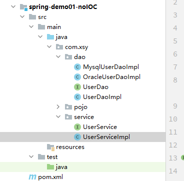
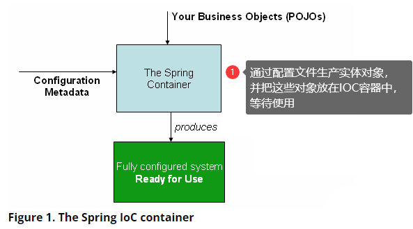
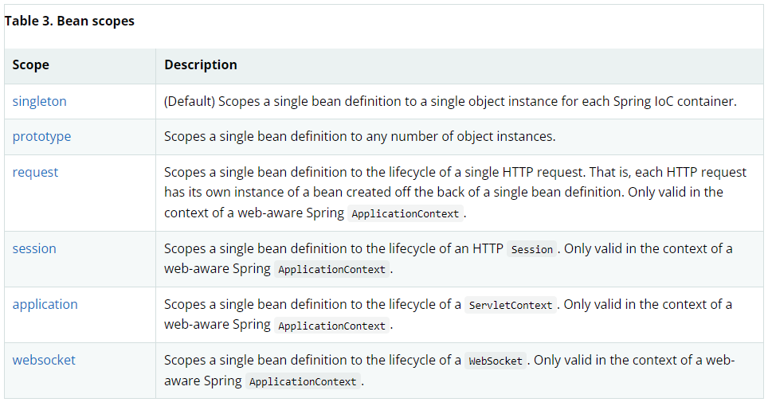
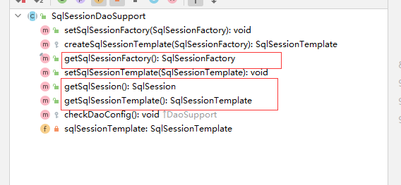

# Spring

## 1、简介

### 1.1、什么是Spring

- **开源框架**，是针对bean的生命周期进行管理的**轻量级容器**。

- 提供了功能强大IOC（控制反转，Inversion Of Control）、AOP（面向切面编程，Aspect Oriented Programming）及Web MVC等功能

- Spring框架主要由七部分组成，分别是 Spring Core、 Spring AOP、 Spring ORM、 Spring DAO、Spring Context、 Spring Web和 Spring Web MVC。

  

- 

### 1.2、Spring 依赖

```xml
<!--spring 依赖包-->
<!-- https://mvnrepository.com/artifact/org.springframework/spring-webmvc -->
<dependency>
    <groupId>org.springframework</groupId>
    <artifactId>spring-webmvc</artifactId>
    <version>5.3.20</version>
</dependency>

<!--spring整合mybatis依赖包-->
<!-- https://mvnrepository.com/artifact/org.springframework/spring-jdbc -->
<dependency>
    <groupId>org.springframework</groupId>
    <artifactId>spring-jdbc</artifactId>
    <version>5.3.20</version>
</dependency>

```


## 2、IOC

### 2.0、有无IOC对比案例

#### 2.0.1、没有IOC

- 目录结构

  

  

- Dao持久层：一个接口和三种实现

  ```java
  // UserDao.java 接口
  public interface UserDao {
      void getUser();
  }
  
  // UserDaoImpl.java
  public class UserDaoImpl implements UserDao {
      @Override
      public void getUser() {
          System.out.println("默认用户登录");
      }
  }
  
  // MysqlUserDaoImpl.java
  public class MysqlUserDaoImpl implements UserDao{
      @Override
      public void getUser() {
          System.out.println("mysql 用户登录");
      }
  }
  
  // OracleUserDaoImpl.java
  public class OracleUserDaoImpl implements UserDao{
      @Override
      public void getUser() {
          System.out.println("oracle 用户登录");
      }
  }
  ```

  

- 服务层：一个接口和一个实现。实现利用组合关系获取了一个UserDao对象（静态注入，写死）。**但是如果用户想要通过mysql来实现持久层，那么需要修改 UserServiceImpl.java中的服务实现。这样耦合度很高，不利于维护和修改。**

  ```java
  // UserService.java 接口
  public interface UserService {
      void getUser();
  }
  
  // UserServiceImpl.java
  public class UserServiceImpl implements UserService{
      private UserDao userDao = new UserDaoImpl();
  //    private UserDao userDao = new MysqlUserDaoImpl();
  //    private UserDao userDao = new OracleUserDaoImpl();
      @Override
      public void getUser() {
          userDao.getUser();
      }
  }
  
  ```

- 测试：用户使用的时候，只管调用就好了

  ```java
  public class TestUserService {
      @Test
      public void testGetUser(){
          UserService service = new UserServiceImpl();
          service.getUser();
      }
  }
  ```

  

#### 2.0.1、有IOC

- 持久层不变

- service层：其中的实现利用IOC的思想，通过`set方法`实现动态注入，将控制权交给用户（对应的test方法）

  ```java
  public class UserServiceImpl implements UserService{
      private UserDao userDao = new UserDaoImpl();        // 默认实现（静态注入，写死的）
      // 用户通过setter方法实现动态注入
      public void setUserDao(UserDao userDao) {
          this.userDao = userDao;
      }
  
      @Override
      public void getUser() {
          userDao.getUser();
      }
  }
  ```

- 测试：自己想用什么Dao层实现由用户自己决定，Service层不管了。**底层换实现，上层不用有任何改动。**

  ```java
  public class TestUserService {
      @Test
      public void testGetUser(){
          UserService service = new UserServiceImpl();
          // 需要什么对象，用户自己就创建什么对象，Service层不用在管了
          ((UserServiceImpl) service).setUserDao(new MysqlUserDaoImpl());
          service.getUser();
      }
  }
  ```

#### 2.0.3、总结：

- 以前主动权在业务层，现在主动权在第三方（用户）手上。

### 2.1、什么是IOC

- 控制反转，inversion of control：是一种设计思想。在面向对象编程中，对象的创建与对象间的依赖关系完全硬编码在程序中（直接写死），创建哪一个对象以及对象的创建完全由程序实现，控制反转后决定权交给了第三方，由第三方来决定创建哪一个对象并且提供该对象。

- 控制反转是一种通过描述（xml或者注解）并通过第三方生产、获取特定对象的方式。在Spring中实现控制反转的是IOC容器，其实现方式是依赖注入（DI，Dependency Injection）

- 这里说的依赖是指：对象的属性，官方说法是**一个对象在工作时需要的一些对象称之为依赖**。

- **获取依赖对象的方式反转了**：以前主动权在业务层，现在主动权在第三方（用户）手上。

- **DI是一个创建对象（bean）时定义依赖过程**，在对象被创建时（构造器或者工厂方法），通过构造器参数、工厂方法参数获取属性的setter方法定义依赖的过程。

- IOC容器：

  - **IOC解耦过程：原来每个对象之间都相互知道，相互调度。现在通过IOC容器，对象之间的调度都交给了IOC容器（第三方）来实现，彼此之间只知道依赖关系，并不知道依赖哪一个对象。**

    如同上述例子中的：UserServiceImpl对象和UserDao对象，UserServiceImpl现在只知道需要一个UserDao对象，具体是哪一个，由IOC（第三方、Test）决定。

    

  - IOC工作流程：读取配置文件，生成所有对象放在容器中，后续程序使用时再从IOC容器中取出对象。**不管你后续会不会使用，在解析配置文件的时候，配置文件中的所有对象都会被创建**

  

## 3、HelloSpring

- 创建一个实体类

  ```java
  package com.xsy.pojo;
  
  public class User {
      private String name;
  
      // getter、setter、constructors、toString
  }
  
  ```

  

- 编写spring配置文件

  ```xml
  <?xml version="1.0" encoding="UTF-8"?>
  <beans xmlns="http://www.springframework.org/schema/beans"
         xmlns:xsi="http://www.w3.org/2001/XMLSchema-instance"
         xsi:schemaLocation="http://www.springframework.org/schema/beans
          https://www.springframework.org/schema/beans/spring-beans.xsd">
  
      <!--
          一个bean标签表示IOC要生成的一个对象，变量名由id配置，类型由class配置
          等价于 User user = new User()
  
          property标签相当于一个setter方法，name表示调用哪个属性的setter方法，value表示要设置的值
          等价于 user.setName(小十一)
      -->
  
      <bean id="user" class="com.xsy.pojo.User">
          <property name="name" value="小十一"/>
      </bean>
  </beans>
  ```

  - 一个bean标签表示IOC要生成的一个对象，变量名由id配置，类型由class配置
  - property标签相当于一个setter方法，name表示调用哪个属性的setter方法，value表示要设置的值

- 测试

  ```java
  import com.xsy.pojo.User;
  import org.junit.Test;
  import org.springframework.context.ApplicationContext;
  import org.springframework.context.support.ClassPathXmlApplicationContext;
  
  public class TestUser {
      @Test
      public void testUser(){
          // 1. 加载配置文件（加载的时候，IOC容器就已经生产对象了，不管你后面会不会get）
          // 资源路径 ClassPathXmlApplicationContext本质上是一个资源加载器
          ApplicationContext context = new ClassPathXmlApplicationContext("beans.xml");
          // 2. 通过变量名（bean id）获取IOC中对象（bean）
          User user = (User) context.getBean("user");
          System.out.println(user);
      }
  }
  ```

  - IOC容器使用步骤：

    1. 通过`ClassPathXmlApplicationContext`加载配置文件

    2. 通过bean id获取IOC容器中的bean


## 4、IOC创建对象的方式

- bean标签本质上是一个生成一个或多个对象的方法。
- **默认情况下，IOC容器通过反射调用无参构造函数创建对象**


### 4.1、使用无参构造器创建对象

- 默认就是无参构造
- `constructor-arg`标签

### 4.2、使用有参构造器创建对象

#### 4.2.1、通过参数引用的依赖注入


#### 4.2.2、通过参数下标的依赖注入

```xml
<bean id="user" class="com.xsy.pojo.User">
    <constructor-arg index="0" value="xsy"/>
</bean>
```

- 通过构造方式中的参数下标给user对象的name属性注入值

  

#### 4.2.3、通过参数名字的依赖注入

```xml
<bean id="user" class="com.xsy.pojo.User">
    <constructor-arg name="name" value="hml"/>
</bean>
```

- 通过构造方式中的参数名字给user对象的name属性注入值

  

#### 4.2.4、通过参数类型的依赖注入

```xml
<bean id="user" class="com.xsy.pojo.User">
    <constructor-arg type="java.lang.String" value="小十一呀"/>
</bean>
```

- 通过构造方式中的参数类型给user对象的name属性注入值

- 如果构造方式中的参数存在相同类型，则不可用。

  

### 4.3、使用静态工厂方法创建对象

### 4.4、使用实例工厂方法创建对象

## 5、Spring配置文件

### 5.1、 别名配置 alias

- 如果添加了别名，可以通过别名从IOC容器中获取对象  

  ```xml
  <alias name="user" alias="user2"/>
  
  <!--通过有参构造器创建对象，下标依赖注入-->
  <bean id="user" class="com.xsy.pojo.User">
      <constructor-arg type="java.lang.String" value="小十一呀"/>
  </bean>
  ```

  

### 5.2、 bean配置

- id：bean的唯一标识符，相当于对象的变量名

- class：bean对象的类全名

- name：别名，多个别名可以用逗号、空格、分号分割

  ```xml
      <bean id="user" class="com.xsy.pojo.User" name="user3,user4">
          <constructor-arg type="java.lang.String" value="小十一呀"/>
      </bean>
  ```

  

### 5.3、import配置

- 用于团队开发，将多个配置文件合并成一个

- 如果有相同标识符的bean会合并

  ```xml
  <?xml version="1.0" encoding="UTF-8"?>
  <beans xmlns="http://www.springframework.org/schema/beans"
         xmlns:xsi="http://www.w3.org/2001/XMLSchema-instance"
         xsi:schemaLocation="http://www.springframework.org/schema/beans
          https://www.springframework.org/schema/beans/spring-beans.xsd">
  	<import resource="beans1.xml"/>
     	<import resource="beans2.xml"/>
      <import resource="beans3.xml"/>
  </beans>
  ```

  


## 6、依赖注入

- 依赖：一个对象在工作时需要的一些对象。

- 注入：（属性）初始化，关联起来

### 6.1、构造器注入

之前说过了

### 6.2、setter注入

6.2.0、环境搭建

1. 导包

2. 实体类

   ```java
   //Address.java
   public class Address {
       private String province;
       private String street;
       
       // constructor、getter、setter、tostring
   }
   
   //User.java
   public class User {
       private String name;
       private Address address;
       private String[] books;
       private List<String> hobbys;
       private Map<String,String> card;
       private Set<String> games;
       private Properties info;
       private String wife;
       
   	// constructor、getter、setter、tostring
   }
   ```

   

3. 测试类

   ```java
   public class TestUser {
       @Test
       public void testGetUser(){
           ApplicationContext context = new ClassPathXmlApplicationContext("beans.xml");
           User user = context.getBean("user", User.class);
           System.out.println(user);
       }
   }
   ```

   - 在获取bean时，可以指定类型

6.2.1、

- 基础类型及String `name`

- 引用类型 `ref`

- 数组类型 `array`、`value`

- list类型 `list`、`value`

- map类型 `map`、`entry[key][value]`

- set类型 `set`、`value`

- properties类型 `props`、`prop[key]`

- null 类型 `null`

  ```xml
  <?xml version="1.0" encoding="UTF-8"?>
  <beans xmlns="http://www.springframework.org/schema/beans"
         xmlns:xsi="http://www.w3.org/2001/XMLSchema-instance"
         xsi:schemaLocation="http://www.springframework.org/schema/beans
          https://www.springframework.org/schema/beans/spring-beans.xsd">
      <bean id="address" class="com.xsy.pojo.Address">
          <property name="province" value="外星省"/>
          <property name="street" value="M78星云"/>
      </bean>
      <bean id="user" class="com.xsy.pojo.User">
          <!--基本类型和String-->
          <property name="name" value="小十一"/>
          <!--引用-->
          <property name="address" ref="address"/>
          <!--数组-->
          <property name="books">
              <array>
                  <value>水浒传</value>
                  <value>三国演义</value>
                  <value>红楼梦</value>
                  <value>西游记</value>
              </array>
          </property>
          <!--list-->
          <property name="hobbys">
              <list>
                  <value>唱歌</value>
                  <value>跳舞</value>
              </list>
          </property>
          <!--map-->
          <property name="card">
              <map>
                  <entry key="id" value="111111222222223333"/>
                  <entry key="student" value="200020002000"/>
              </map>
          </property>
          <!--set-->
          <property name="games">
              <set>
                  <value>AOA</value>
                  <value>BOB</value>
                  <value>COC</value>
              </set>
          </property>
          <!--properties-->
          <property name="info">
              <props>
                  <prop key="driver">com.jdbc.mysql.driver</prop>
                  <prop key="url">jdbc:mysql://localhost:3306/dbname</prop>
              </props>
          </property>
          <!--null-->
          <property name="wife">
              <null/>
          </property>
      </bean>
  </beans>
  ```

  - 注意一下map和properties的写法比较特殊


### 6.3、扩展方式注入（p命名空间和c命名空间）

- 使用p命名空间相当于通过properties给属性注入值

- 使用c命名空间相当于通过constructor-arg给属性注入值

- 使用步骤：

  1. 导入命名空间约束

     ```xml
      xmlns:p="http://www.springframework.org/schema/p"
      xmlns:c="http://www.springframework.org/schema/c"
     ```

     

  2. 使用

     ```xml
     <!--通过下标0来设置参数-->
     <bean id="user2" class="com.xsy.pojo.User" c:_0="奇奇颗颗"/>
     
     <bean id="user3" class="com.xsy.pojo.User" p:name="大头儿子"/>
     
     ```

### 6.4、自动注入（自动装配）

- 在bean标签使用autowire属性，IOC容器根据上下文自动寻找对象进行装配：
  - ByName：IOC容器会去找跟setter方法值（属性名）相同的bean元素id
  - ByType：如果配置了两个同类型的bean标签，则失效
  
  ```xml
  <bean id="user" class="com.xsy.pojo.User" autowire="byName"/>
  ```


## 7、作用域



- singleton：表示单例模型，IOC容器中只有一个容器

- prototype：表示原型模型，IOC容器中的bean标签为每一次实例化都生成一个新对象。每次从容器中get的时候，都会产生一个新对象

  ```xml
  <bean id="user" class="com.xsy.pojo.User" name="user3" scope="prototype">
  ```

  

## 8、注解

- 两个前提：

  1. 在spring4之后，使用注解开发必须要导入AOP包`spring-aop`
  2. 需要导入context约束，同时使用component-scan指定扫描的包，指定哪些包下的注解生效。

  ```xml
  <?xml version="1.0" encoding="UTF-8"?>
  <beans xmlns="http://www.springframework.org/schema/beans"
      xmlns:xsi="http://www.w3.org/2001/XMLSchema-instance"
      xmlns:context="http://www.springframework.org/schema/context"
      xsi:schemaLocation="http://www.springframework.org/schema/beans
          https://www.springframework.org/schema/beans/spring-beans.xsd
          http://www.springframework.org/schema/context
          https://www.springframework.org/schema/context/spring-context.xsd">
  
      <context:annotation-config/>
      <context:component-scan base-package="com.xsy.pojo"/>
  
  </beans>
  ```

  

- xml和注解最好的使用方式：xml管理bean，注解实现注入。xml配置会让注解配置失效，同名bean以配置文件中为准。


### 8.1、bean

- 使用注解的时候，将bean当作是组件，使用@Component注解，默认bean id是类小写

- @Component使用在类上，可以传入一个字符串相当于给bean取id。如果不指定，默认是类名小写为id。

- 与@Component等价的衍生注解：

  - dao层：@Repository
  - service层：@Service
  - controller层：@Controller
  - pojo层：@Component

  以上四个注解都相当于告诉Spring，**将类注册到Spring容器中，装配成bean**。（这个类被Spring接管了）

```java

import org.springframework.stereotype.Component;

// 等价与 <bean id="user3" class="com.xsy.pojo.User"/>
@Component("user3")
public class User {
    private String name="小十一";
}
```


### 8.2、属性输入@Value

- 能实现简单的属性注入，会覆盖默认值
- 可以使用在setter方法上、成员属性上
  - 用在成员变量上的时候，不会走setter方法，
  - 用在setter方法上的时候，等价于`<property name="name" value="xiaoshiyi"></property>`
  - 在setter方法和成员变量上都配置的话，setter方法会生效。

```java
import org.springframework.beans.factory.annotation.Value;
import org.springframework.stereotype.Component;

// 等价于 <bean id="user" class="com.xsy.pojo.User"/>
@Component
public class User {
    @Value("xiaoshiyi")		// 不生效
    private String name="小十一";

    // 等价于 <property name="name" value="xsy" />
    @Value("xsy")		// 生效
    public void setName(String name) {
        System.out.println(name);
        this.name = name;
    }
}
```


### 8.3、作用域

- @Scope用来指定作用域

  ```java
  import org.springframework.context.annotation.Scope;
  import org.springframework.stereotype.Component;
  
  @Component
  @Scope("prototype")		// 每次getBean得到的对象不是同一个对象
  public class User {
      private String name="小十一";
  }
  ```

  

### 8.4、注解实现自动装配

#### 8.4.1、@Autowired

- 可以用在字段、setter方法、构造器，不能用在类上面

- 可以装配数组、list、set、map（key必须是String类型）

- 可以通过参数`required`来指定是否可以为空。如果IOC容器中没有该成员变量的类型对应bean/component，就默认为null；如果有，就注入

  ```java
  @Component
  public class Dog {
      @Value("5")
      private int age;
  
      public void setAge(int age) {
          this.age = age;
      }
  }
  
  ```

- 可以跟@Qualifiers连用，bean的名字默认是qualifier配置的value

  ```xml
  <?xml version="1.0" encoding="UTF-8"?>
  <beans xmlns="http://www.springframework.org/schema/beans"
         xmlns:xsi="http://www.w3.org/2001/XMLSchema-instance"
         xmlns:context="http://www.springframework.org/schema/context"
         xsi:schemaLocation="http://www.springframework.org/schema/beans
          https://www.springframework.org/schema/beans/spring-beans.xsd
          http://www.springframework.org/schema/context
          https://www.springframework.org/schema/context/spring-context.xsd">
  
      <context:annotation-config/>
      <context:component-scan base-package="com.xsy.pojo"/>
  
      <bean id="dog1" class="com.xsy.pojo.Dog">
          <property name="age" value="12"/>
      </bean>
      <bean id="dog2" class="com.xsy.pojo.Dog" />
  
  </beans>
  ```

  

  ```java
  @Component
  public class Host {
      @Autowired
      @Qualifier("dog1")
      private Dog dog;
  }
  ```

  - Autowired**默认使用类型ByType**来减少匹配的bean
    - 如果有Qualifiers指定，再去找qualifier对应的bean
    - 如果不指定Qualifier且IOC容易中有多个同类型的bean，会找和字段名字匹配的bean

  

#### 8.4.2、@Resource

- 需要导入依赖包`javax.annotation-api`

  ```xml
  <!-- https://mvnrepository.com/artifact/javax.annotation/javax.annotation-api -->
  <dependency>
      <groupId>javax.annotation</groupId>
      <artifactId>javax.annotation-api</artifactId>
      <version>1.3.2</version>
  </dependency>
  ```

  - javax.annotation.Resource

- 默认使用ByName来匹配bean的id，如果没有name对应的bean，使用类型去寻找bean

  ```java
  import javax.annotation.Resource;
  
  @Component
  public class Host2 {
      @Resource(name="dog2")
      private Dog dog;
      @Autowired(required = false)
      private Cat cat;
  }
  ```

  - 通过name属性指定bean的id，如果没有匹配的会出错。可以不指定name属性，默认按照字段名寻找bean。

  

小结：

@Resource和@Autowired的区别：

- Autowired默认使用类型来减少匹配的bean，如果有Qualifiers指定，再去找对应的qualifier。（qualifier：限定符）
- Resource默认使用名字，如果匹配不到在使用类型。


## 9、使用java类实现xml配置

### 9.0、@Configuration和@Bean

在类上使用注解`@Configuration`代替xml配置，在方法使用@Bean托管bean对象，例如：

```java
@Configuration
public class AppConfig {
    @Bean
    public MyService myService() {
        return new MyServiceImpl();
    }
}
```

等价于

```xml
<beans>
    <bean id="myService" class="com.acme.services.MyServiceImpl"/>
</beans>
```

### 9.1、完整的步骤

1. 编写配置类

   - 开启组件扫描`@ComponentScan(basePackges="包名")`，等价于`<context:component-scan base-package="包名"/>`

   ```java
   import org.springframework.context.annotation.ComponentScan;
   import org.springframework.context.annotation.Configuration;
   
   @Configuration
   @ComponentScan(basePackages = "com.xsy.pojo")
   public class ApplicationConfig { }
   ```

2. 编写实体类，属性注入

   - @Component实现bean对象托管，@Value实现属性注入

   ```java
   package com.xsy.pojo;
   
   import org.springframework.beans.factory.annotation.Value;
   import org.springframework.stereotype.Component;
   
   @Component
   public class User {
       @Value("小十一")
       private String name;
   
      // getter、setter、toString
   }
   ```

3. 测试

   ```java
   import com.xsy.pojo.User;
   import org.springframework.context.ApplicationContext;
   import org.springframework.context.annotation.AnnotationConfigApplicationContext;
   
   public class Test {
       @org.junit.Test
       public void test(){
           // 通过配置类的Class对象生成ApplicationContext
           ApplicationContext context = new AnnotationConfigApplicationContext(ApplicationConfig.class);
           User user = context.getBean("user", User.class);
           System.out.println(user);
       }
   }
   
   ```

   - AnnotationConfigApplicationContext


## 10、代理

### 10.1、静态代理

角色：真实对象，代理对象，一个抽象接口，客户

流程：真实对象和代理对象实现同一个接口，客户访问代理对象而不是真实对象

```java
// UserServiceImpl.java
public class UserServiceImpl implements UserService {
    @Override
    public void addUser() {
        System.out.println("添加用户");
    }

    @Override
    public void deleteUser() {
        System.out.println("删除用户");
    }

    @Override
    public void updateUser() {
        System.out.println("更新用户");
    }

    @Override
    public void queryUser() {
        System.out.println("查询用户");
    }
}


// LogProxy，在业务逻辑上添加日志输出
public class LogProxy implements UserService{
    UserService userService;		// 真实对象

    public LogProxy(UserService userService) {
        this.userService = userService;
    }

    @Override
    public void addUser() {
        System.out.println("开始执行 userService.addUser 方法");
        userService.addUser();
        System.out.println("userService.addUser 方法执行完成");
    }

    @Override
    public void deleteUser() {
        System.out.println("开始执行 userService.deleteUser 方法");
        userService.deleteUser();
        System.out.println("userService.deleteUser 方法执行完成");
    }

    @Override
    public void updateUser() {
        System.out.println("开始执行 userService.updateUser 方法");
        userService.updateUser();
        System.out.println("userService.updateUser 方法执行完成");
    }

    @Override
    public void queryUser() {
        System.out.println("开始执行 userService.queryUser 方法");
        userService.queryUser();
        System.out.println("userService.queryUser 方法执行完成");
    }
}


// Client.java
public class Client {
    @Test
    public void test(){
        UserService userService = new UserServiceImpl();
        LogProxy proxy = new LogProxy(userService);
        proxy.addUser();
    }
}

```


- 好处：
  - 真实用户业务更加纯粹，公共业务交给代理角色，实现业务的分工，代码解耦。
  - 公共业务发生扩展时，不需要改动真实用户

- 坏处：
  - 一个真实对象就会产生一个代理对象，因为代理对象关联了真实对象。如果真实对象增加，代理对象类也会增加。开发效率变低。（？）


### 10.2、动态代理

**JDK标准的动态代理代理的是一系列的接口，而不是具体类或者对象。**

- 整体思想和静态代理一样，但是代理是动态生成的
- 使用反射机制实现：`java.lang.reflect.Proxy`类和`java.lang.reflect.InvocationHandler`接口
- `java.lang.reflect.Proxy`类提供用于创建代理对象的静态方法`newProxyInstance`
- 通过实现`java.lang.reflect.InvocationHandler`接口的`invoke`方法来定义代理要做的事情，InvocationHandler的实现类是代理对象的逻辑处理类。
- 一个代理对象都有一个关联的InvocationHandler对象，**当代理对象调用方法的时候，会调用对应的InvocationHandler对象的invoke方法。**
- 要代理的类对象不是放在代理对象中，而是放在代理对象（Proxy）对应的处理类对象(InvocationHandler)中。（有点像**把代理实现接口和代理处理逻辑分开了，Proxy专职继承真实对象的所有接口，InvocationHandler专职处理具体的代理逻辑**）

```java
// DynamicLogPorxyHandler 日志代理对象对应的日志处理类
public class DynamicLogPorxyHandler implements InvocationHandler  {
    UserService service;

    public DynamicLogPorxyHandler(UserService service) {
        this.service = service;
    }
    
	// proxy：触发invoke方法的代理对象
    // methods：触发invoke方法的具体方法
    // args：方法的参数
    @Override
    public Object invoke(Object proxy, Method method, Object[] args) throws Throwable {		// 代理对象要做的时，代理的逻辑
        System.out.println("开始执行"+method.getName()+"方法");
        Object result =  method.invoke(service,args);		// 完成真实对象的业务逻辑
        System.out.println(method.getName()+"方法执行完成");
        return result;
    }
}

// Client.java
@Test
public void testDynamicProxy() {
    UserService userService = new UserServiceImpl();        // 被代理的对象
    InvocationHandler dynamicLogPorxyHandler = new DynamicLogPorxyHandler(userService);	// 真实对象放在处理对象中，代理对象只用管继承
    UserService proxy = (UserService) Proxy.newProxyInstance(this.getClass().getClassLoader(), 
                                                             userService.getClass().getInterfaces(),
                                                             dynamicLogPorxyHandler);	// 指定代理对象要实现的接口，并关联处理对象
    proxy.addUser();
}

```


## 11、AOP

### 11.1、什么是AOP

#### 11.1.1、基础概念

面向切面编程（Aspect Oriented Programming）

- 横切关注点（crosscutting concerns）：不属于业务功能的一些方法和功能，例如日志、安全、缓存、事务等...

- 切面（aspect）：实现一个或多个横切关注点的模块或者说是类。（类似于InvocationHandler）
- 连接点（join joint）：业务程序方法的执行过程中的时间点。
- 建议（advice）：切面在特定连接点采取的行动，也就是切面中的一个方法。（类似于InvocationHandler中的Invoke方法）Advice 与切入点表达式相关联，并在与切入点匹配的任何连接点处运行。
- 切入点（pointcut）：与连接点匹配的点，由切入点表达式定义。
- （Introduction）：
- （Target object/advised object）：被代理的对象，业务对象
- （AOP proxy）：默认使用**标准的JDK动态代理实现，可以代理一切接口**。也可以使用CGLIB代理来实现代理类。
- （Weaving）

- Spring AOP中包含的建议类型：
  - **方法执行前（Before advice）**  
  - **方法返回后（After returning advice）**
  - 抛出异常后（After throwing advice）：当切入点
  - 程序流程执行完之后（After (finally) advice）
  - 环绕型建议（Around advice）

### 11.2、AOP在Spring中的作用

- 提供声明式事务
- 允许用户自定义切面

### 11.3、在Spring中实现AOP

使用AOP的前提：

1. 需要导入AOP织入包

   ```xml
   <!-- https://mvnrepository.com/artifact/org.aspectj/aspectjweaver -->
   <dependency>
       <groupId>org.aspectj</groupId>
       <artifactId>aspectjweaver</artifactId>
       <version>1.9.9.1</version>
   </dependency>
   ```
   
2. 开启AOP支持的两种方式：

   - xml方式

     ```xml
     <?xml version="1.0" encoding="UTF-8"?>
     <beans xmlns="http://www.springframework.org/schema/beans"
            xmlns:xsi="http://www.w3.org/2001/XMLSchema-instance"
            xmlns:aop="http://www.springframework.org/schema/aop"
            xsi:schemaLocation="http://www.springframework.org/schema/beans
             https://www.springframework.org/schema/beans/spring-beans.xsd
             http://www.springframework.org/schema/aop
             https://www.springframework.org/schema/aop/spring-aop.xsd">
     
         <aop:aspectj-autoproxy/>
     
     </beans>
     ```

   - 注解方式`@EnableAspectJAutoProxy`（使用java类代替xml文件）

     ```java
     @Configuration
     @EnableAspectJAutoProxy
     public class AppConfig {
     //....
     }
     ```


#### 11.3.1、通过Spring API接口的方式实现AOP

1. 实现`org.springframework.aop`包下一个或多个接口中的方法：
   - `MethodBeforeAdvice`接口中的`before`方法
   - `AfterReturningAdvice`接口中的`afterReturning`方法
   - ``接口
   
```java
	// BeforeLog.java
  import org.springframework.aop.MethodBeforeAdvice;
  public class BeforeLog implements MethodBeforeAdvice {
      @Override
      public void before(Method method, Object[] args, Object target) throws Throwable {
           System.out.println(target.getClass().getName()+"开始执行"+method.getName()+"方法");
       }
   }
   
  // AfterLog.java
  import org.springframework.aop.AfterReturningAdvice;
  public class AfterLog implements AfterReturningAdvice {
      @Override
      public void afterReturning(Object returnValue, Method method, Object[] args, Object target) throws Throwable {
           System.out.println(target.getClass().getName() + "开始执行" + method.getName() + "方法，返回值为：" + returnValue);
       }
   }
```

2. 配置aop的切入点和advice方法

   ```xml
   <?xml version="1.0" encoding="UTF-8"?>
   <beans xmlns="http://www.springframework.org/schema/beans"
          xmlns:xsi="http://www.w3.org/2001/XMLSchema-instance"
          xmlns:context="http://www.springframework.org/schema/context"
          xmlns:aop="http://www.springframework.org/schema/aop"
          xsi:schemaLocation="http://www.springframework.org/schema/beans
           https://www.springframework.org/schema/beans/spring-beans.xsd
           http://www.springframework.org/schema/context
           https://www.springframework.org/schema/context/spring-context.xsd
           http://www.springframework.org/schema/aop
           https://www.springframework.org/schema/aop/spring-aop.xsd">
       <!--开启注解-->
       <context:component-scan base-package="com.xsy.*"/>
       <context:annotation-config/>
       <!--开启aop-->
       <aop:aspectj-autoproxy/>
   
       <!--注册bean-->
       <bean id="userService" class="com.xsy.service.UserServiceImpl"/>
       <bean id="beforLog" class="com.xsy.log.BeforeLog"/>
       <bean id="afterLog" class="com.xsy.log.AfterLog"/>
   
       <!--配置aop的切入点和advice-->
       <aop:config>
           <!--aop:pointcut定义一个切入点，id是切入点的名字，随意-->
           <!--execution()：切入点表达式
               首先是返回值类型
                   第一个 * 表示任何返回值类型
               接着是方法全名，包名.类名.方法名
                   第二个 * 表示该类下所有方法
               接下来是参数类型
                   两个点..表示所有任何参数
           -->
           <aop:pointcut id="pointcut1" expression="execution(* com.xsy.service.UserServiceImpl.*(..))"/>
           <!--aop:advisor 指定advice方法和对应的切入点-->
           <aop:advisor advice-ref="beforLog" pointcut-ref="pointcut1"/>
           <aop:advisor advice-ref="afterLog" pointcut-ref="pointcut1"/>
       </aop:config>
   
   
   </beans>
   ```

   - `aop:pointcut`定义一个切入点，id是切入点的名字
     - execution()：切入点表达式
       - 首先是返回值类型，第一个 * 表示任何返回值类型
       - 接着是方法全名，包名.类名.方法名，第二个 * 表示该类下所有方法
       - 接下来是参数类型，两个点..表示任意个数的参数，任意类型的参数
   - `aop:advisor`指定advice方法（advice-ref）和对应的切入点(pointcut-ref)

3. 测试

   ```java
   @Test
   public void test(){
       ApplicationContext context = new ClassPathXmlApplicationContext("applicationContext.xml");
       UserService service = context.getBean("userService", UserService.class);
       //UserService service = context.getBean("userService", UserServiceImpl.class);	// 会报错
       service.queryUser();
   }
   ```

   - 这个`getBean`的时候，**必须传入接口（UserService）的class不能是实现类（UserServiceImpl）的class对象，因为spring默认使用标准的JDK动态代理实现，代理的是接口，而不是类。**

#### 11.3.2、使用自定义类定义切面来实现AOP

  自定义类和方法，通过配置切面`aop:aspect`来实现AOP。

1. 实现切面类

   ```java
   package com.xsy.log;
   
   public class DiyLog {
       public void beforLogging(){
           System.out.println("====方法执行前====");
       }
       public void afterLogging(){
           System.out.println("====方法执行后====");
       }
   }
   ```

2. 配置切面（注册bean、aop配置）

   ```xml
   <bean id="userService" class="com.xsy.service.UserServiceImpl"/>
   <bean id="diyLog" class="com.xsy.log.DiyLog"/>
   
   <aop:config>
       <aop:aspect id="aspect1" ref="diyLog">
           <aop:pointcut id="point1" expression="execution(* com.xsy.service.UserServiceImpl.*(..))"/>
           <aop:before method="beforLogging" pointcut-ref="point1"/>
           <aop:after-returning method="afterLogging" pointcut-ref="point1"/>
       </aop:aspect>
   </aop:config>
   ```

   - 通过`aop:aspect`中的`aop:before`、`aop:after-returning`指定代理逻辑的执行时机

#### 11.3.3、通过注解方式

- @Aspect：用在类上，表示这是一个切面类
  - `@Before("execution()")`：在指定切入点之前执行
  - `@AfterReturning("execution()")`：在切入点方法返回之后执行
  - `@After("execution()")`：在指定切入点之后执行
  - `@Around("execution()")`：在指定切入点前后执行

1. 编写自定义类

   ```java
   @Aspect		// 注册切面
   public class DiyLog {
       @Before("execution(* com.xsy.service.UserServiceImpl.*(..))")
       public void beforLogging(){
           System.out.println("====方法执行前====");
       }
       @AfterReturning("execution(* com.xsy.service.UserServiceImpl.*(..))")
       public void afterLogging(){
           System.out.println("====方法执行后====");
       }
   
       // 在环绕注解增强中，我们可以给定一个参数，代表我们要获取的对应的连接点
       @Around("execution(* com.xsy.service.UserServiceImpl.*(..))")
       public void aroundLogging(ProceedingJoinPoint pjp) throws Throwable {
           System.out.println("====方法环绕前====");
           pjp.proceed();   // 放行
           System.out.println("====方法环绕后====");
   
   
       }
   }
   
   //===========执行结果============
   //====方法环绕前====
   //====方法执行前====
   //查询用户
   //====方法执行后====
   //====方法环绕后====
   ```

2. 注册bean对象

   ```xml
   <?xml version="1.0" encoding="UTF-8"?>
   <beans xmlns="http://www.springframework.org/schema/beans"
          xmlns:xsi="http://www.w3.org/2001/XMLSchema-instance"
          xmlns:context="http://www.springframework.org/schema/context"
          xmlns:aop="http://www.springframework.org/schema/aop"
          xsi:schemaLocation="http://www.springframework.org/schema/beans
           https://www.springframework.org/schema/beans/spring-beans.xsd
           http://www.springframework.org/schema/context
           https://www.springframework.org/schema/context/spring-context.xsd
           http://www.springframework.org/schema/aop
           https://www.springframework.org/schema/aop/spring-aop.xsd">
       <!--开启注解-->
       <context:component-scan base-package="com.xsy.*"/>
       <context:annotation-config/>
       <!--开启aop-->
       <aop:aspectj-autoproxy/>
   
       <!--    方法3-->
       <bean id="userService" class="com.xsy.service.UserServiceImpl"/>
       <bean id="diyLog" class="com.xsy.log.DiyLog"/>
   </beans>
   ```


## 12、整合Mybatis

### 12.0、依赖包

- mysql-connector-java
- mybatis
- spring-jdbc
- spring-webmvc
- aspectjweaver（aop织入）
- mybatis-spring
- junit

```xml
<dependency>
    <groupId>junit</groupId>
    <artifactId>junit</artifactId>
    <version>4.12</version>
</dependency>
<dependency>
    <groupId>mysql</groupId>
    <artifactId>mysql-connector-java</artifactId>
    <version>8.0.29</version>
</dependency>
<dependency>
    <groupId>org.springframework</groupId>
    <artifactId>spring-webmvc</artifactId>
    <version>5.3.20</version>
</dependency>
<dependency>
    <groupId>org.mybatis</groupId>
    <artifactId>mybatis</artifactId>
    <version>3.5.9</version>
</dependency>
<dependency>
    <groupId>org.aspectj</groupId>
    <artifactId>aspectjweaver</artifactId>
    <version>1.9.9</version>
</dependency>
<!-- https://mvnrepository.com/artifact/org.springframework/spring-jdbc -->
<dependency>
    <groupId>org.springframework</groupId>
    <artifactId>spring-jdbc</artifactId>
    <version>5.3.20</version>
</dependency>
<!-- https://mvnrepository.com/artifact/org.mybatis/mybatis-spring -->
<dependency>
    <groupId>org.mybatis</groupId>
    <artifactId>mybatis-spring</artifactId>
    <version>2.0.7</version>
</dependency>
```

### 12.1、使用spring的配置包含mybatis配置

1. 使用`org.springframework.jdbc.datasource.DriverManagerDataSource`配置mybatis的`<environment>`中的`<dataSource>`

- `public class DriverManagerDataSource extends AbstractDriverBasedDataSource `：父类有url、username、password；自己有DriverClassName

  ```xml
  <bean id="dataSource" class="org.springframework.jdbc.datasource.DriverManagerDataSource">
      <property name="driverClassName" value="com.mysql.jdbc.Driver"/>
      <property name="url" value="jdbc:mysql://localhost:3306/school?useUnicode=true&amp;useSSL=true&amp;characterEncoding=utf-8"/>
      <property name="username" value="root"/>
      <property name="password" value="123456"/>
  </bean>
  ```

2. 使用`org.mybatis.spring.SqlSessionFactoryBean`托管SqlSessionFactory对象，并且绑定外部mybatis配置文件或者自己实现mybatis其他内容配置，例如注册mapper.xml

   - 可以将SqlSessionFactoryBean这个对象当作原来的mybatis配置和SqlSessionFactory对象两者合二为一

   ```xml
   <bean name="sqlSessionFactory" class="org.mybatis.spring.SqlSessionFactoryBean">
       <property name="dataSource" ref="dataSource"/>
       <property name="configLocation" value="mybatis-config.xml"/>
       <!-- mapperLocations属性式一个Resource数组
               Resource：可以是文件路径资源也可以是一个类路径（class path）资源
        -->
       <property name="mapperLocations" value="classpath:com/xsy/mapper/*.xml"/>
   </bean>
   ```

   - SqlSessionFactoryBean包含了原来mybatis配置中的数据源配置、外部xml配置、mapper注册
   -  mapperLocations属性式一个Resource数组
     - Resource：可以是文件路径资源也可以是一个类路径（class path）资源

3. 获取SqlSession对象

   - spring使用`org.mybatis.spring.SqlSessionTemplate`来托管SqlSession对象

   - SqlSessionTemplate是SqlSession的一种实现，没有setter方法，只能通过构造器注入依赖

     ```xml
     <bean name="sqlSessionTemplate" class="org.mybatis.spring.SqlSessionTemplate">
         <!--SqlSessionTemplate是SqlSession的一种实现，没有setter方法，只能通过构造器注入依赖-->
         <constructor-arg index="0" ref="sqlSessionFactory"/>
     </bean>
     ```

4. 编写一个Mapper的实现类。

   由于spring都是用IOC容器来托管对象，所以：

   - 不会使用mybatis的方式：使用SqlSessionFactoryBuilder的builder方法解析配置文件从而获取SqlSessionFactory对象，再通过openSession方法获取SqlSession对象，再通过getMapper方法获取Mapper对象。

   - 而是多编写一个Mapper的实现类，托管Mapper实现类对象

     - 这个Mapper实现类关联了一个Sqlsession对象，然后获取Mapper对象

     ```java
     import org.mybatis.spring.SqlSessionTemplate;
     public class BlogMapperImpl implements BlogMapper{
         // 关联sqlSessionTemplate对象
         private SqlSessionTemplate sqlSessionTemplate;
     
         public BlogMapperImpl(SqlSessionTemplate sqlSessionTemplate) {
             this.sqlSessionTemplate = sqlSessionTemplate;
         }
     
         @Override
         public List<Blog> getBlogs() {
             BlogMapper mapper = sqlSessionTemplate.getMapper(BlogMapper.class);
             return mapper.getBlogs();
         }
     }
     
     ```

   - 并托管实现类对象，实现sqlSession对象注入

     ```xml
     <bean name="blogMapper" class="com.xsy.mapper.BlogMapperImpl">
         <constructor-arg index="0" ref="sqlSessionTemplate"/>
     </bean>
     ```

5.  测试使用spring的方式使用托管对象

   ```java
   @org.junit.Test
   public void testBlogMapper(){
       ApplicationContext context = new ClassPathXmlApplicationContext("applicationContext.xml");
       BlogMapper mapper = context.getBean("blogMapper", BlogMapper.class);
       List<Blog> blogs = mapper.getBlogs();
       for (Blog blog : blogs) {
           System.out.println(blog);
       }
   }
   ```

### 12.2、Spring使用sqlSession的第二种方式

- 通过继承`SqlSessionDaoSupport`，并实现Mapper接口

- `SqlSessionDaoSupport`中有一个setsqlSessionFactory对象（继承DaoSupport类得到的）、一个sqlSessionTemplate对象和对应的setter、getter方法。

  

  ```xml
  <bean name="blogMapper2" class="com.xsy.mapper.BlogMapperImpl2">
      <!--        <property name="sqlSessionFactory" ref="sqlSessionFactory"/>-->
      <property name="sqlSessionTemplate" ref="sqlSessionTemplate"/>
  </bean>
  ```

- 通过getter方法在mapper实现类获取sqlSession对象，然后获取Mapper对象

  ```java
  public class BlogMapperImpl2 extends SqlSessionDaoSupport implements BlogMapper{
      @Override
      public List<Blog> getBlogs() {
          return getSqlSession().getMapper(BlogMapper.class).getBlogs();
      }
  }
  ```

  

## 13、声明式事务

默认Spring中的SqlSession事务自动提交？一个sql就是一次提交？

Spring中有两种事务方式：

- 声明式事务

  - 采用声明的方式来处理事务。这里所说的**声明，就是指在配置文件中声明**。用在Spring配置文件中声明式的处理事务来代替代码式的处理事务。
  - 好处是，事务管理不侵入开发的组件。如果想要改变事务管理的话，也只需要重新配置即可；在不需要事务管理的时候，只要在配置文件上修改一下，即可移去事务管理服务，无需改变代码重新编译，这样维护起来极其方便。

  ```xml
  <!--声明事务-->
  <bean id="transactionManager" class="org.springframework.jdbc.datasource.DataSourceTransactionManager">
      <property name="dataSource" ref="dataSource"/>
  </bean>
  
  <!--通过AOP在不影响现有代码的基础上，横向加入事务管理代码-->
  <!--配置事务建议-->
  <tx:advice id="txAdvice" transaction-manager="transactionManager">
      <!--有哪些方法要开始声明式事务管理-->
      <tx:attributes>
          <tx:method name="select"/>
          <tx:method name="delete"/>
          <!--表示所有方法-->
          <tx:method name="*"/>
      </tx:attributes>
  </tx:advice>
  
  <!--定义事务切点-->
  <aop:config>
      <aop:pointcut id="txPointcut" expression="execution(* com.xsy.mapper.*.*(..))"/>
      <aop:advisor advice-ref="txAdvice" pointcut-ref="txPointcut"/>
  </aop:config>
  ```

  - 这样一来，所有com.xsy.mapper包下所有类中所有方法都开启了事务管理。（方法为单位）方法一旦执行出错，就不会提交事务。如果成功执行，才会提交事务。

- 编程式事务：需要改动代码