# Mybatis


## 1、什么是Mybaits

- MyBatis 是一款优秀的**持久层框架**，它支持自定义 SQL、存储过程以及高级映射。
- MyBatis 免除了几乎所有的 JDBC 代码以及设置参数和获取结果集的工作。
- MyBatis 可以通过简单的 XML 或注解来配置和映射原始类型、接口和 Java POJO（Plain Old Java Objects，普通老式 Java 对象）为数据库中的记录。
- [Github项目地址](https://github.com/mybatis/mybatis-3)


- MyBatis本是apache的一个开源项目iBatis，2010年由apache software foundation迁移到了Google Code，并且改名为MyBatis。2013年11月迁移到Github。

- iBATIS一词来源于“internet”和“abatis”的组合。iBATIS提供的持久层框架包括SQL Maps和Data Access Objects（DAOs）。


## 2、Mybaits对比传统Dao层

**实现查询student表中所有数据，并打印出来的功能**


### 2.0、通过传统的Dao层来实现

1. 导包：数据库连接依赖和Junit测试包

2. 编写数据库连接配置文件`db.properties`（配置数据源）

   ```properties
   driver=com.mysql.jdbc.Driver
   url=jdbc:mysql://localhost:3306/school?useUnicode=true&useSSL=true&characterEncoding=utf-8
   username=root
   password=123456
   ```

   

3. 编写连接数据库的工具类`DBUtil`，负责通过配置文件获取连接对象

   ```java
   package com.hml.utils;
   
   import java.io.IOException;
   import java.io.InputStream;
   import java.sql.Connection;
   import java.sql.DriverManager;
   import java.util.Properties;
   
   // 负责通过配置文件获取连接对象
   public class DBUtil {
       private static String driver;
       private static String url;
       private static String username;
       private static String password;
       // 随着类一起初始化，并且只执行一次
       static{
           try {
               // 通过类加载器，以流的形式获取配置文件
               InputStream is = DBUtil.class.getClassLoader().getResourceAsStream("db.properties");
               Properties prop = new Properties();
               prop.load(is);
   
               driver = prop.getProperty("driver");
               url = prop.getProperty("url");
               username = prop.getProperty("username");
               password = prop.getProperty("password");
               is.close();
           } catch (IOException e) {
               throw new RuntimeException(e);
           }
       }
   
       // 获取连接对象
       public static Connection getConnection() throws Exception {
           Class.forName(driver);          // 需要每次都去加载这个类吗？
           return DriverManager.getConnection(url, username, password);
       }
   }
   ```

   

4. 编写实体类(POJO)

   ```java
   package com.hml.pojo;
   
   public class Student {
       private int studentNo;
       private String studentName;
       private int age;
       private String telNumber;
       private String email;
       private String address;
   
       // 无参构造、有参构造、getter、setter、toString
       // ...
   }
   ```

   

5. 编写持久层接口`XXDao`，定义规范，定义有哪些方法

   ```java
   package com.hml.dao;
   
   import com.hml.pojo.Student;
   import java.util.List;
   
   public interface StudentDao {
       public List<Student> getStudentList() throws Exception;
   }
   ```

   

6. 编写持久层接口对应的实现类

   ```java
   package com.hml.dao;
   
   import com.hml.pojo.Student;
   import com.hml.utils.DBUtil;
   
   import java.sql.Connection;
   import java.sql.PreparedStatement;
   import java.sql.ResultSet;
   import java.util.ArrayList;
   import java.util.List;
   
   public class StudentDaoImpl implements StudentDao{
   
       @Override
       public List<Student> getStudentList() throws Exception {
           // 获取连接对象
           Connection conn = DBUtil.getConnection();
           // 写sql,获取预编译对象
           String sql="select * from student";
           PreparedStatement ps = conn.prepareStatement(sql);
           // 没有参数，直接执行
           ResultSet resultSet = ps.executeQuery();
   
           // 结果集封装
           List<Student> result = new ArrayList<>();
           while(resultSet.next()){
               Student student = new Student();
               student.setStudentNo(resultSet.getInt("student_no"));
               student.setStudentName(resultSet.getString("student_name"));
               student.setAge(resultSet.getInt("age"));
               student.setTelNumber(resultSet.getString("tel_number"));
               student.setEmail(resultSet.getString("email"));
               student.setAddress(resultSet.getString("address"));
               result.add(student);
           }
   
           return result;
       }
   }
   ```

   

7. 编写Test类，maven项目中的`test/java`下文件结构最好`main/java`一样，测试文件和被测试文件一一对应。

   ```java
   package com.hml.dao;
   
   import com.hml.pojo.Student;
   import org.junit.Test;
   
   import java.util.List;
   
   public class StudentDaoTest {
       @Test
       public void testGetStudentList() throws Exception {
           StudentDao studentDao = new StudentDaoImpl();
           List<Student> studentList = studentDao.getStudentList();
           for (Student student : studentList) {
               System.out.println(student);
           }
       }
   }
   
   ```

   


### 2.1、使用Mybatis来实现

1. 搭建项目环境、导包：数据库连接依赖和mybatis依赖

   ```xml
   <dependencies>
       <!--jdbc连接依赖包-->
       <!-- https://mvnrepository.com/artifact/mysql/mysql-connector-java -->
       <dependency>
           <groupId>mysql</groupId>
           <artifactId>mysql-connector-java</artifactId>
           <version>8.0.29</version>
       </dependency>
   
       <!--mybatis依赖包-->
       <!-- https://mvnrepository.com/artifact/org.mybatis/mybatis -->
       <dependency>
           <groupId>org.mybatis</groupId>
           <artifactId>mybatis</artifactId>
           <version>3.5.9</version>
       </dependency>
   
       <dependency>
           <groupId>junit</groupId>
           <artifactId>junit</artifactId>
           <version>4.11</version>
           <scope>test</scope>
       </dependency>
   </dependencies>
   ```

   ==**注意：**==<font color='red'>maven项目需要配置资源过滤</font>，因为会在src的java目录下编写Mapper接口的实现类（实现xml文件）

   ```xml
   <build>
       <resources>
           <resource>
               <directory>src/main/java</directory>
               <includes>
                   <include>**/*.properties</include>
                   <include>**/*.xml</include>
               </includes>
               <filtering>false</filtering>
           </resource>
           <resource>
               <directory>src/main/resources</directory>
               <includes>
                   <include>**/*.properties</include>
                   <include>**/*.xml</include>
               </includes>
               <filtering>false</filtering>
           </resource>
       </resources>
   </build>
   ```

   

2. mybatis的配置文件，因为需要用SqlSession对象执行sql操作，而SqlSession对象通过SqlSessionFactory获取，SqlSessionFactory需要通过SqlSessionFactoryBuilder获取，SqlSessionFactory需要**解析配置文件，获取要连接的数据库以及事务管理类型**。

   - 这个配置文件放在`src/main/resources`目录下，建议命名`mybatis-config.xml`，主要是配置mybatis的环境（数据源和事务管理类型）、所有的shi先了的Mapper。
   - **xml配置文件里面的&都需要转义成`&amp;`**

   ```xml
   <environments default="development">
       <environment id="development">
           <transactionManager type="JDBC"/>
           <dataSource type="POOLED">
               <property name="driver" value="com.mysql.jdbc.Driver"/>
               <property name="url" value="jdbc:mysql://localhost:3306/school?useUnicode=true&amp;useSSL=true&amp;characterEncoding=utf-8"/>
               <property name="username" value="root"/>
               <property name="password" value="123456"/>
           </dataSource>
       </environment>
   </environments>
   ```

   - 上述代码，配置了使用JDBC事务管理器，数据库连接的参数：`driver`、`url`、`username`、`password`相当于传统JDBC项目中的`DB.properties`文件

3. 编写工具类`mybatisUtil.java`，获取SqlSessionFactory对象，**相当于是连接对象**

   - 官网建议的变量作用域：

     - **SqlSessionFactoryBuilder**一旦创建了 SqlSessionFactory，就不再需要它了，也就是**用完及丢**；
     - **SqlSessionFactory对象**的作用域是**应用级别**的， 一旦被创建就应该在应用的运行期间一直存在，也就是一个web应用使用一个SqlSessionFactory对象（单例模式）；
     - **SqlSession对象**的作用域是**请求级别的或者说方法级别**， 绝对不能将 SqlSession 实例的引用放在一个类的静态域，甚至一个类的实例变量也不行。 也绝不能将 SqlSession 实例的引用放在任何类型的托管作用域中，比如 Servlet 框架中的 HttpSession。 换句话说，每次收到 HTTP 请求，就可以打开一个 SqlSession，返回一个响应后，就关闭它。 为了确保每次都能执行关闭操作，你应该把这个关闭操作放到 finally 块中。 使用JDK7新特性也可以。
     - **Mapper对象**的作用域时方法级别的，通过SqlSession获取

     ```java
     package com.hml.utils;
     
     import org.apache.ibatis.io.Resources;
     import org.apache.ibatis.session.SqlSessionFactory;
     import org.apache.ibatis.session.SqlSessionFactoryBuilder;
     
     import java.io.IOException;
     import java.io.InputStream;
     
     public class MybatisUtils {
         public static SqlSessionFactory sqlSessionFactory=null;
         public static SqlSessionFactory getSqlSessionFactory() throws IOException {
             if (sqlSessionFactory==null){
                 // 使用Resources工具类来加载配置文件，流形式
                 InputStream ris = Resources.getResourceAsStream("mybatis-config.xml");
                 // 获取SqlSessionFactory对象
                 sqlSessionFactory = new SqlSessionFactoryBuilder().build(ris);
             }
             return sqlSessionFactory;
         }
     }
     ```

     

4. 编写实体类（JavaBean），跟之前一样。

5. 编写持久层接口`StudentMapper`，跟之前的Dao层接口一样

   ```java
   package com.hml.mapper;
   
   import com.hml.pojo.Student;
   
   import java.util.List;
   
   public interface StudentMapper {
       public List<Student> getStudentList() throws Exception;
   }
   ```

   

6. 编写实现持久层Mapper的xml文件，建议命名为`XXMapper.xml`

   ```xml
   <?xml version="1.0" encoding="UTF-8" ?>
   <!DOCTYPE mapper
           PUBLIC "-//mybatis.org//DTD Mapper 3.0//EN"
           "http://mybatis.org/dtd/mybatis-3-mapper.dtd">
   <!--命名空间写要实现的Mapper接口-->
   <mapper namespace="com.hml.mapper.StudentMapper">
       <!-- select 表示查询相关的方法，
           id是对应Mapper接口的要实现的方法，
           resultType是对应方法的返回类型，Mybatis应该会默认封装成一个List对象，所以这里写List里面的泛型就可以了
               但是要写类全名，只写类名找不到-->
       <select id="getStudentList" resultType="com.hml.pojo.Student">
           select * from student
       </select>
   </mapper>
   ```

   - **namespace（命名空间）**写要实现的Mapper接口

   - **select** 表示查询相关的方法，

   - **id**是对应Mapper接口的要实现的方法，

   - **resultType**是对应方法的返回类型，

     - Mybatis应该会默认封装成一个List对象，所以这里写List里面的泛型就可以了
     - 但是要写**类全名**

   - **<font color="red">写完了Mapper实现之后，要去mybatis配置文件里面注册</font>**

     ```xml
     <mappers>
         <mapper resource="com/hml/mapper/StudentMapper.xml"/>
     </mappers>
     ```

     - 感觉还有一种路径可以叫做**资源路径，是相对于类路径而言的相对路径，例如mapper配置时的路径、通过类加载器或者Resources工具类加载文件时的路径**

7. 编写测试文件

   ```java
   package com.hml.mapper;
   
   import com.hml.pojo.Student;
   import com.hml.utils.MybatisUtils;
   import org.apache.ibatis.session.SqlSession;
   import org.apache.ibatis.session.SqlSessionFactory;
   import org.junit.Test;
   
   import java.io.IOException;
   import java.util.List;
   
   public class StudentMapperTest {
       @Test
       public void testGetStudentList() throws IOException {
           // 获取工厂类
           SqlSessionFactory sqlSessionFactory = MybatisUtils.getSqlSessionFactory();
           // 获取执行sql语句的SqlSession对象
           try(SqlSession sqlSession = sqlSessionFactory.openSession()){
               // 获取Mapper类
               StudentMapper mapper = sqlSession.getMapper(StudentMapper.class);
               List<Student> studentList = mapper.getStudentList();
               for (Student student : studentList) {
                   System.out.println(student);
               }
           } catch (Exception e) {
               throw new RuntimeException(e);
           }
       }
   }
   ```

   

### 2.2、对比

1. 配置文件对比

   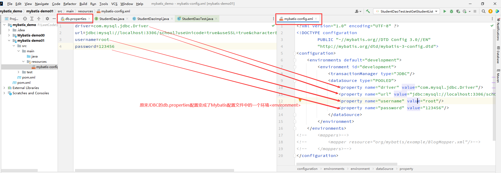

2. 连接对象对比

   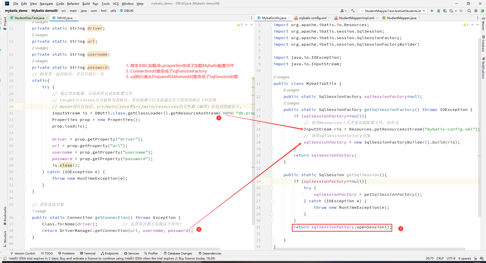

   - **其实感觉SqlSessionFactory对象更像是一个数据库连接池对象，而SqlSession对象才像是一个数据库连接对象，拥有事务管理的能力，每次创建使用了，需要关闭，不然会有资源浪费。**

3. 持久层实现对比

   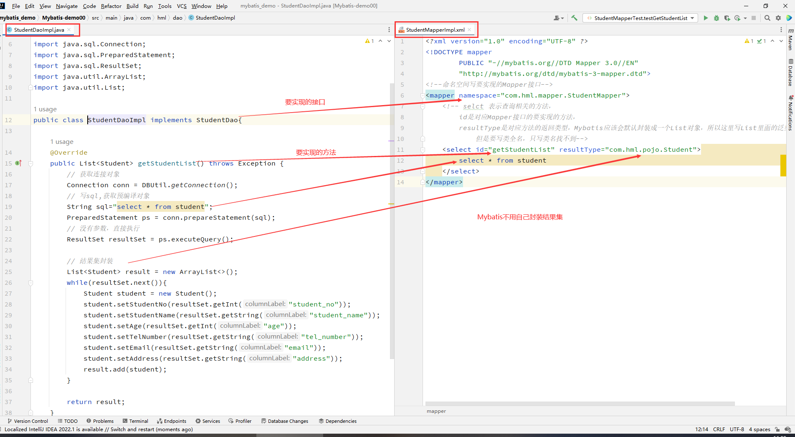

4. 使用对比

   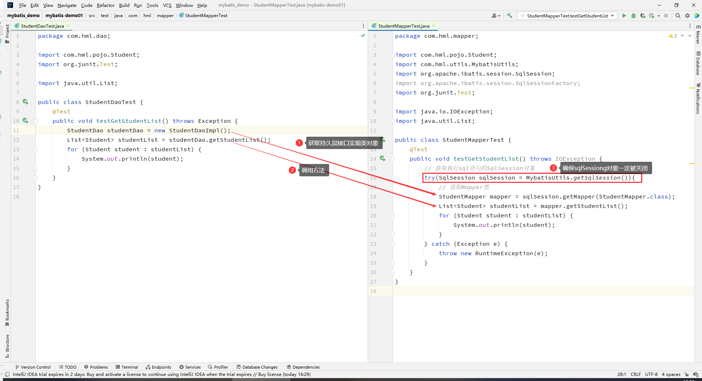


## 3、mybatis配置


<font color='red'>xml文件是可以规定标签定义的顺序的，mybatis的配置文件要求严格按照顺序来定义</font>

### 3.1、属性 properties

- 通常用来定义配置文件mybatis-config.xml中会用到的变量
- 三种配置方式（按照优先级最低在前，**优先级高的会覆盖优先级低**的）
  - 通过配置文件的`property`标签配置
  - 通过`properties`标签的resource/url属性引入外部文件
  - 在build的SqlSessionFactory对象的时候传入参数（最高级）
       ==补充例子==

### 3.2、设置 settings

- mapUnderscoreToCamelCase：是否开启下划线转驼峰命名。默认是false
- logImpl：Mybatis使用哪一种日志实现

### 3.3、类型别名 typeAliases

- 类型别名可为 Java 类型设置一个缩写名字。 它仅用于 XML 配置，意在降低冗余的全限定类名书写。

- 两种配置方式：==补充例子==

   - 通过typeAlias标签一个类一个类的配置别名

  - 通过package标签一整个包下的所有类一起配置别名，在没有注解的时候，默认是使用类名首字母小写来表示。如果使用了注解，就以注解中的别名为准。

- 内置的别名：

  - 基本类型的别名：在原基本类型名字前面加下划线

  - 基本类型的封装类的别名：就是对应的基本类型的名字，首字母小写

  -  一些常用的容器类和数据库常用的日期类：取消驼峰全小写

    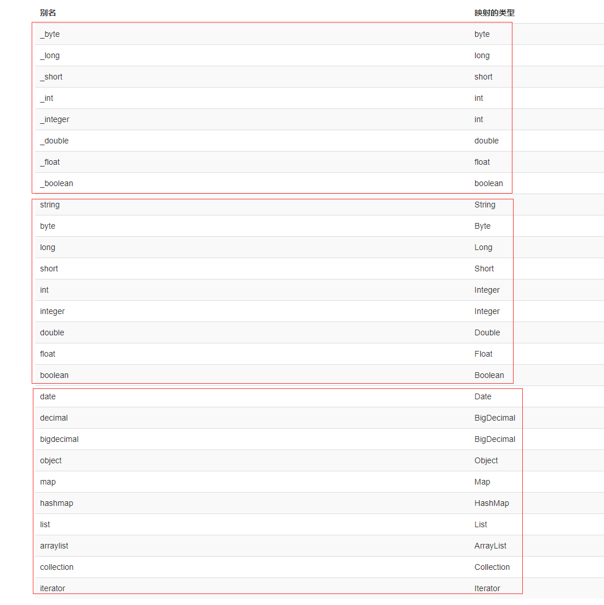

### 3.4、类型处理器 typeHandlers  

- MyBatis 在设置预处理语句（PreparedStatement）中的参数或**从结果集中取出一个值**时， 都会用类型处理器将获取到的值以合适的方式转换成 Java 类型

- 你可以重写已有的类型处理器或创建你自己的类型处理器来处理不支持的或非标准的类型。 具体做法为：实现 org.apache.ibatis.type.TypeHandler 接口， 或继承一个很便利的类 org.apache.ibatis.type.BaseTypeHandler， 并且可以（可选地）将它映射到一个 JDBC 类型。

- <font color='red'>为什么在不使用resultMap的默认情况下，数据库字段名和JavaBean属性名不一致时，设置不成功。typeHandler在得到结果集之后，会根据**结果集中的字段名（有别名就是用别名）**，去找对应的属性名，如果没有就设置不成功。所以最简单的方式解决这个问题是给查询结果集中的字段取别名（AS）</font>

  

### 3.5、对象工厂 objectFactory

- 每次 MyBatis 创建**结果对象**的新实例时，它都会使用一个对象工厂（ObjectFactory）实例来完成实例化工作。 默认的对象工厂需要做的仅仅是实例化目标类，要么通过默认无参构造方法，要么通过存在的参数映射来调用带有参数的构造方法。 

3.6、插件 plugins

- MyBatis 允许你在映射语句执行过程中的某一点进行拦截调用。默认情况下，MyBatis 允许使用插件来拦截的方法调用包括：
  - Executor (update, query, flushStatements, commit, rollback, getTransaction, close, isClosed)
  - ParameterHandler (getParameterObject, setParameters)
  - ResultSetHandler (handleResultSets, handleOutputParameters)
  - StatementHandler (prepare, parameterize batch, update, query)

- 如果你想做的不仅仅是监控方法的调用，那么你最好相当了解要重写的方法的行为。 因为在试图修改或重写已有方法的行为时，很可能会破坏 MyBatis 的核心模块。 
  - 这些都是更底层的类和方法，所以使用插件的时候要特别当心。
  - MyBatis使用插件是非常简单的，只需实现 Interceptor 接口，并指定想要拦截的方法签名即可。

### 3.7、环境配置 environments

- 尽管可以配置多个环境，但每个 SqlSessionFactory 实例只能选择一种环境。如果你想连接两个数据库，就需要创建两个 SqlSessionFactory 实例，**每个数据库对应一个 SqlSessionFactory 实例**。（在build的时候动态设置properties中定义的变量值，就可以实现一个配置文件，但是产生不一样的配置效果）
  ==补充例子== 

- 注意一些关键点:
  - 默认使用的环境 ID（比如：default="development"）。
  - 每个 environment 元素定义的环境 ID（比如：id="development"）。
  - 事务管理器的配置（比如：type="JDBC"）。
  - 数据源的配置（比如：type="POOLED"）。

#### 3.7.2、数据源 dataSource

dataSource 元素使用标准的 JDBC 数据源接口来配置 JDBC 连接对象的资源。有三种内建的数据源类型（也就是 type="[UNPOOLED|POOLED|JNDI]"）：

- UNPOOLED：这个数据源的实现会每次请求时打开和关闭连接。 
- POOLED：这种数据源的实现利用“池”的概念将 JDBC 连接对象组织起来，避免了创建新的连接实例时所必需的初始化和认证时间。
  - 属性配置：poolMaximumActiveConnections：连接池中的最大连接数量 ，默认值：10
- JNDI – 这个数据源实现是为了能在如 EJB 或应用服务器这类容器中使用，容器可以集中或在外部配置数据源，然后放置一个 JNDI 上下文的数据源引用。
- 可以通过继承`org.apache.ibatis.datasource.unpooled.UnpooledDataSourceFactory`实现自定义的数据源

### 3.8、数据库厂商表示 databaseIdProvider

### 3.9、映射器 mappers

- SQL映射语句

- 需要告诉 MyBatis 到哪里去找到这些语句。可以使用**相对于类路径的资源引用，或绝对路径，或类名和包名**等。
  ==补充例子==
  - 使用mapper标签的resource属性通过相对类路径的资源路径进行查找
  - 使用mapper标签的url属性通过绝对路径进行查找
  - 使用mapper标签的class属性通过类全名进行查找
  - 使用package标签的name属性通过包全名进行查找

- SQL 映射文件只有很少的几个顶级元素（按照应被定义的顺序列出）
  - cache：该命名空间的缓存配置。
  - cache-ref：引用其它命名空间的缓存配置。
  - resultMap： 描述如何从数据库结果集中加载对象，是最复杂也是最强大的元素。
  - parameterMap： 老式风格的参数映射。此元素已被废弃，并可能在将来被移除！请使用行内参数映射。文档中不会介绍此元素。
  - sql：可被其它语句引用的可重用语句块。
  - insert：映射插入语句。
  - update：映射更新语句。
  - delete：映射删除语句。
  - select：映射查询语句。
  
- **命名空间 namespace：使用类全名制定要实现的持久层Mapper接口**

- **实现Mapper接口的xml文件命名最好要和Mapper接口文件名一致，并且要放在和Mapper接口相同的包下面。**(感觉因为Mybatis在
  - 通过配置文件中的resource属性和url属性的查找过程是单向的，只能从xml文件到Mapper接口来建立xml实现文件到Mapper接口之间的映射关系。找的时候就只找跟自己xml文件同名的Mapper接口。
  - 通过配置文件中的package属性查找的时候，也是从xml文件到Mapper接口，先找到所有定义了映射器的xml文件，再查找自己包下的和自己xml文件同名的Mapper接口（猜的）（难怪说之前的namespace可有可无）
  - 通过class属性查找的时候，==算了，有机会看看源码吧==
    ==补充测试案例==
  
- 使用`#{变量名}`获取变量值可以防止SQL注入，使用的是`PreparedStatement`对象；使用`${变量名}`不能防止SQL注入

  - 两种取值方式，各有各的用处

  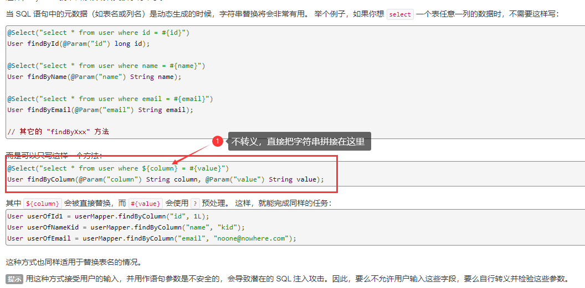

  - 对比

  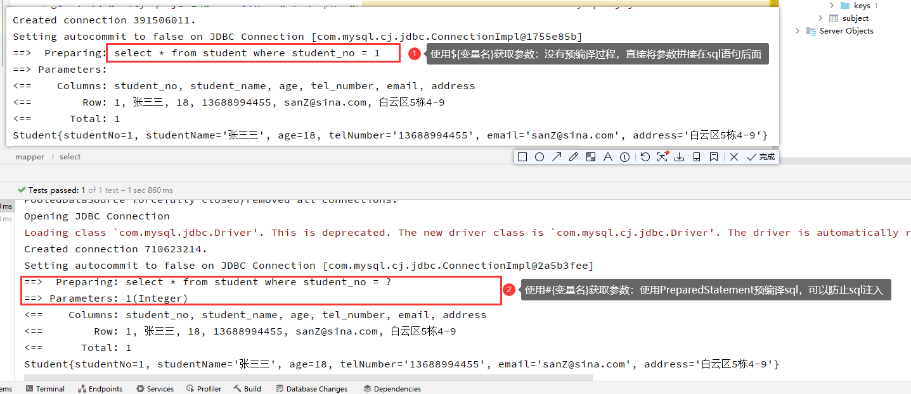

- MyBatis 的基本原则之一是：在每个插入、更新或删除操作之间，通常会执行多个查询操作。

## 4、使用xml实现增删改查

### 4.0、基础环境配置

- mybatis-config.xml文件

  ```xml
  <?xml version="1.0" encoding="UTF-8" ?>
  <!DOCTYPE configuration
          PUBLIC "-//mybatis.org//DTD Config 3.0//EN"
          "http://mybatis.org/dtd/mybatis-3-config.dtd">
  <configuration>
      <settings>
        	<!--标准日志输出-->  
          <setting name="logImpl" value="STDOUT_LOGGING"/>
      </settings>
      
    	<!--设置类型别名-->  
      <typeAliases>
          <typeAlias type="com.hml.pojo.Student" alias="student"></typeAlias>
      </typeAliases>
      
      <environments default="development">
             <!--环境配置跟之前一样-->
      </environments>
      
      <!--配置映射器-->
      <mappers>
          <mapper resource="com/hml/mapper/StudentMapperImpl.xml"/>
      </mappers>
  </configuration>
  ```

  

### 4.1、Select

- 编写持久层Mapper接口中方法

  ```java
  public Student getStudentById(@Param("sid")int studentNo);
  ```

  - 关于`@Param(value)`解释：

    - **可以理解成给参数设置别名，在xml实现文件里或者CRUD注解中都以@Param别名为准**
    - 基本类型和String类型都需要加上，引用类型不用加
    - 如果方法只有一个参数可以不用加，但是建议加上

    

- 编写实现xml

  ```xml
  <?xml version="1.0" encoding="UTF-8" ?>
  <!DOCTYPE mapper
          PUBLIC "-//mybatis.org//DTD Mapper 3.0//EN"
          "http://mybatis.org/dtd/mybatis-3-mapper.dtd">
  <!--命名空间写要实现的Mapper接口-->
  <mapper namespace="com.hml.mapper.StudentMapper">
    	<!--结果集映射-->  
      <resultMap id="studentMap" type="com.hml.pojo.Student">
          <!--对于一些能够自动通过列名设置找到的属性不用重复配置-->
          <result column="student_no" property="studentNo"></result>
          <result column="student_name" property="studentName"></result>
          <result column="tel_number" property="telNumber"></result>
      </resultMap>
  
      <select id="getStudentById" resultMap="studentMap">
          select * from student where student_no = #{sid}		<!--参数别名-->
      </select>
  </mapper>
  ```

  

- 测试

  - 获取`sqlSession`对象（默认关闭了事务自动提交，可以在从`SqlSessionFactory`对象中获取时，通过参数开启事务自动提交）
  - 获取Mapper对象
  - 调用方法


### 4.2、insert

**<font color="red">记住要自己提交，默认自动提交是关闭的</font>**

- 接口方法

  ```java
  public int addStudent(Student stu);
  ```

  

- xml实现

  ```xml
  <insert id="addStudent" parameterType="student"> 
      insert into student(student_no, student_name, age, tel_number, email, address)
      values (#{studentNo}, #{studentName}, #{age}, #{telNumber}, #{email}, #{address})
  </insert>
  ```

  - **传入的是一个引用类型的变量时，直接访问属性**

- 测试

  ```java
  @Test
  public void testAddStudent(){
      SqlSession sqlSession = MybatisUtils.getSqlSession();
      StudentMapper mapper = sqlSession.getMapper(StudentMapper.class);
      int rows = mapper.addStudent(new Student(5,"小十二",5,"15632159875","xse@gmail.com","上海XXX"));
      sqlSession.commit();			// 手动提交
  
      if(rows==1){
          System.out.println("插入成功");
      }
  }
  ```

  

  

### 4.3、update

**<font color="red">记住要自己提交，默认自动提交是关闭的</font>**

- 接口方法

  ```java
  public int modifyStudentName(@Param("sid") int id,@Param("name") String name);
  ```

  

- xml实现

  ```xml
  <update id="modifyStudentName" >
      update student set Student_name=#{name} where student_no=#{sid}
  </update>
  ```

  

### 4.4、delete

**<font color="red">记住要自己提交，默认自动提交是关闭的</font>**

- 接口方法

  ```java
  public int deleteStudent(@Param("sid") int id);
  ```

  

- xml实现

  ```xml
  <delete id="deleteStudent" parameterType="_int">
      delete from student where student_no = #{sid}
  </delete>
  ```

  


## 5、使用注解实现类型别名、增删改查

- 使用注解可以实现一些简单的增删改查，太复杂的不行
- 在简单增删改查的时候，使用注解代替编写xml文件
- **使用注解，在mybatis-config.xml配置时，映射器要使用class属性进行配置**

### 5.0、类型别名`@Alias`用在POJO类上，在配置文件中使用`typeAliases`中的`package`配置时有用

```java
@Alias("author")
public class Author {
    ...
}
```

### 5.1、select

**结果集映射只能依赖类型处理器，不能配置resultMap**

- 编写接口，并使用注解实现方法

  ```java
  @Select("select * from student where student_no=#{sid}")
  public Student getStudentById(@Param("sid")int studentNo);
  ```

  

- 测试（跟xml实现的使用方式一致）

  ```java
  @Test
  public void testGetStudentById() {
      try(SqlSession sqlSession = MybatisUtils.getSqlSession()){
          StudentMapper mapper = sqlSession.getMapper(StudentMapper.class);
          Student student = mapper.getStudentById(1);
          System.out.println(student);
      }   
  }
  ```

  

### 5.2、insert、update、delete

- 编写接口，并使用注解实现方法

- 测试（跟xml实现的使用方式一致）

  ```java
  // StudentMapper.java
  import org.apache.ibatis.annotations.*;
  
  public interface StudentMapper {
      
      @Select("select * from student where student_no=#{sid}")
      public Student getStudentById(@Param("sid")int studentNo);
      
      @Insert("insert into student values(#{studentNo},#{studentName},#{age},#{telNumber},#{email},#{address})")
      public int addStudent(Student stu);
  
      @Update("update student set student_name=#{name} where student_no=#{sid}")
      public int modifyStudentName(@Param("sid") int id,@Param("name") String name);
      
      @Delete("delete from student where student_no=#{sid}")
      public int deleteStudent(@Param("sid") int id);
  }
   
  
  // StudentMapperTest.java
  public class StudentMapperTest {
      @Test
      public void testAddStudent() {
          try(SqlSession sqlSession = MybatisUtils.getSqlSession()){
              StudentMapper mapper = sqlSession.getMapper(StudentMapper.class);
              int rows = mapper.addStudent(new Student(6, "小十二", 5, "15632159875", "xse@gmail.com", "上海XXX"));
              sqlSession.commit();// 手动提交
              if (rows == 1) {
                  System.out.println("插入成功");
              }
          }
      }
  
      @Test
      public void testModifyStudentName() {
          try(SqlSession sqlSession = MybatisUtils.getSqlSession()){
              StudentMapper mapper = sqlSession.getMapper(StudentMapper.class);
              int rows = mapper.modifyStudentName(1, "张三三");
              sqlSession.commit();// 手动提交
  
              if (rows == 1) {
                  System.out.println("修改成功");
              }
          }
      }
  
      @Test
      public void testDeleteStudent() {
          try(SqlSession sqlSession = MybatisUtils.getSqlSession()){
              StudentMapper mapper = sqlSession.getMapper(StudentMapper.class);
              int rows = mapper.deleteStudent(6);
              sqlSession.commit();// 手动提交
  
              if (rows == 1) {
                  System.out.println("删除成功");
              }
          } 
      }
  }
  ```

  

## 6、结果集合映射

- id：数据表主键字段到 JavaBean 属性，标记出作为 ID 的结果可以帮助提高整体性能
- result：数据表中普通字段到 JavaBean 属性
- association：一个JavaBean类型的关联字段，（每个学生关联一个老师，学生有一个老师类型的字段）
- collection：一个JavaBean类型的集合字段（一个老师下面有多个学生，老师有一个学生集合字段）

### 6.1、id和result

- *id* 元素对应的属性会被标记为对象的标识符，在比较对象实例时使用。 这样可以提高整体的性能，尤其是进行**缓存和嵌套结果映射**（也就是连接映射）的时候。

| 属性         | 描述                                                         |
| ------------ | ------------------------------------------------------------ |
| **property** | JavaBean类型中的成员变量名                                   |
| **column**   | sql查询结果中的字段名，如果由as别名，就以别名为准            |
| javaType     | 一个 Java 类的全限定名，或一个类型别名。如果你映射到的是 HashMap，那么你应该明确地指定 javaType 来保证行为与期望的相一致。 |
| jdbcType     | 只需要在可能执行插入、更新和删除的且允许空值的列上指定 JDBC 类型。 |
| typeHandler  |                                                              |


### 6.2、多对一用关联 association

- 关联（association）元素处理“有一个”类型的关系。 比如，在我们的示例中，一个博客有一个用户。
- 关联的不同之处是，**需要告诉 MyBatis 如何加载关联**。MyBatis 有两种不同的方式加载关联：
  - **嵌套 Select 查询**：通过执行另外一个 SQL 映射语句来加载期望的复杂类型。
  - **嵌套结果映射**：使用嵌套的结果映射来处理连接结果的重复子集。

#### 6.2.0、搭建环境

- 数据库表

  ```sql
  CREATE TABLE `teacher` (
  `id` INT(10) NOT NULL,
  `name` VARCHAR(30) DEFAULT NULL,
  PRIMARY KEY (`id`)
  ) ENGINE=INNODB DEFAULT CHARSET=utf8;
  INSERT INTO teacher(`id`, `name`) VALUES (1, '秦老师'); 
  CREATE TABLE `student` (
  `id` INT(10) NOT NULL,
  `name` VARCHAR(30) DEFAULT NULL,
  `tid` INT(10) DEFAULT NULL,
  PRIMARY KEY (`id`),
  KEY `fktid` (`tid`),
  CONSTRAINT `fktid` FOREIGN KEY (`tid`) REFERENCES `teacher` (`id`)
) ENGINE=INNODB DEFAULT CHARSET=utf8INSERT INTO `student` (`id`, `name`, `tid`) VALUES ('1', '小明', '1'); 
INSERT INTO `student` (`id`, `name`, `tid`) VALUES ('2', '小红', '1'); 
INSERT INTO `student` (`id`, `name`, `tid`) VALUES ('3', '小张', '1'); 
INSERT INTO `student` (`id`, `name`, `tid`) VALUES ('4', '小李', '1'); 
INSERT INTO `student` (`id`, `name`, `tid`) VALUES '5', '小王', '1');
  ```

- 创建实体类

  ```java
  // 实体类
  // Student.java
  public class Student implements Serializable {
      private int id;
      private String name;
      private Teacher teacher;
  	// getter、setter、constructor、toString
  }
  
  
  // Teacher.java
  public class Teacher implements Serializable {
      private int id;
      private String name;
      // getter、setter、constructor、toString
  }
  ```

- 编写Mapper和测试（）

  ```java
  // StudentMapper.java
  public interface StudentMapper {
     Student getStudentById(@Param("sid") int id);
  }
  
  //StudentMapperTest.java
  @Test
  public void testGetStudentById() {
      try (SqlSession sqlSession = MybatisUtils.getSqlSession()) {
          StudentMapper mapper = sqlSession.getMapper(StudentMapper.class);
          Student student = mapper.getStudentById(1);
          System.out.println(student);
      }
  }
  ```

#### 6.2.1、关联的嵌套select查询

- 通过**关联的子查询和字段**实现多对一

  ```xml
  <?xml version="1.0" encoding="UTF-8" ?>
  <!DOCTYPE mapper
              PUBLIC "-//mybatis.org//DTD Mapper 3.0//EN"
              "http://mybatis.org/dtd/mybatis-3-mapper.dtd">
  <mapper namespace="com.hml.mapper.StudentMapper">
      <resultMap id="STmap" type="com.hml.pojo.Student">
          <result property="id" column="id"></result>     <!--可省略-->
          <result property="name" column="name"></result> <!--可省略-->
          <!--property：跟result一样，属性名
                  javaType：属性对应的java类型，类全名或者别名
                  column：数据库中关联字段，告诉mybatis关联的字段是什么
                  select：被引用的子查询的名字，告诉mybatis关联的查询是什么
                这里相当于在执行了一个查询，然后再对子查询的结果进行映射
              -->
          <association property="teacher" javaType="com.hml.pojo.Teacher" column="tid"
                       select="selectTeacher">
              <result property="id" column="id" ></result>        <!--可省略-->
              <result property="name" column="name"></result>     <!--可省略-->
          </association>
      </resultMap>
      <!--正常查询学生，在处理结果数据集映射的时候，会通过关联字段进行子查询-->
      <select id="getStudentById" resultMap="STmap">
          select * from student where id = #{sid}
      </select>
  
    <!-- 正常查询老师-->
      <select id="selectTeacher" resultType="com.hml.pojo.Teacher">
          select * from teacher where id=#{tid2}       <!--这里的变量名写什么都可以，反正就是一个占位，值就是结果集映射中传过来的关联字段对应的值-->
      </select>
  </mapper>
  ```
  
- `association`属性：
    - property：跟result一样，属性名
    - javaType：属性对应的java类型，类全名或者别名
    - column：数据库中关联字段，**告诉mybatis关联的字段是什么**。在使用复合主键的时候，你可以使用 `column="{prop1=col1,prop2=col2}"` 这样的语法来指定多个传递给嵌套 Select 查询语句的列名。
    - select：被引用的子查询的id，**告诉mybatis关联的查询是什么。**它会从 column 属性指定的列中检索数据，作为参数传递给目标 select 语句。
    
  - `association`子标签，和resultmap一样，有id和result。因为还要对子查询作结果映射
  
- **所以整个流程就是：sqlSession获取mapper对象，mapper对象调用`getStudentById`方法，预编译查询出来结果之后，进行结果映射的时候发现`association`标签还需要进行一个子查询`selectTeacher`，通过关联字段对子查询完成之后，对子查询结果进行结果映射，得到最终结果。**
  
  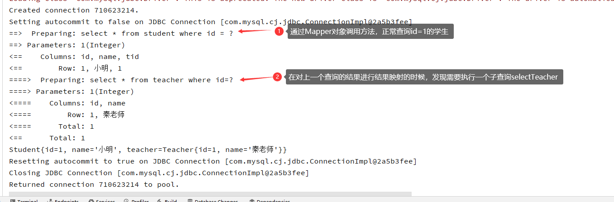
  
- 这种方式虽然很简单，但在大型数据集或大型数据表上表现不佳。这个问题被称为“N+1 查询问题”。 概括地讲，**N+1 查询问题**是这样子的：
  
  - 你执行了一个单独的 SQL 语句来获取结果的一个列表（就是“+1”）。
    - 对列表返回的每条记录，你执行一个 select 查询语句来为每条记录加载详细信息（就是“N”）。（对于每个学生都需要一次子查询来确定他对应的老师）
  
  这个问题会导致成百上千的 SQL 语句被执行。

#### 6.2.2、嵌套结果映射

- 通过**嵌套的结果映射**实现多对一

  ```xml
  <?xml version="1.0" encoding="UTF-8" ?>
  <!DOCTYPE mapper
          PUBLIC "-//mybatis.org//DTD Mapper 3.0//EN"
          "http://mybatis.org/dtd/mybatis-3-mapper.dtd">
  <mapper namespace="com.hml.mapper.StudentMapper">
      <resultMap id="studentMap" type="com.hml.pojo.Student">
          <result property="id" column="sid"/>            <!--结果映射嵌套的时候，不能省略，每一个查询出来的字段都需要配置-->
          <result property="name" column="sname"/>
          <!--嵌套结果映射跟嵌套select查询一样，只不过不是嵌套子查询（select属性），而是嵌套结果集映射（resultMap）-->
          <association property="teacher" javaType="com.hml.pojo.Teacher" column="tid" resultMap="teacherMap"/>
      </resultMap>
  
      <resultMap id="teacherMap" type="com.hml.pojo.Teacher">
          <result property="id" column="tid"/>
          <result property="name" column="tname"/>
      </resultMap>
  
  
      <!--正常地写联表查询-->
      <select id="getStudentById" resultMap="studentMap">
          select s.id sid, s.name sname, t.id tid, t.name tname
          from student s,
               teacher t
          where s.id = #{sid}
            and s.tid = t.id
      </select>
  </mapper>
  ```

  - 根据需要的字段，正常地写联表查询，建议使用as取别名

  - 嵌套结果映射跟嵌套select查询一样，只不过不是嵌套子查询（select属性），而是嵌套结果集映射（resultMap）

  - **结果映射嵌套的时候，最好都自己配置一下字段到成员变量的映射。**可能因为有同名的映射，Student有id和name，Teacher也有id和name，所以不显式配置的话，就映射不成功。

  - 上述写法，**子结果映射可以复用**。如果确定不需要复用，也可以把子映射写在associate标签中：

    ```xml
    <resultMap id="studentMap" type="com.hml.pojo.Student">
        <result property="id" column="sid"/>           
        <result property="name" column="sname"/>
        <association property="teacher" javaType="com.hml.pojo.Teacher">
            <result property="id" column="tid"/>
            <result property="name" column="tname"/>
        </association>
    </resultMap>
    ```

  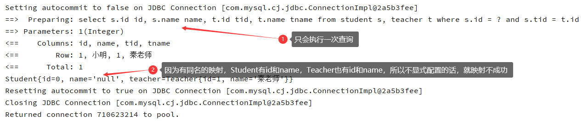

- **非常重要： id 元素（也不是说id标签吧，就是说一定要有一个每条记录的唯一表示）在嵌套结果映射中扮演着非常重要的角色。<font color="red">你应该总是指定一个或多个可以唯一标识结果的属性。需要显式指定可以唯一标识结果的最少属性。</font>**

- <font color='red'>使用嵌套结果映射的时候，一定要显式配置查询结果中的主键到成员变量的映射。</font>


### 6.3、一对多用集合 collection

#### 6.3.0、搭建环境

- 实体类

    ```java
    //Student.java
    public class Student implements Serializable {
        private int id;
        private String name;
    }
    
    
    //Teacher.java
    public class Teacher implements Serializable {
        private int id;
        private String name;
        private List<Student> students;			// 包含多个复杂类型，集合
    }
    ```

- mapper和测试

  ```java
  //TeacherMapper.java
  public interface TeacherMapper {
      Teacher getTeacherById(@Param("tid") int id);
  }
  
  
  // TeacherMapperTest.java
  public void testGetTeacherById(){
      try(SqlSession sqlSession = MybatisUtils.getSqlSession()){
          TeacherMapper mapper = sqlSession.getMapper(TeacherMapper.class);
          Teacher teacher = mapper.getTeacherById(1);
          System.out.println(teacher);
      }
  }
  ```
  

#### 6.3.1、嵌套select实现

```xml
<?xml version="1.0" encoding="UTF-8" ?>
<!DOCTYPE mapper
        PUBLIC "-//mybatis.org//DTD Mapper 3.0//EN"
        "http://mybatis.org/dtd/mybatis-3-mapper.dtd">
<mapper namespace="com.hml.mapper.TeacherMapper">
    <resultMap id="TeacherMap" type="com.hml.pojo.Teacher">
        <!--通过teacher表中的id取查询学生表中指定老师id的学生-->
        <collection property="students" javaType="java.util.ArrayList" ofType="com.hml.pojo.Student" column="id"
                    select="selectStudentsByTid"/>
    </resultMap>

    <select id="getTeacherById" resultMap="TeacherMap">
        select * from teacher where id = #{tid}
    </select>

    <select id="selectStudentsByTid" resultType="com.hml.pojo.Student">
        select * from student where tid = #{tid}
    </select>

</mapper>
```

- `collection`的属性：
  - property：实体类中属性名
  - javaType：实体类中属性类型
  - ofType：实体类属性中泛型的类型
  - column：结果集合中的关联字段，也就是要传给子查询的字段。这里要写当前结果的字段名称。（Teacher查询结果中的id列，而不是tid，除非取别名）
  - select：指定嵌套的子查询

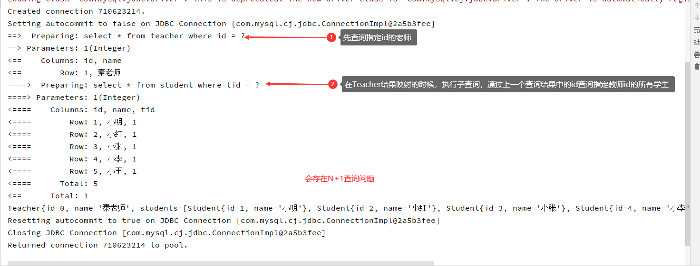

#### 6.3.2、嵌套结果映射实现

- 可复用形式：正常联表查询+resultMap嵌套

  ```xml
  <select id="getTeacherById" resultMap="teacherMap">
      select t.id id, t.name name, s.id sid, s.name sname
      from student s right join teacher t on s.tid = t.id
      where t.id = #{tid}
  </select>
  
  <resultMap id="teacherMap" type="com.hml.pojo.Teacher">
      <id property="id" column="id"/>		
      <result property="name" column="name"/>
      <collection property="students" javaType="java.util.List" ofType="com.hml.pojo.Student" resultMap="studentMap"/>
  </resultMap>
  
  
  <resultMap id="studentMap" type="com.hml.pojo.Student">
      <id property="id" column="sid"/>
      <result property="name" column="sname"/>
  </resultMap>
  ```

  - **非常重要： id 元素（也不是说id标签吧，就是说一定要有一个每条记录的唯一表示）在嵌套结果映射中扮演着非常重要的角色。<font color="red">你应该总是指定一个或多个可以唯一标识结果的属性。需要显式指定可以唯一标识结果的最少属性。</font>显然，你可以选择主键（复合主键也可以）。如果在集合中不指定主码属性的映射，就会报错：`Expected one result (or null) to be returned by selectOne(), but found 5`**
- <font color='red'>使用嵌套结果映射的时候，一定要显式配置查询结果中的主键到成员变量的映射。因为嵌套结果映射时，使用的是正常联表查询，查询出来的记录不止一条，不显式指定主键的结果映射，mybatis不知道多条记录对应java中的一个实体变量，而是当成多个实体变量处理</font>
  
- 注意是查询结果的主键（唯一标识），也就是说外面的resultmap的id和嵌套的resultmap中的id都要配置，才能保证结果正常。
  
- 简写

  ```xml
  <resultMap id="teacherMap" type="com.hml.pojo.Teacher">
      <result property="id" column="id"/>			<!--主键一定要配置，可以用id标签也可以用result标签，id标签会有性能提升-->
      <!--<result property="name" column="name"/>-->		<!--非主键字段同名，可以省略-->
      <collection property="students" javaType="java.util.List" ofType="com.hml.pojo.Student" >
          <id property="id" column="sid"/>		<!--主键一定要配置，可以用id标签也可以用result标签，id标签会有性能提升-->
          <result property="name" column="sname"/>
      </collection>
  </resultMap>
  ```

  - 查询结果中的主键一定要配置，可以用id标签也可以用result标签，id标签会有性能提升

## 7、动态SQL

### 7.1、if

```xml
<select id="getBlogsByIf" parameterType="map" resultType="com.hml.pojo.Blog">
    select * from blog
    <where>
        <if test="id!=null">id =#{id}</if>
        <if test="author">and author =#{author}</if>
    </where>
</select>
```


### 7.2、choose、when、otherwise

- 这三个标签的作用跟switch、case（带break;）、default一样

- 从上到下开始匹配，匹配到之后，后面的when和otherwise。

  ```xml
  <select id="getBlogsByChoose" parameterType="map" resultType="com.hml.pojo.Blog">
      select * from blog
      <where>
          <choose>
              <when test="id!=null">id=#{id}</when>
              <when test="author!=null">author=#{author}</when>		<!--只要给了id，这一项以及后面的otherwise就不生效了-->
              <otherwise>
                  views > 100
              </otherwise>
          </choose>
      </where>
  </select>
  ```

  

### 7.3、trim、set、where

- trim
- set：解决解决if条件匹配不到时，产生的多余的逗号结尾的问题：
  - *set* 元素会动态地在行首插入 SET 关键字，并会删掉额外的逗号（这些逗号是在使用条件语句给列赋值时引入的）。
- where 解决if条件匹配不到时，产生的and/or开头的问题：
  - *where* 元素只会在子元素有内容的情况下才插入 “WHERE” 子句。而且，若子句的开头为 “AND” 或 “OR”，*where* 元素也会将它们去除。

### 7.4、sql片段

### 7.5、foreach

```xml
<select id="getBlogsByIds" resultType="com.hml.pojo.Blog">
    select * from blog
    <where>
        <foreach collection="list" index="idx" item="id" open="id in (" separator="," close=")">
            #{id}
        </foreach>
    </where>
</select>


<!--案例二：传入一个Author的数组或者集合-->
<insert id="insertAuthor" useGeneratedKeys="true" keyProperty="id">
  insert into Author (username, password, email, bio) values
  <foreach item="item" collection="list" separator=",">
    (#{item.username}, #{item.password}, #{item.email}, #{item.bio})
  </foreach>
</insert>
```

- collection属性表示传入的是一个list，可以传入一切可迭代的类型，例如list、set、map、数组等。
  - 当使用可迭代对象或者数组时，index 是当前迭代的序号，item 的值是本次迭代获取到的元素。
  - 当使用 Map 对象（或者 Map.Entry 对象的集合）时，index 是键，item 是值。
- open属性表示第一个元素前面要拼接的内容
- close属性表示最后一个元素后面要拼接的内容
- separator属性表示每个循环体之间的间隔方式，不会错误地添加多余的分隔符。

## 8、缓存

- mybatis中有两种缓存：一级缓存（本地会话缓存）和二级缓存（全局Mapper缓存）
- 映射语句文件中的所有 select 语句的结果（封装好的对象）将会被一级缓存。
- 映射语句文件中的所有 insert、update 和 delete 语句会刷新一级缓存和二级缓存。
- 缓存会使用最近最少使用算法（LRU, Least Recently Used）算法来清除不需要的缓存。
- 缓存默认不会定时进行刷新，除非在cache标签中配置。
- 缓存会保存列表或对象（无论查询方法返回哪种）的 1024 个引用。
- 缓存会被视为读/写缓存，这意味着获取到的对象并不是共享的，可以安全地被调用者修改，而不干扰其他调用者或线程所做的潜在修改。
-  **二级缓存**是事务性的。这意味着，当 SqlSession 完成并提交时，或是完成并回滚，但没有执行 flushCache=true 的 insert/delete/update 语句时，缓存会获得更新。
- 可以通过实现缓存接口实现自定义缓存

> **cache标签只作用于 cache 标签所在的映射文件中的语句。**如果你混合使用 Java API 和 XML 映射文件，在共用接口中的语句将不会被默认缓存。你需要使用 @CacheNamespaceRef 注解指定缓存作用域。

### 8.1、一级缓存

- 一级缓存是保存在SqlSession对象中的，SqlSession对象关闭，缓存会消失

  ```java
  public void testGetStudentById() {
      try(SqlSession sqlSession = MybatisUtils.getSqlSession()){
          StudentMapper mapper = sqlSession.getMapper(StudentMapper.class);
          Student student = mapper.getStudentById(1);
          System.out.println(student);
          System.out.println("==========");
  
          Student student2 = mapper.getStudentById(1);
          System.out.println(student2);
          System.out.println("==========");
  
          System.out.println("两次查询用户是否相同："+(student==student2));
      }
  }
  ```


  结果：

  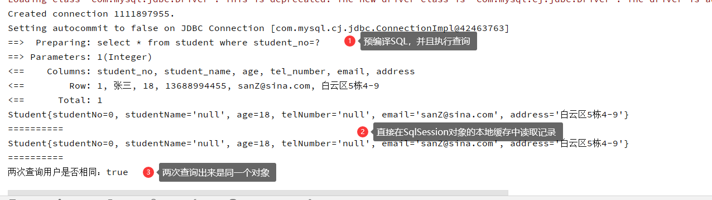

### 8.2、二级缓存

- 二级缓存需要手动在需要缓存的Mapper.xml文件中配置

  ```xml
  <cache/>
  <!--或者配置置换策略为FILO、自动刷新时间60s，最大记录条数512，只能读-->
  <cache eviction="FIFO" flushInterval="60000" size="512" readOnly="true"/>
  ```

- 一级缓存会在SqlSession对象提交记录、回滚记录或者关闭连接时，将自己本地的缓存复制到Mapper的二级缓存中。二级缓存可以在多个SqlSession中使用

  ```java
  @Test
  public void testGetStudentById() {
      try (SqlSession sqlSession = MybatisUtils.getSqlSession()) {
          StudentMapper mapper = sqlSession.getMapper(StudentMapper.class);
          Student student = mapper.getStudentById(1);
          System.out.println(student);
          System.out.println("========");
      }
  
      try(SqlSession sqlSession = MybatisUtils.getSqlSession()){
          StudentMapper mapper = sqlSession.getMapper(StudentMapper.class);
          Student student = mapper.getStudentById(1);
          System.out.println(student);
      }
  }
  ```

  - **在使用二级缓存的时候，由于一级缓存会向二级缓存复制结果集中的对象（实体类），所以需要被复制的对象实现序列化接口`java.io.Serializable`。**
  - 建议所有的实体类都实现序列化接口`java.io.Serializable`
  
   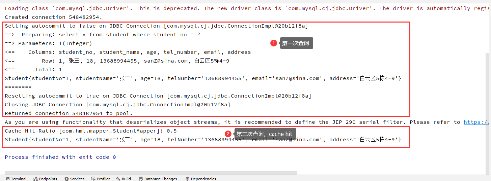

